# SQL & Database Master Notes

---

## 📑 Topic-Wise Indexing

1. [Topic 1: What is a Database?](#topic-1-what-is-a-database)
   - [1.1 Definition & Core Concept](#11-definition--core-concept)
   - [1.2 Detailed Database Structure & Components](#12-detailed-database-structure--components)
   - [1.3 Visual Concept: Without Database vs. With Database & SQL](#13-visual-concept-without-database-vs-with-database--sql)
   - [1.4 Topic 1 Summary (मराठी सारांश)](#14-topic-1-summary-मराठी-सारांश)
2. [Topic 2: What is a DBMS (Database Management System)?](#topic-2-what-is-a-dbms-database-management-system)
   - [2.1 Definition & Meaning](#21-definition--meaning)
   - [2.2 Why Do We Need a DBMS?](#22-why-do-we-need-a-dbms)
   - [2.3 Key Functions & Responsibilities](#23-key-functions--responsibilities)
   - [2.4 Step-by-Step Query Execution Lifecycle in DBMS](#24-step-by-step-query-execution-lifecycle-in-dbms)
   - [2.5 The 4 Core Pillars (Quick Reference)](#25-the-4-core-pillars-quick-reference)
   - [2.6 Popular Examples of DBMS / RDBMS](#26-popular-examples-of-dbms--rdbms)
   - [2.7 Visual Architecture: Server, Database, DBMS & Clients](#27-visual-architecture-server-database-dbms--clients)
   - [2.8 Topic 2 Summary (मराठी सारांश)](#28-topic-2-summary-मराठी-सारांश)
3. [Topic 3: What is SQL?](#topic-3-what-is-sql)
   - [3.1 Definition & Core Meaning](#31-definition--core-meaning)
   - [3.2 Communicating with the Database Brain (Asking Questions)](#32-communicating-with-the-database-brain-asking-questions)
   - [3.3 Accessing & Manipulating Data (CRUD Operations)](#33-accessing--manipulating-data-crud-operations)
   - [3.4 Real-World Applications & Use Cases of SQL](#34-real-world-applications--use-cases-of-sql)
   - [3.5 In Short: The 4 Pillars Chain](#35-in-short-the-4-pillars-chain)
   - [3.6 Visual Concept: How SQL Speaks to the Database](#36-visual-concept-how-sql-speaks-to-the-database)
   - [3.7 Topic 3 Summary (मराठी सारांश)](#37-topic-3-summary-मराठी-सारांश)
4. [Topic 4: Main 2 Types of Databases (SQL vs NO-SQL)](#topic-4-main-2-types-of-databases-sql-vs-no-sql)
   - [4.1 Overview: SQL vs NO-SQL](#41-overview-sql-vs-no-sql)
   - [4.2 Relational Database (SQL)](#42-relational-database-sql)
   - [4.3 NO-SQL Databases (Non-Relational Models)](#43-no-sql-databases-non-relational-models)
   - [4.4 Visual Concept: SQL vs NO-SQL Architecture](#44-visual-concept-sql-vs-no-sql-architecture)
   - [4.5 Topic 4 Summary (मराठी सारांश)](#45-topic-4-summary-मराठी-सारांश)
5. [Topic 5: Why SQL?](#topic-5-why-sql)
   - [5.1 Standardized Way to Interact with Databases](#51-standardized-way-to-interact-with-databases)
   - [5.2 Efficient Data Retrieval](#52-efficient-data-retrieval)
   - [5.3 Data Manipulation (CRUD Examples)](#53-data-manipulation-crud-examples)
   - [5.4 Relationships Between Data](#54-relationships-between-data)
   - [5.5 Data Integrity and Security](#55-data-integrity-and-security)
   - [5.6 Scalability and Engine Optimization](#56-scalability-and-engine-optimization)
   - [5.7 The 3 Core Drivers: Talk to Data, High Demand, Industry Standard](#57-the-3-core-drivers-talk-to-data-high-demand-industry-standard)
   - [5.8 Visual Concept: Why SQL Mind-Map](#58-visual-concept-why-sql-mind-map)
   - [5.9 Topic 5 Summary (मराठी सारांश)](#59-topic-5-summary-मराठी-सारांश)
6. [Topic 6: Database Structure & Hierarchy](#topic-6-database-structure--hierarchy)
   - [6.1 The Relational Database Hierarchy](#61-the-relational-database-hierarchy)
   - [6.2 The Starting Point: Server](#62-the-starting-point-server)
   - [6.3 The Container: Database](#63-the-container-database)
   - [6.4 The Logical Organizer: Schema](#64-the-logical-organizer-schema)
   - [6.5 Types of Schema (Logical vs. Physical)](#65-types-of-schema-logical-vs-physical)
   - [6.6 The Core Object: Table, Columns, Rows & Cells](#66-the-core-object-table-columns-rows--cells)
   - [6.7 The Fingerprint: Primary Key](#67-the-fingerprint-primary-key)
   - [6.8 MySQL Data Types In-Depth](#68-mysql-data-types-in-depth)
     - [6.8.1 Memory Classification: Fixed Data Types vs. Variable Data Types](#681-memory-classification-fixed-data-types-vs-variable-data-types)
     - [6.8.2 Numeric Data Types](#682-numeric-data-types)
     - [6.8.3 String, Text, Binary & Specialized Data Types](#683-string-text-binary--specialized-data-types)
     - [6.8.4 Date and Time (Temporal) Data Types](#684-date-and-time-temporal-data-types)
     - [6.8.5 What is UTC (Coordinated Universal Time) & Why Does It Matter?](#685-what-is-utc-coordinated-universal-time--why-does-it-matter)
     - [6.8.6 Differences Between DATETIME and TIMESTAMP](#686-differences-between-datetime-and-timestamp)
     - [6.8.7 Practical Code Examples for Data Types](#687-practical-code-examples-for-data-types)
     - [6.8.8 Special Data Types: JSON In-Depth](#688-special-data-types-json-in-depth)
     - [6.8.9 Special Data Types: GEOMETRY Types for GIS / Spatial Data In-Depth](#689-special-data-types-geometry-types-for-gis--spatial-data-in-depth)
     - [6.8.10 Quick Overview: JSON & Spatial GEOMETRY (Methods & Properties Master Cheat Sheet)](#6810-quick-overview-json--spatial-geometry-methods--properties-master-cheat-sheet)
   - [6.9 Visual Architectural Diagrams for Data Types & Hierarchy](#69-visual-architectural-diagrams-for-data-types--hierarchy)
   - [6.10 Topic 6 Summary (मराठी सारांश)](#610-topic-6-summary-मराठी-सारांश)
7. [Topic 7: SQL vs MySQL](#topic-7-sql-vs-mysql)
   - [7.1 What is SQL?](#71-what-is-sql)
   - [7.2 What is MySQL?](#72-what-is-mysql)
   - [7.3 Key Differences: Comparison Table](#73-key-differences-comparison-table)
   - [7.4 Visual Concept: Language vs RDBMS Software](#74-visual-concept-language-vs-rdbms-software)
   - [7.5 Topic 7 Summary (मराठी सारांश)](#75-topic-7-summary-मराठी-सारांश)
8. [Topic 8: SQL Commands & DDL (Data Definition Language) In-Depth](#topic-8-sql-commands--ddl-data-definition-language-in-depth)
   - [8.1 Check Current SQL / MySQL Version](#81-check-current-sql--mysql-version)
   - [8.2 Broad Classification of SQL Commands](#82-broad-classification-of-sql-commands)
   - [8.3 What is DDL (Data Definition Language)?](#83-what-is-ddl-data-definition-language)
   - [8.4 The Implicit Commit Rule in MySQL](#84-the-implicit-commit-rule-in-mysql)
   - [8.5 CREATE Commands (Database, Tables, Indexes & Info)](#85-create-commands-database-tables-indexes--info)
   - [8.6 ALTER Commands (Database Level & Table Level)](#86-alter-commands-database-level--table-level)
   - [8.7 Constraints Management via ALTER (Add & Drop Rules)](#87-constraints-management-via-alter-add--drop-rules)
   - [8.8 Quick Revision Cheat Sheet: ALTER Operations](#88-quick-revision-cheat-sheet-alter-operations)
   - [8.9 DROP Commands (Permanent Object Deletion)](#89-drop-commands-permanent-object-deletion)
   - [8.10 TRUNCATE Commands (Wipe Data, Keep Structure)](#810-truncate-commands-wipe-data-keep-structure)
   - [8.11 RENAME Commands (Objects & Tables)](#811-rename-commands-objects--tables)
   - [8.12 Differences Between DELETE, TRUNCATE, and DROP](#812-differences-between-delete-truncate-and-drop)
   - [8.13 Visual Diagrams & Architectural Explanations](#813-visual-diagrams--architectural-explanations)
   - [8.14 Topic 8 Summary (मराठी सारांश)](#814-topic-8-summary-मराठी-सारांश)
9. [Topic 9: DML (Data Manipulation Language) In-Depth](#topic-9-dml-data-manipulation-language-in-depth)
   - [9.1 What is DML (Data Manipulation Language)?](#91-what-is-dml-data-manipulation-language)
   - [9.2 The INSERT Command & Bulk Operations](#92-the-insert-command--bulk-operations)
   - [9.3 The UPDATE Command & Best Practices](#93-the-update-command--best-practices)
   - [9.4 The DELETE Command & Safe Execution](#94-the-delete-command--safe-execution)
   - [9.5 MySQL Safe Update Mode (SQL_SAFE_UPDATES)](#95-mysql-safe-update-mode-sql_safe_updates)
   - [9.6 Soft Delete vs Hard Delete (In-Depth Comparison)](#96-soft-delete-vs-hard-delete-in-depth-comparison)
   - [9.7 Foreign Key Referential Actions (Complete Guide)](#97-foreign-key-referential-actions-complete-guide)
   - [9.8 The REPLACE Command in SQL (MySQL Specific)](#98-the-replace-command-in-sql-mysql-specific)
   - [9.9 Comparison: ALTER Command vs UPDATE Command](#99-comparison-alter-command-vs-update-command)
   - [9.10 Visual Diagrams & Architectural Explanations](#910-visual-diagrams--architectural-explanations)
   - [9.11 Topic 9 Summary (मराठी सारांश)](#911-topic-9-summary-मराठी-सारांश)
10. [Topic 10: DQL (Data Query Language) & Data Retrieval](#topic-10-dql-data-query-language--data-retrieval)
    - [10.1 What is DQL (Data Query Language)?](#101-what-is-dql-data-query-language)
    - [10.2 Two Fundamental Ways to Retrieve Data via SELECT](#102-two-fundamental-ways-to-retrieve-data-via-select)
    - [10.3 Visual Concept: Whole Table vs. Specific Column Projection](#103-visual-concept-whole-table-vs-specific-column-projection)
    - [10.4 Topic 10 Summary (मराठी सारांश)](#104-topic-10-summary-मराठी-सारांश)
11. [Topic 11: DCL (Data Control Language) & Security / Access Control](#topic-11-dcl-data-control-language--security--access-control)
    - [11.1 What is DCL (Data Control Language)?](#111-what-is-dcl-data-control-language)
    - [11.2 Core DCL Commands: GRANT and REVOKE](#112-core-dcl-commands-grant-and-revoke)
    - [11.3 Inspecting Users & Privileges in MySQL](#113-inspecting-users--privileges-in-mysql)
    - [11.4 User Management & Creation (Read-Only User Concept)](#114-user-management--creation-read-only-user-concept)
    - [11.5 Step-by-Step Granting & Revoking Permissions](#115-step-by-step-granting--revoking-permissions)
    - [11.6 Database-Wide Privileges & Administrative Access](#116-database-wide-privileges--administrative-access)
    - [11.7 The 6 Core Privilege Categories in MySQL](#117-the-6-core-privilege-categories-in-mysql)
    - [11.8 Advanced Interview Concepts & Gotchas in DCL / Security](#118-advanced-interview-concepts--gotchas-in-dcl--security)
    - [11.9 Visual Architecture Diagram: DCL & Privileges](#119-visual-architecture-diagram-dcl--privileges)
    - [11.10 Topic 11 Summary (मराठी सारांश)](#1110-topic-11-summary-मराठी-सारांश)
12. [Topic 12: TCL (Transaction Control Language) & Transaction Management](#topic-12-tcl-transaction-control-language--transaction-management)
    - [12.1 What is TCL (Transaction Control Language)?](#121-what-is-tcl-transaction-control-language)
    - [12.2 What is a Transaction? (ACID Overview)](#122-what-is-a-transaction-acid-overview)
    - [12.3 Core TCL Commands: START, COMMIT, ROLLBACK, SAVEPOINT, SET](#123-core-tcl-commands-start-commit-rollback-savepoint-set)
    - [12.4 Real-World Banking Transaction Example (Atomic Transfer)](#124-real-world-banking-transaction-example-atomic-transfer)
    - [12.5 Critical Rules & Constraints of TCL](#125-critical-rules--constraints-of-tcl)
    - [12.6 Transaction Isolation Levels & Concurrency Anomalies](#126-transaction-isolation-levels--concurrency-anomalies)
    - [12.7 Advanced Interview Concepts & Gotchas in TCL / Transaction Management](#127-advanced-interview-concepts--gotchas-in-tcl--transaction-management)
    - [12.8 Visual Architecture Diagram: TCL Lifecycle & Isolation Levels](#128-visual-architecture-diagram-tcl-lifecycle--isolation-levels)
    - [12.9 Topic 12 Summary (मराठी सारांश)](#129-topic-12-summary-मराठी-सारांश)
13. [Topic 13: Commands to Query Data (DQL In-Depth, Clauses & Filtering)](#topic-13-commands-to-query-data-dql-in-depth-clauses--filtering)
    - [13.1 Commands to Query Data & What is DQL?](#131-commands-to-query-data--what-is-dql)
    - [13.2 The Core Mental Model: "Ask Your Data"](#132-the-core-mental-model-ask-your-data)
    - [13.3 Essential Database & Table Setup Commands (Pre-Querying Prerequisites)](#133-essential-database--table-setup-commands-pre-querying-prerequisites)
    - [13.4 SQL Query Anatomy & The 9 Core Clauses](#134-sql-query-anatomy--the-9-core-clauses)
    - [13.5 How SQL Works: Written Syntax (Left to Right) vs. Engine Execution Order](#135-how-sql-works-written-syntax-left-to-right-vs-engine-execution-order)
    - [13.6 Data Retrieval Queries: SELECT * (All Columns) vs. Specific Column Projection](#136-data-retrieval-queries-select--all-columns-vs-specific-column-projection)
    - [13.7 Filtering Data & The WHERE Clause In-Depth](#137-filtering-data--the-where-clause-in-depth)
      - [13.7.1 The 5 Families of WHERE Clause Operators](#1371-the-5-families-of-where-clause-operators)
      - [13.7.2 Comparison Operators: Compare Two Things (Condition Anatomy & 5 Patterns)](#1372-comparison-operators-compare-two-things)
      - [13.7.3 Master Comparison Operators Reference (Definitions & Descriptions)](#1373-master-comparison-operators-reference-definitions--descriptions)
      - [13.7.4 Internal Filtering Process (Row-by-Row Predicate Evaluation)](#1374-internal-filtering-process-row-by-row-predicate-evaluation)
      - [13.7.5 Practical Practice Questions (Hands-on Comparison Queries)](#1375-practical-practice-questions-hands-on-comparison-queries)
      - [13.7.6 Logical Operators In-Depth (AND, OR, NOT)](#1376-logical-operators-in-depth-and-or-not)
      - [13.7.7 Range Operator In-Depth: BETWEEN … AND …](#1377-range-operator-in-depth-between--and-)
    - [13.8 Visual Diagrams & Architectural Reference](#138-visual-diagrams--architectural-reference)
    - [13.9 Topic 13 Summary (मराठी सारांश)](#139-topic-13-summary-मराठी-सारांश)

---

## Topic 1: What is a Database?

### 1.1 Definition & Core Concept

* **Q. What is a Database?**
  * *Definition: A database is an organized collection of structured data that can be stored, managed, and retrieved efficiently using a computer system.*
  * *A database serves as a central container to store data in a systematic format that can be easily accessed and queried.*

---

### 1.2 Detailed Database Structure & Components

* **Q. What is a Database Structure and what are its core components?**
  * *A database structure refers to the architecture, design, and organization of how data is physically and logically stored, secured, and navigated.*

It includes the following five core building blocks:

1. **Schema**
   * *The complete blueprint or architectural design of the database (analogous to an architectural floor plan).*
   * Defines which tables exist, their fields, relational links, and integrity constraints.

2. **Tables (Relations)**
   * Two-dimensional grid structures where concrete data records reside.
   * Consists of *Rows* (*Tuples / Records*) representing individual entities, and *Columns* (*Attributes*) representing entity properties.

3. **Columns (Attributes / Fields)**
   * Specific attributes of an entity with strictly defined *Data Types* (e.g., `INT` for numbers, `VARCHAR` for variable text, `DATE`/`TIMESTAMP` for temporal values, `BOOLEAN` for true/false flags).

4. **Relationship Between Tables**
   * Establishes logical connections between tables using key references:
     * *One-to-One (1:1):* One user $\leftrightarrow$ One profile.
     * *One-to-Many (1:N):* One customer $\rightarrow$ Multiple placed orders.
     * *Many-to-Many (N:M):* Multiple students $\leftrightarrow$ Multiple enrolled courses.

5. **Constraints (Integrity Rules)**
   * Enforces business rules so corrupted, invalid, or duplicate data is rejected:
     * `PRIMARY KEY`: Uniquely identifies each record; neither `NULL` nor duplicate values are permitted.
     * `FOREIGN KEY`: Links a column to the primary key of another table, guaranteeing referential integrity.
     * `NOT NULL`: Requires the field to have a value (cannot be empty).
     * `UNIQUE`: Guarantees distinct values across all rows (e.g., email address, phone number).
     * `CHECK`: Validates conditions on input data (e.g., `CHECK (age >= 18)` or `CHECK (salary > 0)`).
     * `DEFAULT`: Injects a preset value automatically when no explicit value is supplied.

---

### 1.3 Visual Concept: Without Database vs. With Database & SQL

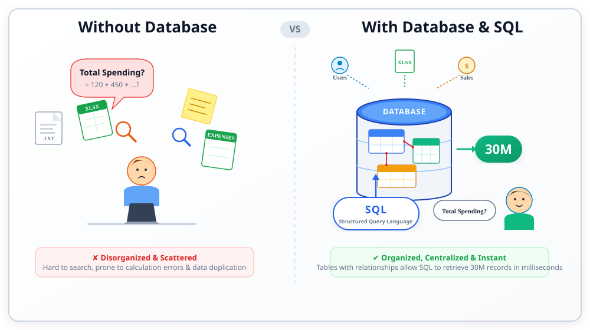

#### Simple Explanation of the Diagram:
1. **Left Side (Without a Database):**
   * Data is scattered across uncoordinated files like `.txt`, spreadsheets (`.xlsx`), and manual notes.
   * Asking a question like *"What is the total spending?"* requires manual, error-prone file searches across hundreds of documents.
2. **Right Side (With a Database & SQL):**
   * All records from disparate operational pipelines are organized inside a unified Database container.
   * Data is structured into relational tables connected by keys.
   * Users communicate inquiries through SQL (*Structured Query Language*).
   * The database engine calculates and returns the verified aggregate (e.g., **"30M"**) in milliseconds.

* **📌 आकृतीचे मराठीत स्पष्टीकरण:**
  * *डावी बाजू (डेटाबेस नसताना):* डेटा विविध फाइल्स, स्प्रेडशीट्स व नोट्समध्ये अस्ताव्यस्त विखुरलेला असतो. सोपा हिशोब विचारल्यासही शेकडो फाइल्स मॅन्युअली तपासाव्या लागतात, ज्यामुळे वेळ वाया जातो आणि चुका होतात.
  * *उजवी बाजू (डेटाबेस व SQL सोबत):* सर्व प्रकारचा डेटा एकाच सुरक्षित डेटाबेस नावाच्या कंटेनरमध्ये नीटनेटका साठवला जातो. युजर SQL भाषेत प्रश्न विचारतो आणि डेटाबेस एका सेकंदात अचूक उत्तर (उदा. "30M") देतो.

---

### 1.4 Topic 1 Summary (मराठी सारांश)

* **डेटाबेस म्हणजे काय?** डेटा साठवण्यासाठीचा एक कंटेनर (Container). संगणक प्रणालीद्वारे डेटा सुरक्षितपणे साठवणे (store), व्यवस्थापित करणे (manage) आणि वेगाने मिळवणे (retrieve) यासाठी व्यवस्थित मांडणी केलेला डेटा संग्रह.
* **डेटाबेस रचना (Database Structure):**
  1. *Schema:* डेटाबेसचा संपूर्ण आराखडा (Blueprint).
  2. *Tables:* डेटा रो (Rows) आणि कॉलम (Columns) स्वरूपात साठवणारे टेबल्स.
  3. *Columns:* डेटाचे विशिष्ट प्रकार/फील्ड्स (Data Types: Numbers, Text, Date).
  4. *Relationship:* टेबल्समधील परस्पर संबंध ($1:1, 1:N, N:M$).
  5. *Constraints (नियम):* डेटा अचूक राहण्यासाठीचे नियम (`PRIMARY KEY`, `FOREIGN KEY`, `NOT NULL`, `UNIQUE`, `CHECK`, `DEFAULT`).
* **फायदा:** विखुरलेल्या फाईल्सऐवजी डेटाबेसमुळे सर्व डेटा एका ठिकाणी व्यवस्थित राहतो आणि SQL मुळे अचूक माहिती सेकंदात मिळते.

---

## Topic 2: What is a DBMS (Database Management System)?

### 2.1 Definition & Meaning

* **Q. What is a DBMS (Database Management System)?**
  * *DBMS stands for Database Management System.*
  * *Definition: A DBMS is system software that manages, controls, and operates databases. It provides an interface allowing users and applications to create, retrieve, update, and manage data efficiently.*
  * *It provides systematic ways to store, retrieve, update, and organize data while maintaining security and consistency.*
  * It powers the core CRUD operations:
    * *Create:* Insert new records (`INSERT`)
    * *Read:* Search and retrieve records (`SELECT`)
    * *Update:* Modify existing records (`UPDATE`)
    * *Delete:* Remove obsolete records (`DELETE`)

---

### 2.2 Why Do We Need a DBMS?

* **Q. Why do we need a DBMS instead of accessing raw database storage directly?**
  * *A database by itself is passive physical storage; it cannot authenticate users, prioritize traffic, or enforce concurrency on its own.*
  * Real-world applications encounter simultaneous high-volume traffic from:
    1. Multiple Developers / Database Administrators (running scripts and administration tasks)
    2. Web & Mobile Applications (concurrent read/write requests from millions of users)
    3. BI & Reporting Tools like Power BI / Tableau (generating real-time analytical dashboards)
  * To handle concurrent requests, avoid system lockups, and protect data, an intelligent controller layer is mandatory: that layer is the DBMS.

---

### 2.3 Key Functions & Responsibilities

1. **Request Management & Traffic Routing:**
   * Coordinates, validates, and routes concurrent requests arriving from client applications.
2. **Priority Handling (Query Scheduling):**
   * Schedules query execution order to prevent resource starvation and deadlock conditions.
3. **Security Management & Access Control:**
   * Enforces role-based authorization and verifies whether incoming queries have permission to access requested data.
4. **Data Integrity & Concurrency Control:**
   * Uses lock mechanisms and transaction isolation so multiple concurrent updates never produce corrupted states.
5. **Backup & Disaster Recovery:**
   * Manages transaction write-ahead logs (`WAL`) enabling complete crash recovery after power or hardware failures.

---

### 2.4 Step-by-Step Query Execution Lifecycle in DBMS

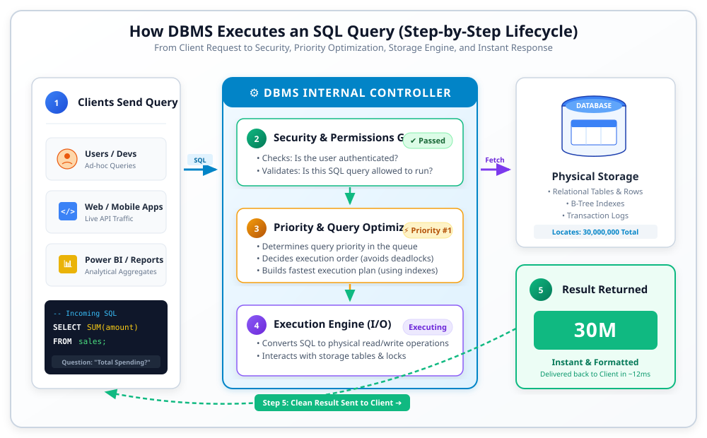

#### Detailed Step-by-Step Explanation of the Lifecycle:

1. **Step 1: Client Submits SQL Query**
   * Developers, client applications, and BI tools submit queries formatted in standard SQL (e.g., `SELECT SUM(amount) FROM sales;`).

2. **Step 2: DBMS Security & Authentication Check (Gatekeeper)**
   * Before parsing, the DBMS verifies:
     * *Is the user account authenticated?*
     * *Does the account hold permission to read or write the targeted tables?*
     * *Is the statement safe to process?*
   * Unauthorized requests are immediately blocked with an authentication error.

3. **Step 3: Query Priority & Optimization**
   * Approved queries enter the scheduler queue where the internal Query Optimizer devises the most efficient execution plan (evaluating B-tree indexes, join strategies, and cache hits).

4. **Step 4: Execution Engine (Storage I/O)**
   * The execution engine converts the SQL execution plan into low-level block I/O operations, acquires needed row/table locks, and accesses physical disk blocks.

5. **Step 5: Database Storage & Instant Result Delivery**
   * Matching records are retrieved from storage, formatted into tabular result sets, and returned to the client in milliseconds.

> **💡 मराठी मध्ये समजून घ्या (Lifecycle in Marathi):**
> 1. *क्लायंट विनंती (Client Request):* युजर किंवा अ‍ॅप SQL द्वारे प्रश्न पाठवतो (उदा. Total Spending?).
> 2. *सुरक्षा तपासणी (Security Gate):* युजर अधिकृत आहे का आणि त्याला डेटा पाहण्याची परवानगी आहे का हे DBMS तपासते.
> 3. *प्राधान्यक्रम आणि ऑप्टिमायझर (Priority & Optimizer):* अनेक विनंत्यांमधून कोणती क्वेरी आधी चालवायची आणि सर्वात कमी वेळेत उत्तर कसे मिळवायचे हे ठरवले जाते.
> 4. *एक्झिक्यूशन इंजिन (Execution Engine):* डेटाबेसच्या प्रत्यक्ष स्टोरेजमधून डेटा शोधून आणला जातो.
> 5. *निकाल (Result):* अचूक उत्तर तयार करून सेकंदात क्लायंटला परत पाठवले जाते.

---

### 2.5 The 4 Core Pillars (Quick Reference)

| Component | Role in the Ecosystem | Simple Analogy |
| :--- | :--- | :--- |
| 🗄️ Database | Stores Data | The physical storage locker / container |
| 🗣️ SQL | Speaks to Database | The standardized language used to communicate |
| ⚙️ DBMS | Manages Database | The intelligent manager / security controller |
| 🖥️ Server | Hosts Database Engine | The 24/7 operating computer host (Cloud / On-Premise) |

---

### 2.6 Popular Examples of DBMS / RDBMS

> **Note on RDBMS:** Modern enterprise DBMS solutions are typically *RDBMS* (*Relational Database Management Systems*) because they structure information into related tables.

* **MySQL:** The world's most widely deployed open-source RDBMS (ideal for web architectures with PHP, Python, Java, Node.js).
* **PostgreSQL / pgAdmin:**
  * *PostgreSQL:* Highly extensible, enterprise-grade open-source relational DBMS.
  * *pgAdmin:* The official graphical management console for interacting with PostgreSQL.
* **Oracle Database:** Industry-standard enterprise RDBMS optimized for massive financial systems and high-availability clusters.
* **Microsoft SQL Server (MS SQL):** Enterprise database suite integrated with the Microsoft ecosystem and .NET.

---

### 2.7 Visual Architecture: Server, Database, DBMS & Clients

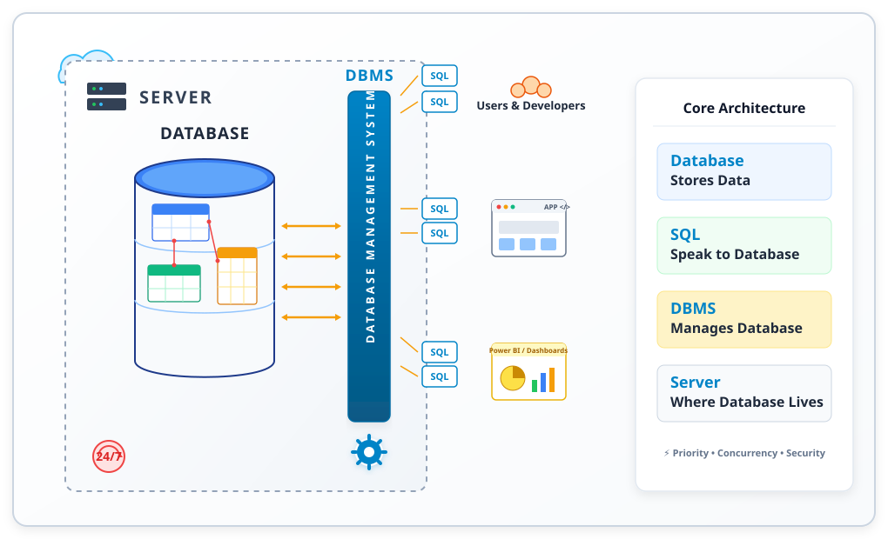

#### Simple Explanation of the Diagram:
1. **The Server (Host Environment):**
   * Continuous-uptime machine hosting database storage files and background services 24/7.
2. **The Database (Data Container):**
   * The storage container containing tables, rows, columns, and relationships.
3. **The DBMS (The Manager):**
   * The central software engine that mediates client connections, validates access permissions, schedules tasks, and accesses storage.
4. **Clients (Speaking via SQL):**
   * *Developers & DBAs:* Running administrative queries and migrations.
   * *Applications (App `</>`):* Web and mobile backend services processing user transactions.
   * *Analytics Tools (Power BI / Dashboards):* Running aggregate calculations for live executive reports.

* **📌 आकृतीचे मराठीत स्पष्टीकरण:**
  * *१. Server (सर्व्हर):* २४ तास चालू असणारे फिजिकल किंवा क्लाउड कॉम्प्युटर जिथे डेटाबेस प्रत्यक्ष राहतो.
  * *२. Database (डेटाबेस):* सर्व टेबल्स आणि डेटा साठवणारा मुख्य कंटेनर.
  * *३. DBMS (व्यवस्थापक सॉफ्टवेअर):* बाहेरील जग आणि डेटाबेस यांच्यातील सुरक्षा रक्षक व मॅनेजर.
  * *४. Clients (क्लायंट्स):* डेव्हलपर्स, ॲप्लिकेशन्स आणि ॲनालिटिक्स टूल्स जे SQL द्वारे DBMS कडे डेटा मागतात.

---

### 2.8 Topic 2 Summary (मराठी सारांश)

* **DBMS म्हणजे काय?**
  * *DBMS = Database Management System*. हे एक विशेष सॉफ्टवेअर आहे जे संपूर्ण डेटाबेसचे नियोजन व व्यवस्थापन करते.
  * हे युजर्सना डेटा तयार करणे (Create), वाचणे (Read), बदलणे (Update) आणि हटवणे (Delete) म्हणजेच CRUD ऑपरेशन्स करण्यास मदत करते.
* **DBMS ची गरज का असते?**
  * डेटाबेस हा केवळ डेटा साठवणारा कंटेनर असतो. एकाच वेळी हजारो युजर्स आणि ॲप्लिकेशन्सच्या विनंत्या सुरक्षितपणे हाताळण्यासाठी DBMS आवश्यक असतो.
  * *ट्रॅफिक व्यवस्थापन:* सर्व विनंत्या व्यवस्थित हाताळणे.
  * *प्राधान्यक्रम:* कोणती क्वेरी आधी चालवायची हे ठरवणे.
  * *सुरक्षा:* युजरला परवानगी आहे का हे तपासणे.
* **४ मुख्य खांब (Core Pillars):**
  1. *Database:* डेटा साठवतो.
  2. *SQL:* डेटाबेसशी बोलण्याची भाषा.
  3. *DBMS:* डेटाबेसचे व्यवस्थापन व सुरक्षा सांभाळणारे सॉफ्टवेअर.
  4. *Server:* जेथे डेटाबेस २४/७ सुरक्षितपणे चालू राहतो.
* **उदाहरणे:** MySQL, PostgreSQL (pgAdmin सह), Oracle, Microsoft SQL Server.

---

## Topic 3: What is SQL?

### 3.1 Definition & Core Meaning

* **Q. What is SQL?**
  * *SQL stands for: Structured Query Language (pronounced "Sequel" or "S-Q-L").*
  * *Definition: SQL is the standardized domain-specific language designed to manage, query, manipulate, and communicate with relational databases.*
  * *It serves as the universal language used to communicate inquiries to the database engine.*

---

### 3.2 Communicating with the Database Brain (Asking Questions)

* With SQL, developers and analysts express direct declarative queries to retrieve specific slices of business records.
* **Q. How do you query recent customer purchases in SQL?**
  * Business requirement: *"Show me all customers who completed purchases since last month."*
  * Query implementation:
    ```sql
    SELECT customer_id, first_name, last_name, email, purchase_date
    FROM customers
    WHERE purchase_date >= CURRENT_DATE - INTERVAL '1 month';
    ```

---

### 3.3 Accessing & Manipulating Data (CRUD Operations)

SQL provides complete data access and mutation capabilities through standard CRUD operations:

| CRUD Operation | Meaning | Primary SQL Command | Example Syntax & Usage |
| :--- | :--- | :--- | :--- |
| Create | Adding new data records | `INSERT` | `INSERT INTO customers (name, email) VALUES ('Rohan', 'rohan@example.com');` |
| Read | Searching & viewing records | `SELECT` | `SELECT * FROM customers WHERE id = 101;` |
| Update | Modifying existing records | `UPDATE` | `UPDATE customers SET email = 'new_email@example.com' WHERE id = 101;` |
| Delete | Removing unwanted records | `DELETE` | `DELETE FROM customers WHERE id = 101;` |

---

### 3.4 Real-World Applications & Use Cases of SQL

Beyond basic row lookup, SQL powers modern enterprise platforms across eight major domains:

1. **Data Integration:** Combining separate tables into unified analytical views using relational `JOIN` operations.
2. **Backup & Recovery:** Exporting database snapshots and recovering state after system failures.
3. **Big Data & Analytics:** Running aggregate analytics (`COUNT`, `SUM`, `AVG`, `GROUP BY`) to derive business metrics.
4. **Managing User Permissions:** Administering security using DCL statements (`GRANT`, `REVOKE`) to protect sensitive schemas.
5. **Creating Indexes:** Constructing B-tree indices (`CREATE INDEX`) to maintain sub-millisecond retrieval speeds across millions of records.
6. **Automating Workflows:** Writing Stored Procedures, Functions, and Triggers to automate repeating database logic.
7. **Generating Reports:** Feeding clean, structured tables directly to BI dashboards, spreadsheets, and reporting engines.
8. **Powering Real-Time Applications:** Facilitating transactional operations across e-commerce, banking, logistics, and social platforms.

---

### 3.5 In Short: The 4 Pillars Chain

```
[ 🗄️ Database ] ────────► [ 🗣️ SQL ] ────────► [ ⚙️ DBMS ] ────────► [ 🖥️ Server ]
(Container to             (Language to           (Software manager      (Physical/cloud host
 store data)               speak to DB)           for database)          running 24/7)
```

1. **Database:** The container that stores organized records.
2. **SQL:** The language used to speak to the database.
3. **DBMS:** The software manager that executes queries, optimizes performance, and enforces security.
4. **Server:** The machine environment where the database services execute 24/7.

---

### 3.6 Visual Concept: How SQL Speaks to the Database

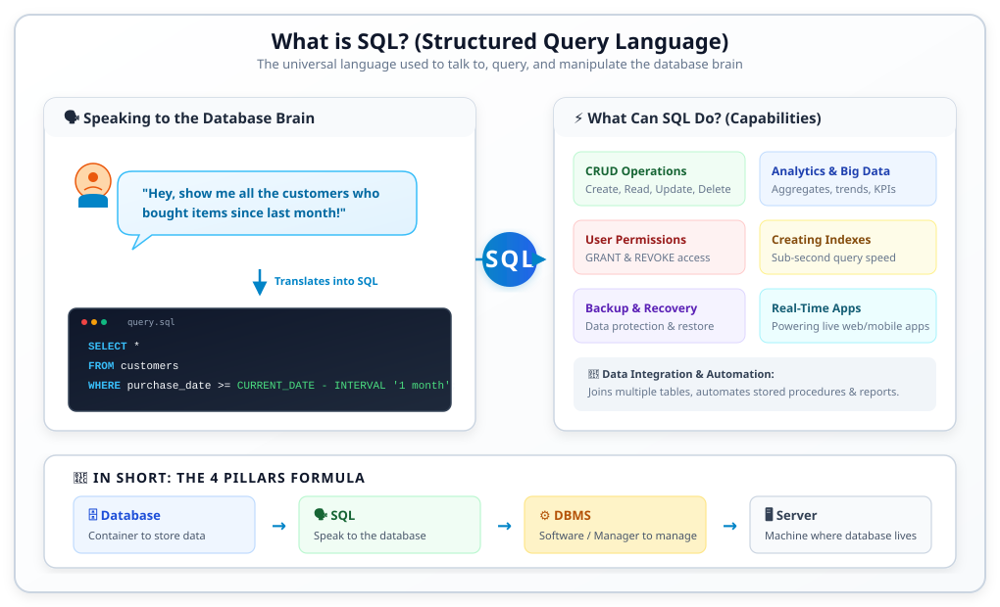

#### Simple Explanation of the Diagram:
1. **Left Panel (Speaking in SQL):**
   * A human-language request (*"Show me all customers who bought items since last month!"*) translates into standard SQL (`SELECT * FROM customers WHERE ...`).
2. **Right Panel (Capabilities):**
   * Highlights the core functional roles of SQL: CRUD operations, Analytics, Permissions/Security, Indexing, Backup/Recovery, and Real-Time application support.
3. **Bottom Chain:**
   * Summarizes the foundational ecosystem formula: Database (Container) $\rightarrow$ SQL (Language) $\rightarrow$ DBMS (Manager) $\rightarrow$ Server (Host Machine).

* **📌 आकृतीचे मराठीत स्पष्टीकरण:**
  * *डावा भाग (SQL संवाद):* युझरचा साधा प्रश्न SQL क्वेरीमध्ये (`SELECT ... WHERE ...`) रूपांतरित होऊन डेटाबेसकडे पाठवला जातो.
  * *उजवा भाग (SQL ची ताकद):* SQL च्या मुख्य क्षमता दाखवतो—CRUD ऑपरेशन्स, ॲनालिटिक्स, युझर सुरक्षा, इंडेक्सिंग आणि बॅकअप.
  * *खालची साखळी (४ खांब):* डेटाबेस (कंटेनर) $\rightarrow$ SQL (भाषा) $\rightarrow$ DBMS (व्यवस्थापक) $\rightarrow$ Server (मशीन).

---

### 3.7 Topic 3 Summary (मराठी सारांश)

* **SQL म्हणजे काय?**
  * *SQL = Structured Query Language*. ही डेटाबेसशी संवाद साधण्याची अधिकृत भाषा आहे.
  * डेटाबेस नावाच्या मोठ्या संगणक मेंदूशी सहजपणे बोलण्यासाठी SQL चा वापर केला जातो.
* **प्रश्न विचारणे (Querying):**
  * SQL द्वारे आपण डेटाबेसला व्यावसायिक प्रश्न विचारून अचूक माहिती मिळवू शकतो.
* **CRUD ऑपरेशन्स:**
  * *Create:* नवीन डेटा भरणे (`INSERT`)
  * *Read:* डेटा शोधणे व पाहणे (`SELECT`)
  * *Update:* जुना डेटा बदलणे (`UPDATE`)
  * *Delete:* नको असलेला डेटा हटवणे (`DELETE`)
* **SQL चे मुख्य उपयोग:** डेटा इंटिग्रेशन (Joins), सुरक्षित बॅकअप, ॲनालिटिक्स, युझर परवानग्या, इंडेक्सिंग आणि रिअल-टाइम ॲप्लिकेशन्स.
* **थोडक्यात ४ खांब (The 4 Pillars):**
  * *Database:* डेटा साठवणारा कंटेनर.
  * *SQL:* डेटाबेसशी बोलण्याची भाषा.
  * *DBMS:* डेटाबेसचे नियंत्रण व सुरक्षा सांभाळणारे सॉफ्टवेअर.
  * *Server:* जेथे डेटाबेस २४/७ सुरक्षितपणे चालतो.

---

## Topic 4: Main 2 Types of Databases (SQL vs NO-SQL)

### 4.1 Overview: SQL vs NO-SQL
There are **2 main types of databases**:
1. **SQL** (Relational Databases)
2. **NO-SQL** (Non-Relational Databases)

> **📌 Important Note:**
> * **Relational Database** is called **SQL**.
> * We group **Document**, **Graph**, **Column-based**, and **Key-value** databases together $\rightarrow$ all those databases are called **NO-SQL** databases.

---

### 4.1 Overview: SQL vs NO-SQL

* **Q. What are the two primary classifications of modern databases?**
  * *Modern database architectures are primarily classified into two main paradigms:*
    1. **SQL** *(Relational Databases)*
    2. **NO-SQL** *(Non-Relational Databases)*

| Dimension | SQL (Relational Databases) | NO-SQL (Non-Relational Databases) |
| :--- | :--- | :--- |
| Storage Paradigm | Tables with strictly typed columns and rows | Key-Value, Document, Columnar, or Graph models |
| Schema Design | Predefined, rigid, structured schema | Flexible, dynamic, schema-less architecture |
| Primary Query Tool | Standardized SQL language | Specialized document queries, APIs, or key lookups |
| Primary Strengths | ACID compliance, data integrity, complex relations | Rapid horizontal scalability, big data, rapid prototyping |
| Typical Examples | MySQL, PostgreSQL, Oracle, SQL Server | MongoDB, Redis, Cassandra, Neo4j |

> **📌 Important Note:**
> * *Relational Database* is commonly referred to as *SQL*.
> * We group *Document*, *Graph*, *Column-based*, and *Key-value* data stores together $\rightarrow$ all those database engines are classified as NO-SQL databases.

---

### 4.2 Relational Database (SQL)

* **Q. What is a Relational Database and how does it organize data?**
  * *Definition: A relational database is a database architecture that organizes structured data into two-dimensional tables consisting of rows and columns, with defined mathematical relationships connecting related tables.*
  * *How it works:*
    * It operates intuitively, similar to structured spreadsheets (Excel sheets).
    * Data entities are organized into *tables*, where each column represents an attribute and each row represents an individual record.
    * Data is held strictly in a *tabular format*.
    * Foreign keys establish explicit *relationships between tables* to reflect real-world connections without redundant data storage.
* **Popular Examples:**
  * MySQL
  * PostgreSQL
  * Microsoft SQL Server

---

### 4.3 NO-SQL Databases (Non-Relational Models)

Non-relational databases store and manage unstructured or semi-structured data using four primary architectural models:

#### 1. Key-Value Pair Database
* **Q. What is a Key-Value database and where is it used?**
  * *Definition: A Key-Value database is a non-relational storage system where every data item is stored as an associative array or dictionary mapping a unique key to an arbitrary value.*
  * *Think of it like an indexed dictionary:*
    * The word functions as the *Key*.
    * The explanation represents the *Value*.
  * Data is stored directly as Key ➔ Value pairs in object formats.
* **Popular Examples:**
  * Redis
  * Amazon DynamoDB

#### 2. Column-Based Database
* **Q. What is a Column-Based database and why is it used for Big Data?**
  * *Definition: A Column-Based (wide-column) database stores data tables by columns rather than by rows, optimizing analytical query speeds over massive distributed datasets.*
  * Engineered specifically to process and query billions of records in *Big Data* and data warehousing.
  * Columnar orientation allows the storage engine to read only relevant attributes during aggregations, minimizing disk I/O.
* **Popular Examples:**
  * Apache Cassandra
  * Amazon Redshift

#### 3. Graph Database
* **Q. What is a Graph database and what problems does it solve?**
  * *Definition: A Graph database is a NoSQL system that uses graph structures with nodes, edges, and properties to represent and query interconnected data.*
  * Focuses heavily on the *relationships between objects* (e.g., social follower networks, fraud detection graphs, recommendation engines).
* **Popular Example:**
  * Neo4j

#### 4. Document-Based Database
* **Q. What is a Document database?**
  * *Definition: A Document database stores semi-structured information as self-contained hierarchical documents (typically JSON, BSON, or XML).*
  * Rather than strictly normalizing attributes across multiple tables, all related details for an entity are embedded together in a single document.
* **Popular Example:**
  * MongoDB

---

### 4.4 Visual Concept: SQL vs NO-SQL Architecture

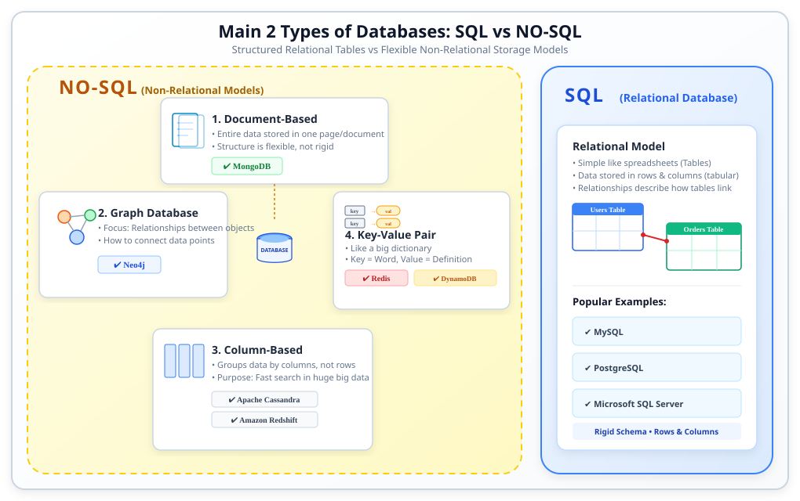

#### Simple Explanation of the Diagram:
1. **Right Side (SQL - Relational):**
   * Stored in structured tables with rows and columns (analogous to spreadsheets).
   * Tables maintain explicit relationships through primary and foreign keys.
   * *Examples:* Microsoft SQL Server, MySQL, PostgreSQL.
2. **Left Side (NO-SQL Cloud):**
   * Combines four specialized non-relational storage models:
     * *Document:* Packages all related entity data inside a single JSON document (*MongoDB*).
     * *Graph:* Maps interconnected data points focusing on network relationships (*Neo4j*).
     * *Column-Based:* Organizes storage by columns for rapid big data search queries (*Cassandra, Redshift*).
     * *Key-Value:* Associative dictionary model indexing pairs (*Redis, DynamoDB*).

* **📌 आकृतीचे मराठीत स्पष्टीकरण:**
  * *उजवी बाजू (SQL - Relational):* एक्सेलसारख्या टेबल्समध्ये रो आणि कॉलम्सच्या स्वरूपात डेटा ठेवला जातो आणि टेबल्समध्ये परस्पर संबंध (Keys) जोडलेले असतात (उदा. MySQL, PostgreSQL).
  * *डावी बाजू (NO-SQL - Non-Relational):* टेबल्स नसलेले ४ आधुनिक प्रकार—(१) *Document:* सर्व माहिती एकाच JSON पानात बसवणे (MongoDB), (२) *Graph:* नोड्स आणि संबंधांवर भर (Neo4j), (३) *Column-Based:* प्रचंड डेटा वेगाने शोधण्यासाठी कॉलम्समध्ये मांडणी (Cassandra), (४) *Key-Value:* शब्दकोशासारखी `Key ➔ Value` जोडी (Redis).

---

### 4.5 Topic 4 Summary (मराठी सारांश)

* **डेटाबेसचे २ मुख्य प्रकार:**
  1. *SQL (Relational Database)*
  2. *NO-SQL (Non-Relational Database)*

* **१. Relational Database (SQL):**
  * हे एक्सेल स्प्रेडशीटसारखे सोपे असते. याला टेबल (Table) म्हणतात, ज्यामध्ये *रो (Rows)* आणि *कॉलम (Columns)* असतात.
  * डेटा टेबल्समध्ये साठवला जातो आणि या टेबल्समध्ये एकमेकांशी *संबंध (Relationship)* जोडलेले असतात.
  * *उदाहरणे:* MySQL, PostgreSQL, Microsoft SQL Server.

* **२. NO-SQL Databases (४ मुख्य प्रकार):**
  * *Key-Value Pair Database:*
    * हा एका मोठ्या शब्दकोशासारखा (Dictionary) असतो. शब्द म्हणजे *Key* आणि त्याचा अर्थ म्हणजे *Value*.
    * *उदाहरणे:* Redis, Amazon DynamoDB.
  * *Column-Based Database:*
    * डेटा रोऐवजी कॉलम्समध्ये विभागला जातो. प्रचंड मोठ्या डेटावर (Big Data) वेगाने सर्चिंग करण्यासाठी याचा वापर होतो.
    * *उदाहरणे:* Apache Cassandra, Amazon Redshift.
  * *Graph Database:*
    * या डेटाबेसचा मुख्य भर डेटा पॉईंट्स एकमेकांना कसे जोडलेले आहेत (Relationships) यावर असतो.
    * *उदाहरणे:* Neo4j.
  * *Document-Based Database:*
    * सर्व माहिती एका संपूर्ण डॉक्युमेंटमध्ये (एकाच पानावर) साठवली जाते (JSON/BSON).
    * *उदाहरणे:* MongoDB.

* **लक्षात ठेवा:** Document, Graph, Column-based आणि Key-Value या सर्वांना मिळून NO-SQL म्हणतात; तर Relational डेटाबेसला SQL म्हणतात.

---

## Topic 5: Why SQL?

### 5.1 Standardized Way to Interact with Databases

* **Q. Why is SQL considered a standardized database language?**
  * *Universal Standard: SQL provides a standardized, ANSI/ISO certified language for communicating with relational database engines across all vendors (including MySQL, PostgreSQL, Oracle, and MS SQL Server).*
  * *Cross-Platform Compatibility:* Without SQL, every database vendor would require proprietary syntax, making multi-database engineering and developer onboarding difficult.

---

### 5.2 Efficient Data Retrieval

* Instead of scanning entire tables into client memory, SQL enables clients to extract only the exact slice of data required.
* Powered by precise filtering and grouping clauses:
  * `SELECT`: Specifies exact attributes to project.
  * `WHERE`: Filters records satisfying precise logical conditions (e.g., `WHERE age >= 18`).
  * `JOIN`: Relates and merges rows across multiple tables in a single operation.
  * `GROUP BY`: Aggregates records into consolidated summary figures.

---

### 5.3 Data Manipulation (CRUD Examples)

SQL facilitates complete transactional record mutation:

* **Insert new data:**
  ```sql
  INSERT INTO users (name, age) VALUES ('Vishal', 25);
  ```
* **Update existing data:**
  ```sql
  UPDATE users SET age = 26 WHERE name = 'Vishal';
  ```
* **Delete data:**
  ```sql
  DELETE FROM users WHERE age < 18;
  ```

---

### 5.4 Relationships Between Data

* Relational architectures separate entities cleanly across distinct tables (e.g., `Customers`, `Orders`, `Products`).
* SQL enables developers to define, enforce, and query relationships across these entities using keys (`PRIMARY KEY` and `FOREIGN KEY`), avoiding data duplication and anomalies.

---

### 5.5 Data Integrity and Security

* **Q. How does SQL enforce data integrity and database security?**
  * *SQL provides three robust architectural safeguards:*
    1. **Constraints:** Rules like `PRIMARY KEY`, `FOREIGN KEY`, `NOT NULL`, and `UNIQUE` reject malformed or duplicate data at the storage layer.
    2. **ACID Transactions:** Multi-query workflows (such as fund transfers) strictly *either fully complete or completely rollback* if an error occurs.
    3. **Access Control (Security):** System DBAs enforce access rights using declarative security statements (`GRANT SELECT`, `REVOKE DELETE`) per user role.

---

### 5.6 Scalability and Engine Optimization

* SQL engines process hundreds of millions of records with sub-second response times.
* They leverage B-Tree indexes, memory caching buffers, and internal execution planners.
* Custom application code written in high-level languages (Python, Java, C#) to filter and join millions of rows is far slower and less memory-efficient than native database engines.

---

### 5.7 The 3 Core Drivers: Talk to Data, High Demand, Industry Standard

```
              ┌──────────────────────────────────────────────┐
              │              WHY LEARN SQL?                  │
              └──────────────────────┬───────────────────────┘
                                     │
         ┌───────────────────────────┼───────────────────────────┐
         ▼                           ▼                           ▼
  [ 💬 TALK TO DATA ]      [ 🔥 HIGH DEMAND ]         [ 🌐 INDUSTRY STANDARD ]
  Standardized queries      Required for Devs,         Native support across
  to retrieve, insert,      Data Analysts, Data        Power BI, Tableau,
  update, & delete data.    Engineers, Scientists.     Spark, Kafka, Cloud.
```

1. **💬 TALK TO DATA:**
   * Universal communication bridge between users, client apps, and relational tables.
2. **🔥 HIGH DEMAND (Core Technical Competency):**
   * Foundational skill across key engineering and analytics professions:
     * *Software Developers:* Designing application backends, ORMs, and persistence layers.
     * *Data Analysts:* Extracting data to evaluate business trends and performance.
     * *Data Engineers:* Building ETL pipelines and cloud data warehouse architectures.
     * *Data Scientists:* Querying training and validation datasets for machine learning.
3. **🌐 INDUSTRY STANDARD (Broad Ecosystem Integration):**
   * Universally supported by analytics, streaming, and enterprise big data platforms:
     * *BI & Analytics:* Power BI, Tableau, Looker
     * *Streaming & Big Data:* Apache Spark, Apache Kafka
     * *Cloud Data Warehouses:* Snowflake, Google BigQuery, AWS Redshift

---

### 5.8 Visual Concept: Why SQL Mind-Map

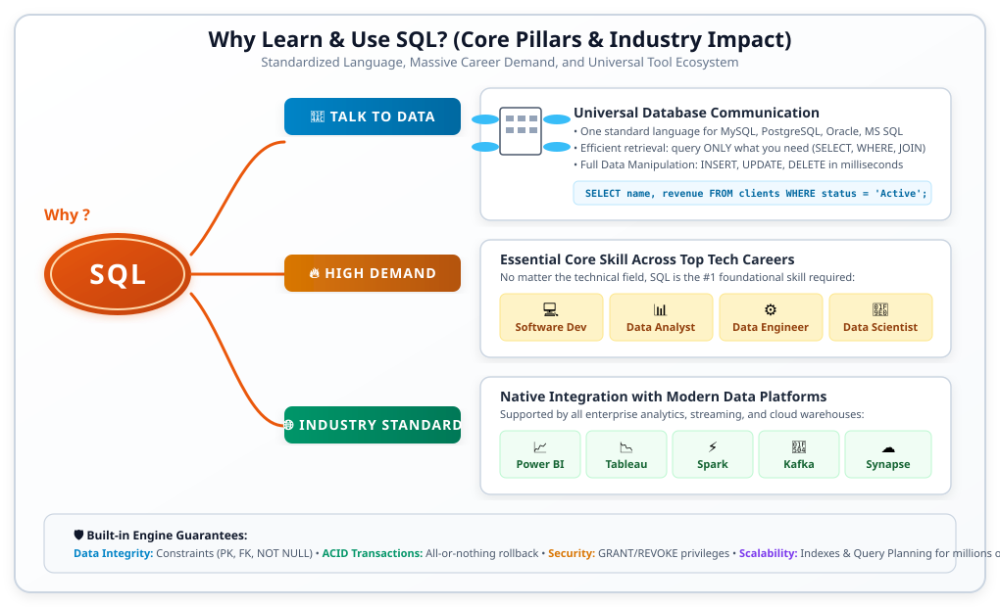

#### Simple Explanation of the Diagram:
* **The "Why SQL?" Core:** Branches out into three primary real-world drivers:
  1. *Talk to Data:* Standardized commands (`SELECT`, `INSERT`, `UPDATE`, `DELETE`) addressing enterprise datasets.
  2. *High Demand:* Core skill set for developers, analysts, engineers, and data scientists.
  3. *Industry Standard:* Native execution across Power BI, Tableau, Kafka, Spark, and cloud data warehouses.
* **Engine Guarantees (Bottom Banner):** Enforces data integrity through constraints, transactional reliability via rollback mechanisms, role permissions, and scalable performance over millions of records.

* **📌 आकृतीचे मराठीत स्पष्टीकरण:**
  * *मध्यवर्ती केंद्र (Why SQL?):* SQL का वापरावे याचे ३ प्रमुख आधार दाखवतो:
    1. *Talk to Data:* कोणत्याही डेटाबेसशी समान पद्धतीने संवाद साधणे.
    2. *High Demand:* डेव्हलपर्स, डेटा अनॅलिस्ट आणि डेटा सायंटिस्टसाठी सर्वाधिक मागणी असलेले कौशल्य.
    3. *Industry Standard:* Power BI, Tableau, Spark, Kafka आणि क्लाउड वेअरहाऊसमध्ये थेट चालणारी जागतिक भाषा.
  * *खालची पट्टी (इंजिनची सुरक्षा):* डेटाचे नियम (Constraints), व्यवहार सुरक्षितता (Rollback), आणि कोट्यवधी नोंदी जलद हाताळण्याची क्षमता.

---

### 5.9 Topic 5 Summary (मराठी सारांश)

* **SQL का वापरावे? (Why SQL):**
  1. *प्रमाणित भाषा (Standardized Way):* MySQL, PostgreSQL, Oracle, SQL Server अशा सर्व डेटाबेससाठी एकच समान भाषा आहे.
  2. *वेगाने आणि अचूक डेटा शोधणे (Efficient Data Retrieval):* `SELECT`, `WHERE`, `JOIN`, `GROUP BY` वापरून कोट्यवधी रेकॉर्ड्समधून हवा तेवढाच डेटा अचूक मिळवता येतो.
  3. *डेटा बदलणे (Data Manipulation):*
     * नवीन डेटा भरणे: `INSERT INTO users (name, age) VALUES ('Vishal', 25);`
     * जुना डेटा बदलणे: `UPDATE users SET age=26 WHERE name='Vishal';`
     * डेटा हटवणे: `DELETE FROM users WHERE age < 18;`
  4. *टेबल्समधील संबंध (Relationships):* Keys (Primary Key व Foreign Key) च्या मदतीने विविध टेबल्स एकमेकांशी अचूक जोडता येतात.
  5. *डेटा सुरक्षा आणि अचूकता (Integrity & Security):*
     * *Constraints:* चुकीचा डेटा येण्यापासून रोखतात.
     * *Transactions:* चूक झाल्यास व्यवहार त्वरित Rollback (पूर्ववत) करतात.
     * *Access Control:* युजर्सना हवे तेच अधिकार (`GRANT` / `REVOKE`) देऊन डेटा सुरक्षित ठेवतात.
  6. *प्रचंड डेटा हाताळण्याची क्षमता (Scalability & Optimization):* Indexes आणि Query Planners मुळे कोट्यवधी रेकॉर्ड्स जलद गतीने प्रोसेस होतात.
* **३ मुख्य चालक (The 3 Core Drivers):**
  * *Talk to Data:* डेटाबेसशी सहजपणे संवाद साधणे.
  * *High Demand:* Software Developers, Data Analysts, Data Engineers आणि Data Scientists या सर्वांसाठी अनिवार्य कौशल्य.
  * *Industry Standard:* Power BI, Tableau, Spark, Kafka आणि Azure Synapse या सर्व प्रमुख टूल्समध्ये SQL थेट चालते.

---

## Topic 6: Database Structure & Hierarchy

### 6.1 The Relational Database Hierarchy

* **Q. What is the Relational Database Hierarchy?**
  * *Definition: A database structure refers to the systemic architecture and multi-tier hierarchy through which data is organized, stored, and managed inside an enterprise database environment.*
  * Relational database systems organize data through a clean 4-tier hierarchy:

```
[ Tier 1: SERVER ] ──► [ Tier 2: DATABASES ] ──► [ Tier 3: SCHEMAS ] ──► [ Tier 4: OBJECTS / TABLES ]
```

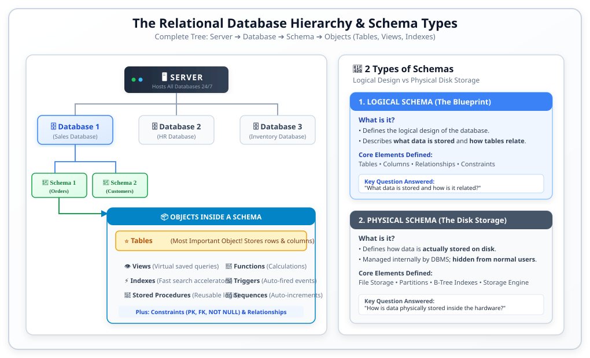

#### Point-Wise Breakdown of the Hierarchy:

1. **Level 1: Server (Host Machine Environment)**
   * A powerful physical computer or cloud instance running database server software.
   * Operates continuous 24/7 services to host, process, and secure one or multiple database engines.
   * Receives incoming connection requests, validates authentication, executes queries, and manages backups.

2. **Level 2: Databases (Isolated Storage Containers)**
   * Reside on the server as discrete, isolated data containers.
   * A single server instance can host multiple independent databases (e.g., `Sales_DB`, `HR_DB`, `Inventory_DB`).
   * Each database encapsulates related corporate data in an organized structure.

3. **Level 3: Schemas (Logical Categories & Namespaces)**
   * Logical subdivisions within a database that group related tables and objects together.
   * Prevents namespace collisions and organizes hundreds of enterprise tables into functional modules (e.g., `orders.*`, `customers.*`).

4. **Level 4: Database Objects (Functional Components)**
   * Every schema encapsulates specific operational database objects:
     * ⭐ *Tables:* The primary object; stores physical records in rows and columns.
     * 👁️ *Views:* Virtual tables compiled from saved `SELECT` queries.
     * ⚡ *Indexes:* Fast search structures (e.g., B-Trees) accelerating query lookups.
     * 📜 *Stored Procedures:* Precompiled batches of procedural SQL logic.
     * 🔧 *Functions:* Reusable subroutines returning calculated scalar or tabular values.
     * 🎯 *Triggers:* Automated callback routines triggered by table `INSERT`, `UPDATE`, or `DELETE` events.
     * 🔢 *Sequences:* Sequential number generators used for primary key counters.

---

### 6.2 The Starting Point: Server

* **Q. What is a Database Server?**
  * *Definition: A Database Server is a dedicated, high-performance physical computer or cloud virtual machine running database daemon software that manages storage, coordinates query execution, and enforces security.*
  * *Core Functions:*
    * Provides storage resources for multiple isolated database containers.
    * Mediates concurrent TCP/IP connections from application servers, developers, and analytics tools.
    * Parses, optimizes, and executes incoming queries via internal execution engines.
    * Manages user authorization, transport encryption, automated snapshots, and crash recovery.

---

### 6.3 The Container: Database

* **Q. What is a Database container?**
  * *Definition: A database is a structured collection of related data records that functions as an independent storage container inside a database server.*
  * *Core Functions:*
    * Holds business entities in a secured, structured, and queryable namespace.
    * Guarantees data isolation so different applications or business departments operate safely without cross-interference.
  * *Real-World Examples:*
    * `Employee Database` (personnel records, compensation, department assignments)
    * `Student Database` (enrollments, grades, academic transcripts)
    * `Hospital Database` (patient charts, clinician schedules, medical prescriptions)

---

### 6.4 The Logical Organizer: Schema

* **Q. What is a Schema and why are schemas essential in enterprise databases?**
  * *Definition: A database schema is a logical container and architectural blueprint that defines the structure, organization, and category boundaries of tables and database objects within a database.*
  * *Why do we need Schemas?*
    * In enterprise systems with hundreds of tables, placing all tables into a single flat list creates name conflicts and maintenance overhead.
    * Schemas introduce modular namespaces:
      * Cart, checkout, payment, and invoice tables $\rightarrow$ categorized under the orders schema.
      * Authentication, profiles, and billing addresses $\rightarrow$ categorized under the customers schema.

---

### 6.5 Types of Schemas (Logical vs. Physical)

Databases are designed in two complementary layers: **Logical** and **Physical**.

| Dimension | Logical Schema | Physical Schema |
| :--- | :--- | :--- |
| **Definition** | *Conceptual blueprint of data entities and business relations.* | *Technical blueprint of hardware-level byte and file layout.* |
| **Core Focus** | *What data is stored and how tables relate.* | *How data is physically laid out, indexed, and partitioned on disk.* |
| **Key Question** | *"What information is captured and how is it connected?"* | *"How are pages written to disk blocks, memory, and NVMe drives?"* |
| **Components** | Tables, column datatypes, relationships, constraints. | Filepaths, tablespace files (`.ibd`), partitions, B-tree block sizes. |
| **Primary Audience** | Developers, Data Analysts, Data Modelers. | Database Administrators (DBAs), Storage Engineers, DB Engines. |
| **Visibility** | Public to SQL queries and application layers. | Abstracted and hidden beneath storage engine drivers. |

#### 1. Logical Schema (The Conceptual Blueprint)
* *Definition: The Logical Schema describes the conceptual arrangement of tables, columns, relations, and business constraints without reference to physical storage media.*
* Governs entity rules: for example, specifying that every row in `Orders` must reference an existing `Customer_ID` in `Customers`.

#### 2. Physical Schema (The Hardware Storage Blueprint)
* *Definition: The Physical Schema specifies the internal disk configuration, file locations, block allocations, table partitions, and hardware indices used by the storage engine.*
* Governs storage architecture: for example, compressing archive tables from 2020 onto secondary SATA drives while hosting active 2026 data in high-speed NVMe flash storage.

---

### 6.6 The Core Object: Table, Columns, Rows & Cells

* **Q. What is a Table and what constitutes its anatomy?**
  * *Definition: A Table is a two-dimensional relational data structure that organizes information into vertical columns and horizontal rows.*

| Customer_ID | Customer_Name | City |
| :--- | :--- | :--- |
| 101 | Rahul | Pune |
| 102 | Priya | Mumbai |
| 103 | Amit | Nashik |

#### 1. Columns (Fields / Attributes)
* A column models a single attribute of an entity across all rows.
* Each column is bound to a single, strict *Data Type* (`INT`, `VARCHAR`, `DATE`, `DECIMAL`).
* Examples: `Customer_ID`, `Customer_Name`, `City`, `Age`.

#### 2. Rows (Records / Tuples)
* A row represents one distinct, complete record of an entity instance.
* Example: The horizontal record `[101 | Rahul | Pune]` constitutes one complete customer entity.

#### 3. Cell (Single Value)
* The intersection of a single row and column representing an atomic data value (e.g., `101` or `'Rahul'`).
* Every cell value must conform strictly to the column's defined datatype and constraints.

---

### 6.7 The Fingerprint: Primary Key

* **Q. What is a Primary Key and what are its 5 essential properties?**
  * *Definition: A Primary Key is a column (or composite set of columns) that uniquely and definitively identifies every distinct row record in a database table.*
  * *Analogous to a human fingerprint: No two records in the table can ever share the same Primary Key value.*

| Customer_ID (🔑 Primary Key) | Customer_Name | City |
| :--- | :--- | :--- |
| 101 | Rahul | Pune |
| 102 | Priya | Mumbai |

* **The 5 Core Properties of a Primary Key:**
  1. Unique: Every row must hold a distinct, non-duplicate key value.
  2. Cannot be NULL: Primary keys can never contain empty or missing values.
  3. Only ONE per Table: Each table is restricted to exactly one primary key definition.
  4. Instant Indexing: Backed by a clustered index for rapid row lookups.
  5. Referential Anchor: Serves as the referenced parent key for *Foreign Keys* in child tables.

---

### 6.8 MySQL Data Types In-Depth

*Definition: Data types specify the category of data that a column can legally store, the amount of physical memory it occupies, and the mathematical or logical operations that can be performed on it.*

---

#### 6.8.1 Memory Classification: Fixed Data Types vs. Variable Data Types

**Q. What are the two main types of data types based on memory allocation in MySQL?**

MySQL classifies data types into two fundamental storage models based on how memory is allocated on disk:

1. **Fixed Data Type (Fixed Storage Allocation):**
   * *Definition: Fixed data types take up a fixed, predetermined storage size in memory regardless of the actual length of the data inserted.*
   * They are best used when the size of data is known, uniform, and consistent across all rows.
   * If an inserted value is shorter than the defined length, MySQL automatically pads it with spaces to fill the entire allocated slot (e.g., in `CHAR(n)`).
   * **Key Examples:** `CHAR(n)`, `INT`, `BIGINT`, `FLOAT`, `DOUBLE`, `DECIMAL`.
   * **Performance Advantage:** Faster read and write operations because the storage engine can compute exact byte offsets in memory without inspecting row length headers.

2. **Variable Data Type (Dynamic Storage Allocation):**
   * *Definition: Variable data types allocate storage dynamically based strictly on the actual length of the inserted value, plus a small overhead byte to record the length.*
   * These types take storage based on the actual value length.
   * If a column allows up to 255 characters but only 5 characters are stored, it consumes only 5 bytes + 1 byte overhead.
   * **Key Examples:** `VARCHAR(n)`, `TEXT` (TINYTEXT, TEXT, MEDIUMTEXT, LONGTEXT), `BLOB`, `VARBINARY(n)`.
   * **Space Advantage:** Highly disk and memory-efficient when text lengths vary significantly across rows, preventing wasted space.

##### Comparison: Fixed vs. Variable Data Types

| Feature / Dimension | Fixed Data Types (e.g., `CHAR(10)`) | Variable Data Types (e.g., `VARCHAR(10)`) |
| :--- | :--- | :--- |
| **Storage Allocation** | Takes fixed, predetermined storage size in memory | Takes storage dynamically based on actual value length |
| **Space Utilization** | Can waste disk/RAM space if values are short (pads with spaces) | Highly space-efficient (stores actual length + 1-2 prefix bytes) |
| **Read / Write Speed** | Faster performance (static byte offset calculation in memory) | Slightly slower (engine must inspect length prefix byte first) |
| **Space Overhead** | 0 overhead bytes (exact allocated size is reserved) | 1 byte (for $L \le 255$) or 2 bytes (for $L > 255$) length header |
| **Space Padding** | Automatically padded with right-side spaces on disk | No space padding; stored exactly as entered |
| **Best Used When** | Length is fixed and predictable across all rows | Length varies significantly across different rows |
| **Primary Examples** | `CHAR(n)`, `INT`, `BIGINT`, `DECIMAL`, `FLOAT`, `DOUBLE` | `VARCHAR(n)`, `TEXT`, `BLOB`, `VARBINARY(n)` |

##### Practical Example to Understand Memory Storage (CHAR(10) vs. VARCHAR(10))

Suppose we create two columns: `code_fixed CHAR(10)` and `code_var VARCHAR(10)`, and store the same string values. Notice how MySQL stores them physically:

| Inserted String | Actual Length | `CHAR(10)` Physical Storage | Bytes Used (`CHAR(10)`) | `VARCHAR(10)` Physical Storage | Bytes Used (`VARCHAR(10)`) | Memory Saved by VARCHAR |
| :--- | :--- | :--- | :--- | :--- | :--- | :--- |
| `''` (Empty) | 0 chars | `'          '` (10 spaces) | **10 Bytes** | `[0]` (length prefix 0) | **1 Byte** | **90% Saved** (9 Bytes) |
| `'AB'` | 2 chars | `'AB        '` (2 chars + 8 spaces) | **10 Bytes** | `[2] + 'AB'` | **3 Bytes** (2 + 1) | **70% Saved** (7 Bytes) |
| `'Pune'` | 4 chars | `'Pune      '` (4 chars + 6 spaces) | **10 Bytes** | `[4] + 'Pune'` | **5 Bytes** (4 + 1) | **50% Saved** (5 Bytes) |
| `'India'` | 5 chars | `'India     '` (5 chars + 5 spaces) | **10 Bytes** | `[5] + 'India'` | **6 Bytes** (5 + 1) | **40% Saved** (4 Bytes) |
| `'0123456789'` | 10 chars | `'0123456789'` (no spaces) | **10 Bytes** | `[10] + '0123456789'` | **11 Bytes** (10 + 1) | -1 Byte (overhead) |

##### Visual Memory Layout Diagram

```text
Storing 'Pune' (4 characters) in a 10-character column:

CHAR(10) Memory Slot (Always 10 bytes):
+---+---+---+---+---+---+---+---+---+---+
| P | u | n | e |   |   |   |   |   |   |  -> Fixed 10 Bytes allocated
+---+---+---+---+---+---+---+---+---+---+
                 ^^^^^^^^^^^^^^^^^^^^^^
                 (6 padded space bytes wasted)

VARCHAR(10) Memory Slot (Dynamic 4 + 1 = 5 bytes):
+--------+---+---+---+---+
| Length | P | u | n | e |  -> Only 5 Bytes total on disk
|   04   |   |   |   |   |     (1 byte length prefix + 4 char bytes)
+--------+---+---+---+---+
```

##### Hands-On SQL Demonstration: Fixed vs Variable Storage

````sql
-- 1. Create demonstration table
CREATE TABLE storage_comparison (
    id INT AUTO_INCREMENT PRIMARY KEY,
    description VARCHAR(30),
    country_iso_fixed CHAR(10),     -- Fixed allocation
    country_name_var VARCHAR(10)    -- Dynamic allocation
);

-- 2. Insert sample rows with varying lengths
INSERT INTO storage_comparison (description, country_iso_fixed, country_name_var)
VALUES 
    ('Two characters', 'IN', 'IN'),
    ('Four characters', 'Pune', 'Pune'),
    ('Full ten characters', '0123456789', '0123456789');

-- 3. Query actual character length vs storage consumption
SELECT 
    description,
    country_iso_fixed,
    CHAR_LENGTH(country_iso_fixed) AS fixed_char_count,
    OCTET_LENGTH(country_iso_fixed) AS fixed_bytes_stored,
    country_name_var,
    CHAR_LENGTH(country_name_var) AS var_char_count,
    OCTET_LENGTH(country_name_var) AS var_bytes_stored
FROM storage_comparison;
````

> [!TIP]
> **Production Rule of Thumb:**
> * Use **Fixed Data Types (`CHAR`)** when values are guaranteed to be the exact same length in every single row — e.g., ISO Country Codes (`'IN'`, `'US'`), SHA-256 Hashes (always 64 characters), UUIDs (36 characters), Currency codes (`'INR'`, `'USD'`), or MD5 checksums.
> * Use **Variable Data Types (`VARCHAR`)** whenever data length varies — e.g., User names, email addresses, city names, URLs, and street addresses.

---

#### 6.8.2 Numeric Data Types

**Q. What are the primary Numeric Data Types in MySQL and their storage ranges?**

Numeric data types store numbers and are broadly divided into **Integers (Whole Numbers)** and **Fractional / Decimal / Floating-Point Numbers**.

##### 1. Integer Data Types (Whole Numbers)
*Stores whole numbers (no decimals).*

* **`TINYINT`:**
  - Storage Size: **1 Byte** (8 bits).
  - Signed Range: `-128` to `127`.
  - Unsigned Range: `0` to `255`.
  - Best for: Age, status codes, small quantities.

* **`SMALLINT`:**
  - Storage Size: **2 Bytes** (16 bits).
  - Signed Range: `-32,768` to `32,767`.
  - Unsigned Range: `0` to `65,535`.
  - Best for: Small inventory items, years.

* **`MEDIUMINT`:**
  - Storage Size: **3 Bytes** (24 bits).
  - Signed Range: `-8,388,608` to `8,388,607`.
  - Unsigned Range: `0` to `16,777,215`.

* **`INT` / `INTEGER`:**
  - Storage Size: **4 Bytes** (32 bits).
  - Stores whole numbers (no decimals).
  - Signed Range: `-2,147,483,648` to `2,147,483,647` (~2.14 Billion).
  - `UNSIGNED INT` Range: `0` to `4,294,967,295` (~4.29 Billion).
  - Best for: Standard table primary keys, employee IDs, customer numbers.

* **`BIGINT`:**
  - Storage Size: **8 Bytes** (64 bits).
  - Stores very large whole numbers.
  - Signed Range: `-9 quintillion` to `9 quintillion` (`-9,223,372,036,854,775,808` to `9,223,372,036,854,775,807`).
  - Best for: High-volume financial transactions, global e-commerce order tracking, social media view counts.

##### 2. Exact Numeric Data Type: `DECIMAL(p, s)`
* *Definition: DECIMAL stores exact numeric values (not approximate) with user-defined precision and scale.*
* Extra numeric value (like prices).
* **Parameters:**
  - `p` = **Precision**: Total number of significant digits (both before and after the decimal point). Maximum is 65.
  - `s` = **Scale**: Number of digits after the decimal point. Maximum is 30 ($s \le p$).
* **Core Characteristics:**
  - Stores exact numbers (not approximate).
  - Does not suffer from binary floating-point rounding inaccuracies.
  - **Best for: Money, financial accounting, banking balances, product prices.**
  - *Example:* `DECIMAL(10, 2)` stores numbers up to `99,999,999.99`.

##### 3. Approximate Numeric Data Types: `FLOAT` & `DOUBLE`
*Stores approximate decimal numbers (floating-point representation).*

* **`FLOAT`:**
  - Storage Size: **4 Bytes**.
  - Less precision (~7 decimal digits of precision).
  - Used for approximate decimal values.

* **`DOUBLE`:**
  - Storage Size: **8 Bytes**.
  - More precision (~15 decimal digits of precision).
  - Used for higher-accuracy scientific calculations.

* **Core Characteristics:**
  - Store approximate decimal numbers (floating point).
  - Used for scientific, engineering, graphics, and statistical calculations where mathematical execution speed is prioritized over exact penny-level accounting accuracy.

---

#### 6.8.3 String, Text, Binary & Specialized Data Types

**Q. What are the String, Text, Binary, and Category Data Types available in MySQL?**

##### 1. `CHAR(n)` (Fixed-Length String)
* *Definition: CHAR(n) is a fixed-length character string that always reserves and occupies exactly n characters of storage regardless of the actual string length inserted.*
* **Core Characteristics:**
  - **Fixed length string:** Pre-allocates memory for the full defined length.
  - **Storage:** Always uses full defined length. If the data is shorter than $n$, MySQL automatically pads it with spaces on the right upon storage.
  - **Performance:** Faster for fixed-length values because MySQL calculates exact byte memory offsets directly without inspecting length headers.
  - **Range:** Supports up to **255 characters** ($0 \le n \le 255$).
  - **Wastes Space:** Wastes disk and RAM space if the inserted data is shorter than the defined capacity.
  - **Best Use Cases:** Fixed-size data where length is identical across every row (e.g., Postal/ZIP codes, ISO Country codes `'IN'`, `'US'`, Currency codes `'USD'`, `'INR'`, MD5/SHA hashes, Phone extensions).

##### 2. `VARCHAR(n)` (Variable-Length String)
* *Definition: VARCHAR(n) is a variable-length character string that stores only the actual characters inserted plus 1 or 2 overhead bytes to record the string length.*
* **Core Characteristics:**
  - **Variable length string:** Dynamically allocates memory based strictly on the actual string length.
  - **Storage:** Uses only the number of characters actually stored + 1 byte (for $L \le 255$) or 2 bytes (for $L > 255$) for the length prefix.
  - **Performance:** Slightly slower for updates when length varies (since row fragmentation or shifting can occur).
  - **Range:** Supports up to **65,535 characters** (subject to the maximum row size limit of 65,535 bytes).
  - **Space Efficient:** Highly space-efficient; stores only the needed length without space padding.
  - **Best Use Cases:** Variable data where string length differs widely across rows (e.g., Customer names, email addresses, street addresses, descriptions, URLs).

##### Comparison: `CHAR` vs. `VARCHAR`

| Feature / Dimension | `CHAR(n)` | `VARCHAR(n)` |
| :--- | :--- | :--- |
| **String Length Type** | **Fixed-length** string | **Variable-length** string |
| **Storage Allocation** | Always uses full defined length (padded with spaces if shorter) | Uses only the actual characters stored + 1 or 2 length prefix bytes |
| **Performance** | **Faster** for fixed-length values (predictable byte offsets) | **Slightly slower** for dynamic updates (variable row sizes) |
| **Maximum Range** | Up to **255 characters** | Up to **65,535 characters** (shared across row) |
| **Space Utilization** | **Wastes space** if data is shorter than $n$ | **Highly efficient** (allocates only needed space) |
| **Trailing Spaces** | Padded with spaces on storage; stripped when retrieved | Preserves trailing spaces exactly as entered |
| **Primary Use Cases** | Fixed-size data: Postal codes, Country codes (`'IN'`, `'US'`), Hashes | Variable-size data: User names, Email addresses, Passwords, URLs |

##### 3. `TEXT` Family (Long Text Strings)
*Stores long text strings exceeding standard column limits:*
* **`TINYTEXT`:** Stores up to **255 characters** (256 Bytes).
* **`TEXT`:** Stores up to **65,535 characters** (~64 KB).
* **`MEDIUMTEXT`:** Stores up to **16,777,215 characters** (~16 MB).
* **`LONGTEXT`:** Stores up to **4,294,967,295 characters** (~4 GB).
* **Best for:** Blog articles, product descriptions, customer feedback, HTML/XML content.

##### 4. `BLOB` (Binary Large Object)
* *Definition: BLOB (Binary Large Object) is designed to store raw binary data rather than text strings.*
* Stores binary data (images, files, PDFs, audio clips, compiled code).
* **Variants:** `TINYBLOB`, `BLOB`, `MEDIUMBLOB`, `LONGBLOB`.
* **Difference from TEXT:** Unlike `TEXT`, it is intended for raw binary files and has no character set or collation.

##### 5. `BIT` & `BINARY(n)`
* **`BINARY(n)`:** Fixed-length binary string.
* **`VARBINARY(n)`:** Variable-length binary string.
* **`BIT(m)`:** Stores bit values from 1 to 64 bits.
  - Stored in format 0 and 1.
  - By default, bit values are 0 (i.e., false).

##### 6. `BOOLEAN` / `BOOL`
* *Definition: In MySQL and relational databases, BOOLEAN is an alias for TINYINT(1).*
* Some databases use a `BIT` data type; in MySQL, it stores in 0 and 1 format:
  - `0` means FALSE.
  - `1` means TRUE.
* By default, boolean bit values are zero (i.e., false).

##### 7. `ENUM('val1', 'val2', ...)`
* *Definition: ENUM is a string data type that allows you to store ONE value from a predefined list of permitted values.*
* Useful when a column should accept only specific values (like gender, status, etc.) — kind of like a controlled vocabulary.
* Useful for fixed categories.
* *Example:* `status ENUM('active', 'inactive', 'pending')`. Rejects any value not in the list.

##### 8. `SET('val1', 'val2', ...)`
* *Definition: The SET data type is similar to ENUM, but instead of storing only one value, it can store MULTIPLE values (a combination) from a predefined list.*
* Stores multiple values from a predefined list.
* Each row can contain any combination of permitted values separated by commas.
* *Example:* `hobbies SET('Reading', 'Sports', 'Coding', 'Music')`. A row can store `'Reading,Coding'`.

---

#### 6.8.4 Date and Time (Temporal) Data Types

**Q. What are the Temporal (Date and Time) Data Types in MySQL?**

It is also known as the **temporal data type** family.

* **Default Date Format:** By default, MySQL stores date in **`YYYY-MM-DD`** format.
* **Memory Allocation:** **3 bytes** of memory allocated for a single date.
* **Supported Range for Date:** `1000-01-01` to `9999-12-31`.

##### 1. `DATE`
* Stores **date only** (`YYYY-MM-DD`).
* Storage: **3 Bytes**.
* Range: `1000-01-01` to `9999-12-31`.
* *Example:* `'2026-09-21'`.

##### 2. `TIME`
* Stores **time only** (`HH:MM:SS`).
* Storage: **3 Bytes** of memory occupied by a single time value.
* Covers 24 hours, 60 minutes, 60 seconds.
* Range: `-838:59:59` to `838:59:59` (supports elapsed intervals over multiple days).
* *Example:* `'15:45:30'`.

##### 3. `YEAR`
* Stores **year in 4 digits** (`YYYY`).
* Storage: **1 Byte**.
* Range: `1901` to `2155`.

##### 4. `DATETIME`
* Stores **both date and time** in format: **`YYYY-MM-DD HH:MM:SS`**.
* Storage: Takes **5 to 8 bytes** of memory to store date and time (8 bytes originally, 5 bytes in MySQL 5.6+).
* Range: `1000-01-01 00:00:00` to `9999-12-31 23:59:59` (covers years 1000 to 9999).
* **Key Characteristics:**
  - Does not update automatically.
  - Without timezone conversion.
  - Useful when you need an absolute timestamp (same everywhere).
  - `DATETIME` doesn't change with the server time zone.
  - It stores the exact value as inserted.

##### 5. `TIMESTAMP`
* Stores **both date and time** in format: **`YYYY-MM-DD HH:MM:SS`**.
* Storage: **4 Bytes** (compact storage).
* Range: `1970-01-01 00:00:01 UTC` to `2038-01-19 03:14:07 UTC` (based on 32-bit UNIX epoch time, i.e., 1970 to 2038).
* **Key Characteristics:**
  - Auto-updates when row changes (if defined: `DEFAULT CURRENT_TIMESTAMP ON UPDATE CURRENT_TIMESTAMP`).
  - Stores date and time, but it is **timezone-sensitive**.
  - MySQL automatically converts `TIMESTAMP` values from the current time zone to **UTC** for storage, and back to the session time zone when retrieved.

---

#### 6.8.5 What is UTC (Coordinated Universal Time) & Why Does It Matter?

**Q. What is UTC?**
* *Definition: UTC (Coordinated Universal Time) is the global time standard used to coordinate clocks around the world.*
* It is the base reference time zone — all other time zones are defined as offsets from UTC.
* **UTC = World's "neutral" time.**
* It does not change with location or daylight savings.
* Every local time zone is expressed as:
  $$\text{Local Time} = \text{UTC} \pm \text{offset}$$
  *(For example: IST = $\text{UTC} + 5:30$)*.

* **In MySQL (TIMESTAMP and UTC):**
  - MySQL internally stores `TIMESTAMP` values in **UTC**, then:
    1. Converts to your session time zone when you read them.
    2. Converts back to UTC when you insert them.

**Q. Why Does UTC Matter?**
1. **Keeps timestamps consistent across servers:** In multi-region deployments, servers across different continents all log events consistently.
2. **Prevents confusion between time zones:** Eliminates time-shifting bugs caused by regional Daylight Saving Time changes.
3. **Useful for global applications, scheduling, and logging:** Ensures events are sequentially ordered worldwide.
4. **Clean display to end-users:** You can always convert UTC $\rightarrow$ Local time when displaying records to users in their localized interface.

---

#### 6.8.6 Differences Between DATETIME and TIMESTAMP

**Q. What is the difference between DATETIME and TIMESTAMP?**

| Feature / Dimension | `DATETIME` | `TIMESTAMP` |
| :--- | :--- | :--- |
| **1. Display Format** | `YYYY-MM-DD HH:MM:SS` | `YYYY-MM-DD HH:MM:SS` |
| **2. Storage Size** | **8 Bytes** (MySQL 5.6+: 5B + fractional) | **4 Bytes** (more compact) |
| **3. Supported Range** | `1000-01-01 00:00:00` to `9999-12-31 23:59:59` (Years 1000 $\rightarrow$ 9999) | `1970-01-01 00:00:01 UTC` to `2038-01-19 03:14:07 UTC` (Years 1970 $\rightarrow$ 2038) |
| **4. Time Zone Handling** | **Does NOT store time zone information.** Stores exactly what you insert; no conversion. `DATETIME` doesn't change with server time zone. | **Timezone-sensitive.** Stored in UTC internally, but converted to current session time zone when retrieved. |
| **5. Auto-Update Capability** | Cannot automatically update itself. You must explicitly set values with `DEFAULT` or `ON UPDATE`. | **Can automatically update:** Set current time on insert (`DEFAULT CURRENT_TIMESTAMP`) and update on modification (`ON UPDATE CURRENT_TIMESTAMP`). |
| **6. Epoch Dependency** | Independent of UNIX Epoch | Bound to **UNIX Epoch** (Seconds elapsed since Jan 1, 1970 UTC) |
| **7. Best Use Cases** | When you need to store date & time exactly as given, independent of time zones.<br>*Examples:* Birthdays, historical events, scheduled appointment times. | When you need to track events relative to the current time zone.<br>*Examples:* Logging creation/update times (`created_at`, `updated_at`), audit trails. |

##### Point-Wise Detailed Breakdown:

1. **`DATETIME` Details:**
   - Stores both date and time in the format: `YYYY-MM-DD HH:MM:SS`.
   - Storage size: 8 bytes (or 5 bytes in modern MySQL).
   - Range: `1000-01-01 00:00:00` $\rightarrow$ `9999-12-31 23:59:59` (i.e. 1000 $\rightarrow$ 9999).
   - Does not store time zone information. Stores exactly what you insert, no conversion.
   - Cannot automatically update itself. You must explicitly set values with `DEFAULT` or `ON UPDATE`.
   - When you need to store a date & time exactly as given, independent of time zones.
   - *Example:* Birthdays, historical events, schedule times.

2. **`TIMESTAMP` Details:**
   - Stores both date and time in the same format: `YYYY-MM-DD HH:MM:SS`.
   - Storage size: 4 bytes (more compact).
   - Range: `1970-01-01 00:00:01 UTC` $\rightarrow$ `2038-01-19 03:14:07 UTC` (because it is based on UNIX epoch time, i.e., 1970 $\rightarrow$ 2038).
   - Stored in UTC internally, but converted to the current time zone when retrieved.
   - Useful for tracking system-wide events.
   - Can automatically:
     - Set current time on insert (`DEFAULT CURRENT_TIMESTAMP`)
     - Update to current time on update (`ON UPDATE CURRENT_TIMESTAMP`)
   - When you need to track events relative to the current time zone.
   - *Example:* Logging creation/update times, audit trails.

---

#### 6.8.7 Practical Code Examples for Data Types

```sql
-- Production Example: Utilizing Diverse MySQL Data Types
CREATE TABLE customer_profiles (
    -- Integer Types:
    customer_id INT UNSIGNED PRIMARY KEY AUTO_INCREMENT,
    reward_points BIGINT DEFAULT 0,
    age TINYINT UNSIGNED,
    
    -- Exact Numeric for Currency:
    account_balance DECIMAL(10, 2) DEFAULT 0.00,
    
    -- Approximate Floating Point for Geolocation:
    latitude FLOAT(10, 6),
    longitude FLOAT(10, 6),
    
    -- Fixed String vs Variable String:
    country_code CHAR(2) NOT NULL,            -- Always 2 characters (e.g. 'IN', 'US')
    full_name VARCHAR(100) NOT NULL,           -- Dynamic length
    email VARCHAR(150) UNIQUE NOT NULL,
    
    -- Large Text:
    bio TEXT,
    
    -- Boolean Flag (TINYINT(1)):
    is_verified BOOLEAN DEFAULT FALSE,
    
    -- Category Types (ENUM & SET):
    gender ENUM('Male', 'Female', 'Other'),
    interests SET('Sports', 'Tech', 'Music', 'Travel', 'Art'),
    
    -- Temporal Types (DATETIME vs TIMESTAMP):
    date_of_birth DATE NOT NULL,              -- Date only: YYYY-MM-DD
    login_time TIME,                          -- Time only: HH:MM:SS
    birth_timestamp DATETIME,                 -- Exact literal birth time (no timezone conversion)
    created_at TIMESTAMP DEFAULT CURRENT_TIMESTAMP, -- UTC converted auto-timestamp
    updated_at TIMESTAMP DEFAULT CURRENT_TIMESTAMP ON UPDATE CURRENT_TIMESTAMP
);
```

---

### 6.8.8 Special Data Types: JSON In-Depth

* **Q. What is the JSON Data Type in MySQL and How Does It Function?**
  * *Definition: JSON (JavaScript Object Notation) is a lightweight, human-readable data-interchange format designed to store and transmit structured semi-structured data.*
  * *Capability: MySQL's native `JSON` data type allows you to store entire JSON documents (single object, multiple objects, or arrays) directly inside a table column with automatic schema validation.*
  * *Format & Structure: In JSON format, data is stored in key-value pairs, arrays, and objects. The keys are always strings (enclosed in double quotes), and values can be of any JSON-supported type (string, number, boolean, array, object, or null).*
  * *Internal Storage Mechanism: Internally, MySQL stores JSON documents in an optimized binary format rather than as plain text. This binary format enables fast lookup of sub-elements, keys, or array indexes without needing to parse the entire text document.*
  * *Validation: MySQL automatically validates any document inserted into a `JSON` column and raises an error if the document is not valid JSON syntax.*

* **Path Traversal Syntax & The `$` Root Symbol:**
  * *The `$` symbol represents the root (starting point) of the JSON document.*
  * `$` : Root JSON $\rightarrow$ Represents the entire JSON document/object.
  * `$.key` : Specific field $\rightarrow$ Field named "key" inside the root object (e.g., `$.age` returns the age value).
  * `$.object.key` : Nested key $\rightarrow$ Accesses a nested property inside an object (e.g., `$.address.city` accesses "city" inside "address").
  * `$.array[index]` : Array element $\rightarrow$ Accesses an element by zero-based index position (e.g., `$.skills[0]` retrieves the first element of the "skills" array).

* **JSON Extraction Operators (`->` vs. `->>`):**
  * MySQL provides two convenient inline operators for extracting values from JSON documents:

| Operator | Extraction Syntax | Output Type | Description & Purpose | Example | Result |
| :--- | :--- | :--- | :--- | :--- | :--- |
| `->` | `column->'path'` | JSON Value (**with quotes**) | Extracts the data as a JSON value preserving double quotes. Use `->` when you need to treat the result as JSON for further JSON manipulation. | `details->'$.age'` | `"25"` |
| `->>` | `column->>'path'` | Plain Text (**unquoted**) | Inline unquoting path operator. Extracts the value as clean, unquoted plain text. Use `->>` when comparing in `WHERE` clauses or displaying in UI. | `details->>'$.age'` | `25` |

* **Core MySQL Built-in JSON Functions:**
  * `JSON_EXTRACT(json_doc, path[, path] ...)`: Extracts values from a JSON document at the specified path(s).
  * `JSON_SET(json_doc, path, val[, path, val] ...)`: Inserts or updates values in a JSON document (updates existing keys or appends new keys).
  * `JSON_ARRAY([val[, val] ...])`: Creates a valid JSON array from an argument list of values.
  * `JSON_OBJECT([key, val[, key, val] ...])`: Creates a valid JSON object from alternating key-value pairs.

* **Step-by-Step Practical SQL Implementation:**

```sql
-- 1. Create a table with a native JSON column:
CREATE TABLE users (
 id INT AUTO_INCREMENT PRIMARY KEY,
 name VARCHAR(100),
 details JSON
);

-- 2. Inserting data with structured JSON documents:
INSERT INTO users (name, details) VALUES
('Alice', '{"age": 25, "email": "alice@example.com", "skills": ["SQL", "Python", "JavaScript"]}'),
('Bob', '{"age": 30, "email": "bob@example.com", "skills": ["Java", "C++"], "isAdmin": true}');

-- 3. Extract individual fields using JSON_EXTRACT():
SELECT 
  NAME,
  JSON_EXTRACT(DETAILS, '$.FIRSTNAME') AS FirstName,
  JSON_EXTRACT(DETAILS, '$.AGE') AS Age,
  JSON_EXTRACT(DETAILS, '$.ADDREDD') AS Address
FROM USER;

-- 4. Use ->> operator to extract plain text (without quotes):
SELECT NAME, DETAILS ->> '$.AGE' AS USERAGE FROM USER;

-- 5. Use -> operator to get JSON value (with quotes):
-- GET THE JSON VALUE WITH QUOTES
SELECT NAME, DETAILS -> '$.AGE' AS ISADMIN FROM USER;

-- 6. Extract nested array values (0-indexed):
-- EXTRACT NESTED ARRAY VALUE 
SELECT DETAILS->>'$.skills[0]' AS FIRST FROM USER WHERE ID = 2;
-- $ -> root, skills -> array name, [0] -> first element in the array

-- 7. Filter rows based on JSON content in the WHERE clause:
SELECT NAME, 
       DETAILS  
FROM USER 
WHERE JSON_EXTRACT(DETAILS, '$.isAdmin') = TRUE;

-- 8. Update a JSON field (Modify existing key):
UPDATE USER
SET DETAILS = JSON_SET(DETAILS, '$.ADDREDD', 'MUMBAI')
WHERE NAME = 'VISHAL';

-- 9. Add a new JSON key into an existing document:
UPDATE USER
SET DETAILS = JSON_SET(DETAILS, '$.PHONE', '123456789')
WHERE ID = 1;

-- 10. Update or Add key using JSON_SET():
UPDATE USER
SET DETAILS = JSON_SET(DETAILS, '$.MOBILENUMBER', '9988999889')
WHERE ID = 1;

SELECT * FROM USER;

-- 11. Extract nested properties of an object:
-- GET NESTED PROPERTIES 
SELECT NAME, DETAILS, JSON_EXTRACT(DETAILS, '$.address.city') AS USERCITY FROM USER WHERE ID = 2;

-- 12. Create a JSON Array on the fly:
SELECT JSON_ARRAY('SQL', 'Node.js', 'Python') AS skills;

-- 13. Create a JSON Object on the fly:
SELECT JSON_OBJECT('name', 'Vishal', 'age', 25, 'city', 'Pune') AS user_details;

-- 14. Advanced JSON Manipulation: Create a new JSON Array inside details:
-- Use JSON_ARRAY() along with JSON_SET()
UPDATE users
SET details = JSON_SET(details, '$.skills', JSON_ARRAY('SQL', 'Node.js', 'Python'))
WHERE name = 'Vishal';

-- 15. Advanced JSON Manipulation: Add a new nested object inside existing JSON:
-- Use JSON_OBJECT() to create a nested object
UPDATE users
SET details = JSON_SET(
  details,
  '$.address',
  JSON_OBJECT('street', 'MG Road', 'city', 'Pune', 'zip', '411001')
)
WHERE name = 'Vishal';

-- 16. Advanced JSON Manipulation: Create an object inside an existing object (Deep Nesting):
-- Specify deeper nested paths like $.address.geo
UPDATE users
SET details = JSON_SET(
  details,
  '$.address.geo',
  JSON_OBJECT('lat', 18.5204, 'lng', 73.8567)
)
WHERE name = 'Vishal';
```

* **Summary Checklist for MySQL JSON Operations:**
  * `$` : Root of the JSON document.
  * `$.key` : Specific field in root object.
  * `$.object.key` : Nested field inside an object.
  * `$.array[index]` : Specific element from an array.
  * `->` : Shortcut for `JSON_EXTRACT()` returning quoted JSON value.
  * `->>` : Shortcut for `JSON_UNQUOTE(JSON_EXTRACT())` returning clean plain text.
  * `JSON_EXTRACT()` : Extracts values from JSON data paths.
  * `JSON_SET()` : Inserts or updates key-value pairs in a JSON document.
  * `JSON_ARRAY()` : Creates a JSON array from given values.
  * `JSON_OBJECT()` : Creates a JSON object from key-value pairs.

---

### 6.8.9 Special Data Types: GEOMETRY Types for GIS / Spatial Data In-Depth

* **Q. What are MySQL Spatial / GIS Data Types and How Are They Used?**
  * *Definition: Spatial and geometric data types are specialized data types designed to store geographical locations, shapes, coordinates, and spatial boundaries in MySQL.*
  * *Standards: MySQL follows OpenGIS (Open Geospatial Consortium - OGC) standards to store, query, and perform geometric analysis on geographical information.*
  * *Primary Use Cases:*
    * Mapping applications (Google Maps, GIS portals, GPS telemetry).
    * Real-time location tracking (latitude/longitude coordinates of users or delivery fleets).
    * Geofencing, restricted zones, and delivery service coverage boundaries.
    * Spatial calculations (distance between locations, area of regions, point-in-polygon checks).

* **The 8 OpenGIS Spatial Data Types in MySQL:**

| Data Type | Structural Category | Geometric Representation | Primary Real-World Use Case |
| :--- | :--- | :--- | :--- |
| `GEOMETRY` | Generic Spatial | Any geometric shape (`POINT`, `LINESTRING`, `POLYGON`). | Flexible column capable of holding any spatial geometry per row. |
| `POINT` | Single Coordinate | Single 2D coordinate pair $(x, y)$ (longitude, latitude). | User coordinates, GPS device locations, store/branch coordinates. |
| `LINESTRING` | Connected Points | Series of connected coordinate points representing a line. | Roads, delivery routes, rivers, railway tracks, flight paths. |
| `POLYGON` | Closed Area | Closed boundary where the last coordinate connects to the first. | City limits, delivery coverage zones, lakes, property plots. |
| `MULTIPOINT` | Multi-Geometry | Collection of multiple separate `POINT` objects. | Multiple branch locations of a company, multiple check-in points. |
| `MULTILINESTRING` | Multi-Geometry | Collection of multiple separate `LINESTRING` objects. | Road networks, subway transit systems, highway networks. |
| `MULTIPOLYGON` | Multi-Geometry | Collection of multiple separate `POLYGON` objects. | Country territories with archipelagos/islands, multi-district zones. |
| `GEOMETRYCOLLECTION` | Mixed Collection | Collection containing mixed geometry types (`POINT` + `LINE` + `POLYGON`). | Mixed complex geographic zones (e.g., city with points, routes, and parks). |

* **In-Depth Breakdown of Each Geometry Type with Code Examples:**

#### 1. GEOMETRY (Any Geometric Object)
* *Definition: A generic spatial data type that can store any spatial object (`POINT`, `LINESTRING`, or `POLYGON`).*
* *Use Case: When a single column needs the flexibility to store varying geometry types across different records.*

```sql
-- CREATE TABLE WITH GEOMETRY DATA TYPE 
CREATE TABLE GEO_OBJECTS(
  ID INT AUTO_INCREMENT PRIMARY KEY,
  NAME VARCHAR(50),
  SHAP GEOMETRY
);

-- Insert a Point into GEOMETRY column:
INSERT INTO geo_objects (name, SHAP)
VALUES ('Store Location', ST_GeomFromText('POINT(72.8777 19.0760)'));

SELECT * FROM GEO_OBJECTS;
```

#### 2. POINT (Single Coordinate $(x, y)$)
* *Definition: Represents a single location in 2D space with $x$ (longitude) and $y$ (latitude) coordinates.*
* *Use Case: Track user/device live location, store physical address coordinates, pin landmarks and points of interest.*

```sql
-- CREATE TABLE TO STORE THE LOCATION OF USER
CREATE TABLE USER_LOCATION(
  ID INT AUTO_INCREMENT PRIMARY KEY,
  NAME VARCHAR(50),
  LOCATION POINT
);

-- INSERT DATA INTO USER LOCATION TABLE USING POINT GEOMETRY TYPE
INSERT INTO USER_LOCATION(NAME, LOCATION) 
VALUES('VISHAL', ST_GeomFromText('POINT(72.8777 19.0760)'));

-- Convert binary geometry to readable WKT text:
SELECT NAME, ST_AsText(location) AS location_text FROM USER_LOCATION;
```

#### 3. LINESTRING (Connected Path / Route)
* *Definition: A series of two or more connected coordinate points forming a continuous path.*
* *Use Case: Model roads, rivers, walking paths, delivery vehicle routes, and transit tracks.*

```sql
-- CREATE TABLE WITH LINESTRING
CREATE TABLE road(
  id INT AUTO_INCREMENT PRIMARY KEY,
  road_name VARCHAR(50),
  road_path LINESTRING
);

-- INSERT LINESTRING DATA INTO THE TABLE 
INSERT INTO road (road_name, road_path) 
VALUES ('pune_nashik_hiway', ST_GeomFromText('LINESTRING(77.59 12.97, 77.60 12.98, 77.62 12.99)'));

SELECT road_name, ST_AsText(road_path) FROM road;
```

#### 4. POLYGON (Closed Area / Boundary)
* *Definition: A closed surface shape formed by connecting multiple points where the last point connects back to the first point.*
* *Use Case: Define city municipal boundaries, restricted zones, delivery service radiuses, lakes, parks, and agricultural plots.*

```sql
-- CREATE TABLE WITH POLYGON 
CREATE TABLE REAGION(
  ID INT AUTO_INCREMENT PRIMARY KEY,
  REGION_NAME VARCHAR(50),
  REAGION POLYGON
);

-- INSERT POLYGON DATA 
INSERT INTO REAGION(REGION_NAME, REAGION)
VALUES('KASARSAI_DAM', ST_GEOMFROMTEXT('POLYGON((77.58 12.97, 77.60 12.97, 77.60 12.99, 77.58 12.99, 77.58 12.97))'));

SELECT * FROM REAGION;
```

#### 5. MULTIPOINT (Collection of Multiple Points)
* *Definition: A collection of multiple individual `POINT` geometries stored in a single record.*
* *Use Case: Store all branches, stores, or user check-in points within a single corporate zone.*

```sql
-- CREATE TABLE FOR MULTIPOINT 
CREATE TABLE MULTIPOINT(
  ID INT AUTO_INCREMENT PRIMARY KEY,
  NAME VARCHAR(50),
  LOCATION MULTIPOINT
);

-- INSERT MULTIPOINT DATA 
INSERT INTO MULTIPOINT (NAME, LOCATION) 
VALUES('PUNE-ZONE', ST_GEOMFROMTEXT('MULTIPOINT((77.59 12.97), (77.61 12.98), (77.63 12.99))'));

SELECT * FROM MULTIPOINT;
```

#### 6. MULTILINESTRING (Collection of Multiple Lines)
* *Definition: A collection of multiple `LINESTRING` objects grouped together in a single record.*
* *Use Case: Represent a full network of roads, train transit networks, or delivery flight paths.*

```sql
CREATE TABLE MULTLILINESTRINGDATA(
  ID INT AUTO_INCREMENT PRIMARY KEY,
  NETWORK_NAME VARCHAR(50),
  PATHS MULTILINESTRING
);

-- INSERT MULTILINE DATA 
INSERT INTO MULTLILINESTRINGDATA (NETWORK_NAME, PATHS) 
VALUES ('D-MART', ST_GEOMFROMTEXT('MULTILINESTRING((77.58 12.97, 77.60 12.98), (77.61 12.99, 77.63 13.00))'));

SELECT * FROM MULTLILINESTRINGDATA;
```

#### 7. MULTIPOLYGON (Collection of Multiple Closed Polygons)
* *Definition: A collection of multiple separate `POLYGON` closed areas grouped into a single spatial entity.*
* *Use Case: Represent non-contiguous land territories, archipelagos/islands, multi-district sales zones.*

```sql
-- CREATE TABLE MULTIPOLYGON 
CREATE TABLE MULTIPOLYGONDATA(
  ID INT AUTO_INCREMENT PRIMARY KEY, 
  NAME VARCHAR(50),
  AREAS MULTIPOLYGON
);

-- INSERT MULTIPOLYGON DATA INTO TABLE
INSERT INTO MULTIPOLYGONDATA (NAME, AREAS)
VALUES('District Zones', ST_GeomFromText('MULTIPOLYGON(((77.58 12.97, 77.60 12.97, 77.60 12.99, 77.58 12.99, 77.58 12.97)), ((77.62 13.00, 77.64 13.00, 77.64 13.02, 77.62 13.02, 77.62 13.00)))'));

SELECT * FROM MULTIPOLYGONDATA;
```

#### 8. GEOMETRYCOLLECTION (Mixed Collection of Geometries)
* *Definition: A collection container capable of storing any arbitrary combination of geometry types (`POINT`, `LINESTRING`, and `POLYGON`) within a single record.*
* *Use Case: Storing comprehensive city maps that incorporate points of interest, transit lines, and zone polygons simultaneously.*

```sql
CREATE TABLE geo_collection (
  id INT AUTO_INCREMENT PRIMARY KEY,
  name VARCHAR(50),
  geo_data GEOMETRYCOLLECTION
);

INSERT INTO geo_collection (name, geo_data)
VALUES ('City Example', ST_GeomFromText(
  'GEOMETRYCOLLECTION(
     POINT(77.59 12.97),
     LINESTRING(77.59 12.97, 77.61 12.98),
     POLYGON((77.62 13.00, 77.64 13.00, 77.64 13.02, 77.62 13.02, 77.62 13.00))
   )'
));
```

---

#### Detailed Comparison: `GEOMETRY` vs. `GEOMETRYCOLLECTION`

* **High-Level Analogy:**
  * `GEOMETRY` = A flexible container that can hold **one single item** of any geometry type (a single Point, a single Line, or a single Polygon).
  * `GEOMETRYCOLLECTION` = A comprehensive container that holds **multiple items** together in one record (Points + Lines + Polygons combined).

| Feature / Aspect | `GEOMETRY` Type | `GEOMETRYCOLLECTION` Type |
| :--- | :--- | :--- |
| **Storage Capacity** | Stores **only one** geometry object at a time per row. | Stores **multiple** geometry objects in a single record. |
| **Object Variation** | The type can vary across rows (Row 1 = Point, Row 2 = Polygon). | Can contain a heterogeneous mix of Points, Lines, and Polygons simultaneously. |
| **Shape Complexity** | Models **simple shapes** (individual point or single polygon). | Models **complex compound shapes** (entire city layout). |
| **Use Case** | When you want column flexibility without knowing the specific type ahead of time. | When multiple geometric elements make up a single logical geographic entity. |
| **WKT Syntax Example** | `'POINT(77.59 12.97)'` or `'POLYGON((...))'` | `'GEOMETRYCOLLECTION(POINT(...), LINESTRING(...), POLYGON(...))'` |

* **Code Demonstration: `GEOMETRY` vs `GEOMETRYCOLLECTION`:**

```sql
-- A. GEOMETRY: Storing one simple shape per row
CREATE TABLE geo_examples (
  id INT AUTO_INCREMENT PRIMARY KEY,
  name VARCHAR(50),
  shape GEOMETRY
);

-- Store a single point:
INSERT INTO geo_examples (name, shape)
VALUES ('Restaurant', ST_GeomFromText('POINT(77.59 12.97)'));

-- Store a single polygon:
INSERT INTO geo_examples (name, shape)
VALUES ('Park', ST_GeomFromText('POLYGON((77.58 12.96, 77.60 12.96, 77.60 12.98, 77.58 12.98, 77.58 12.96))'));

-- B. GEOMETRYCOLLECTION: Storing multiple combined shapes together
CREATE TABLE city_shapes (
  id INT AUTO_INCREMENT PRIMARY KEY,
  city_name VARCHAR(50),
  objects GEOMETRYCOLLECTION
);

-- Store multiple shapes together in one record:
INSERT INTO city_shapes (city_name, objects)
VALUES ('ExampleCity', ST_GeomFromText(
  'GEOMETRYCOLLECTION(
     POINT(77.59 12.97),
     LINESTRING(77.58 12.96, 77.61 12.99),
     POLYGON((77.62 13.00, 77.64 13.00, 77.64 13.02, 77.62 13.02, 77.62 13.00))
   )'
));
```

---

#### Special Spatial Functions in MySQL

* **1. `ST_GeomFromText('WKT')`:**
  * *Purpose: Creates a binary geometry object from Well-Known Text (WKT) string representation.*

```sql
CREATE TABLE locations (
    id INT AUTO_INCREMENT PRIMARY KEY,
    name VARCHAR(50),
    geom GEOMETRY
);

-- Insert a POINT using WKT:
INSERT INTO locations (name, geom)
VALUES ('User A', ST_GeomFromText('POINT(77.5946 12.9716)'));

-- Insert a POLYGON using WKT:
INSERT INTO locations (name, geom)
VALUES ('Park Area', ST_GeomFromText(
    'POLYGON((77.58 12.97, 77.60 12.97, 77.60 12.99, 77.58 12.99, 77.58 12.97))'
));
```

* **2. `ST_AsText(geometry)`:**
  * *Purpose: Converts internal binary geometry data back into human-readable WKT string format.*

```sql
SELECT name, ST_AsText(geom) AS geom_text
FROM locations;
```

* **3. `ST_Distance(geometry1, geometry2)`:**
  * *Purpose: Calculates the distance between two geometry objects.*
  * *Note: MySQL calculates planar (Euclidean) distance, not geodetic (Earth curved surface) distance.*

```sql
-- Create two points:
SET @p1 = ST_GeomFromText('POINT(77.5946 12.9716)'); -- Bangalore
SET @p2 = ST_GeomFromText('POINT(77.6090 12.9721)'); -- Nearby location

-- Calculate distance:
SELECT ST_Distance(@p1, @p2) AS distance;
```

* **4. `ST_Within(geometry_a, geometry_b)`:**
  * *Purpose: Checks whether geometry `a` is completely located inside geometry `b` (e.g. Point inside a Polygon). Returns `1` (true) or `0` (false).*

```sql
-- Create a point and a polygon:
SET @point = ST_GeomFromText('POINT(77.59 12.98)');
SET @polygon = ST_GeomFromText('POLYGON((77.58 12.97, 77.60 12.97, 77.60 12.99, 77.58 12.99, 77.58 12.97))');

-- Check if point is within polygon:
SELECT ST_Within(@point, @polygon) AS is_within;
```

* **5. `ST_Contains(geometry_a, geometry_b)`:**
  * *Purpose: Checks whether geometry `a` contains geometry `b` (e.g. Polygon contains a Point). Returns `1` (true) or `0` (false).*

```sql
-- Check if polygon contains point:
SELECT ST_Contains(@polygon, @point) AS contains;
```

---

### 6.8.10 Quick Overview: JSON & Spatial GEOMETRY (Methods & Properties Master Cheat Sheet)

* **Q. What is the Quick Reference for MySQL JSON and Spatial GEOMETRY Data Types?**
  * *Definition: This master cheat sheet provides a rapid lookup for all paths, shortcut operators, built-in functions, spatial types, and geometric analysis methods supported in MySQL 8.0+.*

#### Part 1: JSON Data Type — Quick Reference & Methods Matrix


##### 1. JSON Path Traversal Properties
| Path Expression | Target Element | Description & Behavior | Example |
| :--- | :--- | :--- | :--- |
| `$` | Document Root | The entire JSON document / top-level object or array. | `SELECT data->'$' FROM t;` |
| `$.key` | Direct Object Key | Extracts the value of property `key` from the root object. | `data->>'$.age'` |
| `$.parent.child` | Nested Property | Traverses inside object `parent` to retrieve `child`. | `data->>'$.address.city'` |
| `$.array[i]` | Array Element | Retrieves element at 0-based index `i`. | `data->>'$.skills[0]'` |
| `$.array[*]` | Array Wildcard | Returns all elements of the array. | `JSON_EXTRACT(data, '$.skills[*]')` |
| `$.*` | Object Wildcard | Returns the values of all direct keys in the object. | `JSON_EXTRACT(data, '$.*')` |

##### 2. JSON Extraction Operators Matrix
| Operator | Name | Syntax | Return Format | Best Used For |
| :--- | :--- | :--- | :--- | :--- |
| `->` | Arrow Operator | `column->'path'` | JSON-formatted value (**with double quotes**) | Further JSON functions, preserving JSON typing |
| `->>` | Inline Unquote Operator | `column->>'path'` | Clean unquoted plain string (**without quotes**) | Displaying in UI, filtering in `WHERE`, joining |

##### 3. Complete MySQL JSON Built-in Methods
| Method / Function | Signature / Parameters | Purpose & Description | Practical SQL Example |
| :--- | :--- | :--- | :--- |
| `JSON_EXTRACT()` | `(doc, path[, path]...)` | Extracts data from a JSON document at specified path(s). | `JSON_EXTRACT(details, '$.email')` |
| `JSON_SET()` | `(doc, path, val[, path, val]...)` | Updates existing keys or adds new keys if absent. | `JSON_SET(details, '$.active', true)` |
| `JSON_INSERT()` | `(doc, path, val[, path, val]...)` | Adds new key-value pair **only** if the key does not exist. | `JSON_INSERT(details, '$.role', 'Admin')` |
| `JSON_REPLACE()` | `(doc, path, val[, path, val]...)` | Overwrites value **only** if the key already exists. | `JSON_REPLACE(details, '$.age', 31)` |
| `JSON_REMOVE()` | `(doc, path[, path]...)` | Deletes a key, property, or array element from the JSON. | `JSON_REMOVE(details, '$.skills[1]')` |
| `JSON_ARRAY()` | `([val1, val2, ...])` | Creates a JSON array on the fly from arguments. | `JSON_ARRAY('Java', 'Python', 'SQL')` |
| `JSON_OBJECT()` | `([k1, v1, k2, v2, ...])` | Creates a JSON object on the fly from key-value pairs. | `JSON_OBJECT('city', 'Pune', 'zip', 411001)` |
| `JSON_CONTAINS()` | `(target, candidate[, path])` | Checks if JSON document contains a specific value (returns 1 or 0). | `JSON_CONTAINS(details, '"SQL"', '$.skills')` |
| `JSON_SEARCH()` | `(doc, 'one'\|'all', search_str)` | Searches for a string within a document and returns its path. | `JSON_SEARCH(details, 'one', 'Python')` |
| `JSON_TYPE()` | `(json_val)` | Returns the data type string (`OBJECT`, `ARRAY`, `INTEGER`, etc.). | `JSON_TYPE(JSON_EXTRACT(details, '$.age'))` |
| `JSON_VALID()` | `(val)` | Validates whether a string has valid JSON syntax (returns 1 or 0). | `JSON_VALID('{"valid": true}')` |

---

#### Part 2: Spatial GEOMETRY Types — Quick Reference & Methods Matrix


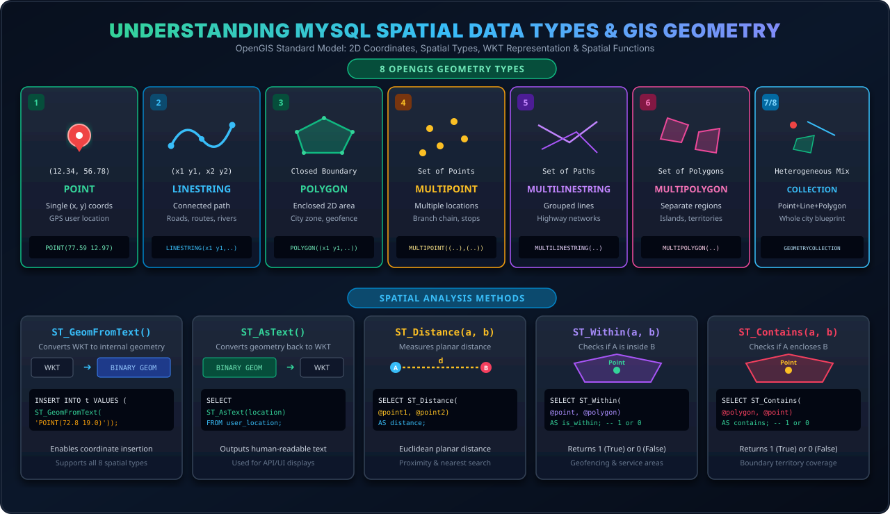

##### 1. The 8 OpenGIS Spatial Data Types Matrix
| Spatial Type | Structural Geometry | Dimension | Real-World Application | WKT Syntax Pattern |
| :--- | :--- | :--- | :--- | :--- |
| `POINT` | Single 2D coordinate $(x, y)$ | 0D (Point) | GPS user locations, pin drop, branch coordinates | `POINT(77.59 12.97)` |
| `LINESTRING` | Connected series of points | 1D (Length) | Roads, delivery routes, rivers, railways, flight corridors | `LINESTRING(x1 y1, x2 y2, ...)` |
| `POLYGON` | Closed area (first = last point) | 2D (Area) | Delivery geofencing zones, lakes, city boundaries, plots | `POLYGON((x1 y1, x2 y2, ..., x1 y1))` |
| `MULTIPOINT` | Multiple distinct points | 0D Set | Multiple store branches, delivery drop points | `MULTIPOINT((x1 y1), (x2 y2))` |
| `MULTILINESTRING` | Multiple distinct line paths | 1D Set | Highway networks, subway train lines, multi-segment routes | `MULTILINESTRING((...), (...))` |
| `MULTIPOLYGON` | Multiple closed polygon zones | 2D Set | Archipelagos/islands, multi-district sales territories | `MULTIPOLYGON(((...)), ((...)))` |
| `GEOMETRYCOLLECTION` | Mixed heterogeneous collection | Mixed | Complex city models (Points + Lines + Polygons combined) | `GEOMETRYCOLLECTION(POINT(...), ...)` |
| `GEOMETRY` | Polymorphic spatial column | Any | Column that can store any single geometric object per row | Holds any single geometry object |

##### 2. Complete MySQL Spatial Analysis Methods (`ST_` Functions)
| Function Name | Input Signature | Output Type | Description & Analysis Role | Practical SQL Example |
| :--- | :--- | :--- | :--- | :--- |
| `ST_GeomFromText()` | `(wkt_string[, srid])` | Geometry Object | Converts Well-Known Text (WKT) string to internal binary geometry. | `ST_GeomFromText('POINT(72.87 19.07)')` |
| `ST_AsText()` | `(geometry_obj)` | WKT String | Converts internal binary geometry back into human-readable text. | `SELECT ST_AsText(location) FROM user_location;` |
| `ST_Distance()` | `(geom1, geom2)` | Double | Computes planar Euclidean distance between two geometries. | `ST_Distance(point1, point2)` |
| `ST_Within()` | `(geom_a, geom_b)` | Boolean (0 or 1) | Checks if geometry `A` is completely inside geometry `B`. | `ST_Within(user_point, zone_polygon)` |
| `ST_Contains()` | `(geom_a, geom_b)` | Boolean (0 or 1) | Checks if geometry `A` completely surrounds/encloses geometry `B`. | `ST_Contains(zone_polygon, user_point)` |
| `ST_Area()` | `(polygon_obj)` | Double | Calculates total surface area of a closed Polygon or MultiPolygon. | `ST_Area(region)` |
| `ST_Length()` | `(linestring_obj)` | Double | Calculates the total length of a LineString or MultiLineString. | `ST_Length(road_path)` |
| `ST_Buffer()` | `(geom, distance)` | Polygon Object | Generates a polygon buffer zone of radius $d$ around a geometry. | `ST_Buffer(store_point, 5000)` |
| `ST_Intersects()` | `(geom1, geom2)` | Boolean (0 or 1) | Returns 1 if any part of `geom1` touches or overlaps `geom2`. | `ST_Intersects(route_line, flood_zone)` |

---

### 6.9 Visual Architectural Diagrams for Data Types & Hierarchy

#### Diagram 1: Comprehensive MySQL Data Types Architecture
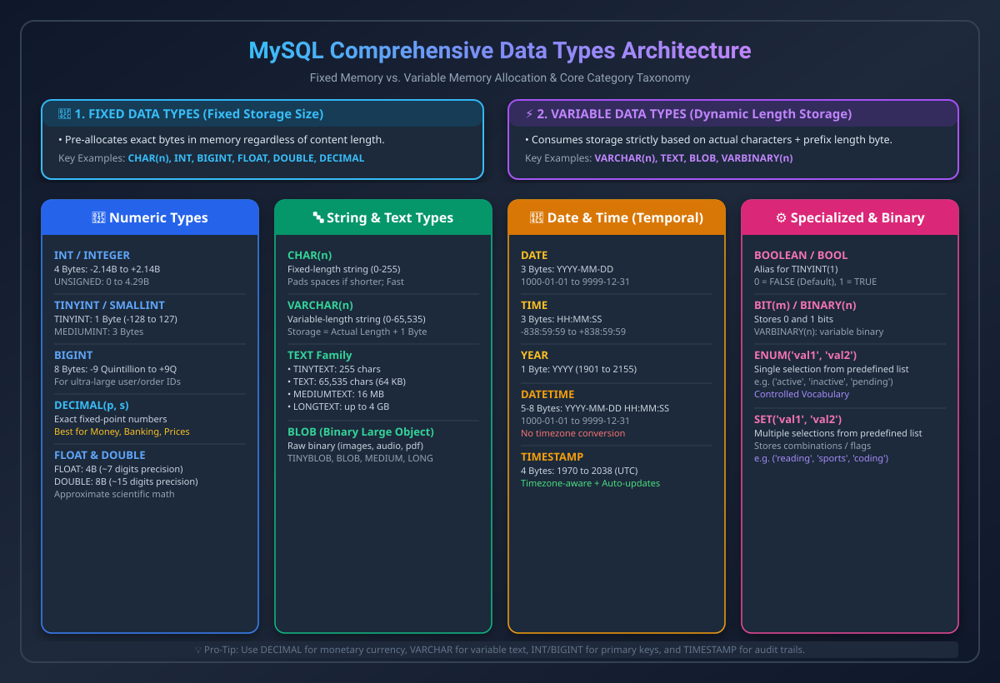

* **Architecture & Flow Explanation (आकृतीचे सविस्तर स्पष्टीकरण):**
  * **Top Section (Memory Strategy):** Highlights the architectural difference between **Fixed Data Types** (pre-allocating memory bytes) and **Variable Data Types** (dynamically allocating based on string length + prefix byte).
  * **4 Main Taxonomy Cards:**
    1. **Numeric Types:** Explains `INT` (4B), `TINYINT` (1B), `BIGINT` (8B), exact arithmetic `DECIMAL(p,s)` for money, and `FLOAT`/`DOUBLE` for science.
    2. **String & Text Types:** Details `CHAR(n)` (fixed padding) vs `VARCHAR(n)` (dynamic), `TEXT` scaling (up to 4GB), and `BLOB` for binary assets.
    3. **Date & Time (Temporal):** Illustrates `DATE`, `TIME`, `YEAR`, `DATETIME` (independent), and `TIMESTAMP` (UTC-aware).
    4. **Specialized Types:** Outlines `BOOLEAN` (0/1), `BIT`, single-category `ENUM`, and multi-category `SET`.

* **📌 आकृतीचे मराठीत स्पष्टीकरण:**
  * **वरचा भाग (मेमरी वाटप):** फिक्स्ड (Fixed) आणि व्हेरिएबल (Variable) मेमरीमधील फरक स्पष्ट करतो.
  * **४ मुख्य स्तंभ:** न्यूमरिक (पूर्णांक व दशांश), स्ट्रिंग (अक्षरे व टेक्स्ट), तारीख व वेळ (Temporal), आणि विशिष्ट प्रकार (Boolean, Enum, Set) यांची संपूर्ण रचना दर्शवतो.

---

#### Diagram 2: DATETIME vs. TIMESTAMP In-Depth Architectural Comparison
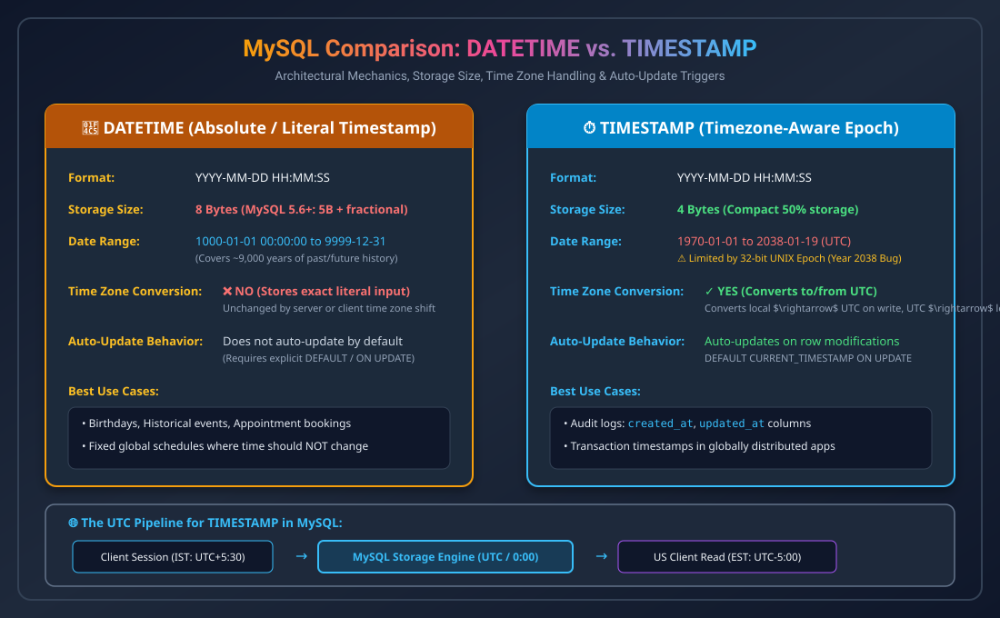

* **Architecture & Flow Explanation (आकृतीचे सविस्तर स्पष्टीकरण):**
  * **Left Card (`DATETIME`):** 8/5 Bytes storage, 9,000-year span (`1000` to `9999`), literal storage with zero time zone conversion, best for birthdays and schedules.
  * **Right Card (`TIMESTAMP`):** 4 Bytes compact storage, bound by 32-bit UNIX Epoch (`1970` to `2038`), automatic UTC conversion, auto-update on changes (`CURRENT_TIMESTAMP`), best for audit logs.
  * **Bottom Pipeline (UTC Workflow):** Shows client in India writing in IST ($\text{UTC}+5:30$), engine storing in universal UTC ($0:00$), and client in the US reading in EST ($\text{UTC}-5:00$) seamlessly.

* **📌 आकृतीचे मराठीत स्पष्टीकरण:**
  * **DATETIME (डावीकडे):** ८ बाईट्स मेमरी, वर्ष १००० ते ९९९९ पर्यंतची मर्यादा, टाइमझोनचा कोणताही परिणाम होत नाही (जशी तारीख दिली तशीच साठवली जाते).
  * **TIMESTAMP (उजवीकडे):** ४ बाईट्स कॉम्पॅक्ट मेमरी, वर्ष १९७० ते २०३८ (Epoch) पर्यंत मर्यादा, स्वयंचलित UTC रूपांतरण आणि आपोआप अपडेट होण्याची क्षमता.
  * **खालचा भाग (UTC चक्र):** वेगवेगळ्या देशांतील सर्व्हर व युझर्स एकाच सेंट्रल डेटाबेसमध्ये अचूक वेळेसह कसे काम करतात ते दर्शवतो.

---

#### Diagram 3: Database Structure & Hierarchy Diagram
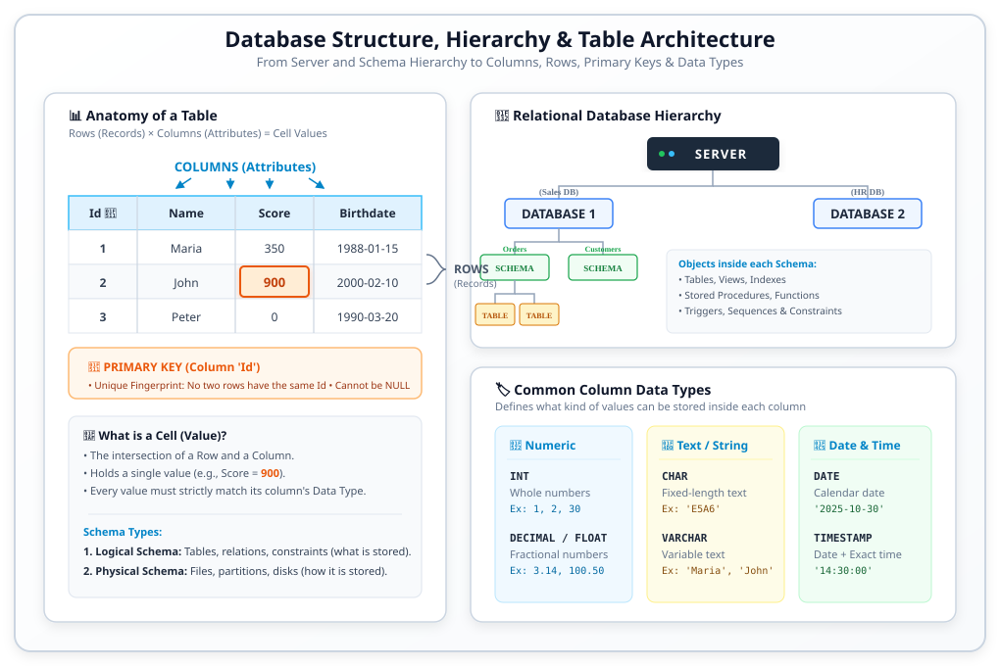

* **Explanation:**
  * Displays the 4-tier relational structure: Server $\rightarrow$ Databases $\rightarrow$ Schemas $\rightarrow$ Tables.
  * Details table anatomy (Columns, Rows, Cells) and Primary Key indexing.

---

#### Diagram 4: MySQL JSON Data Type Architecture & Path Traversal
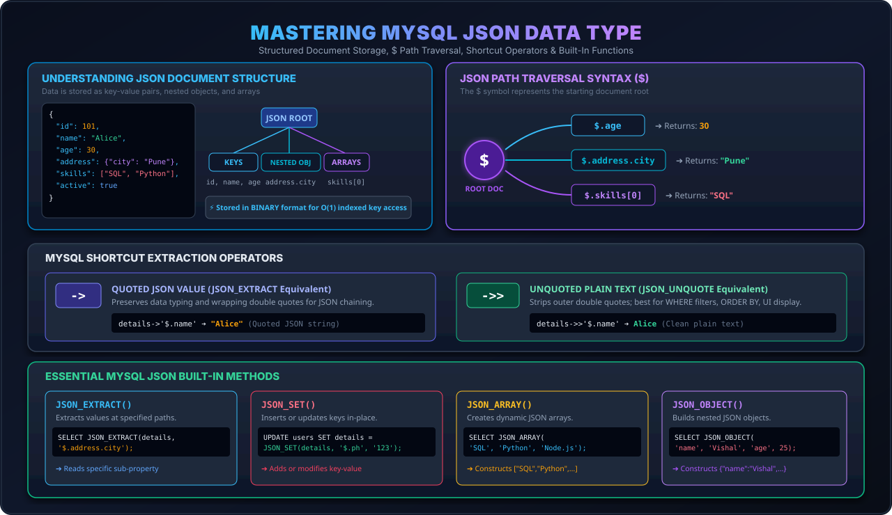

* **Architecture & Flow Explanation (आकृतीचे सविस्तर स्पष्टीकरण):**
  * **Header & Concept:** Highlights the internal binary format of MySQL JSON columns, distinguishing it from raw text strings for fast key-indexed lookup.
  * **The `$` Root Symbol & Path Navigation:** Shows how `$` represents the root document, `$.key` targets a specific field, `$.object.key` navigates nested objects, and `$.array[i]` indexes into arrays.
  * **Extraction Operators (`->` vs. `->>`):** Visualizes the critical difference between `->` (quoted JSON value) and `->>` (unquoted clean plain text).
  * **Core Built-in JSON Functions:** Details `JSON_EXTRACT()`, `JSON_SET()`, `JSON_ARRAY()`, and `JSON_OBJECT()`.

* **📌 आकृतीचे मराठीत स्पष्टीकरण:**
  * **बायनरी फॉरमॅट (Binary Format):** MySQL मध्ये JSON डेटा केवळ साधा टेक्स्ट म्हणून न राहता बायनरी फॉरमॅटमध्ये सेव्ह होतो, ज्यामुळे कोणत्याही की (Key) चा शोध अत्यंत वेगाने घेता येतो.
  * **`$` रूट चिन्ह व पाथ (Path):** `$` हा संपूर्ण डॉक्युमेंटचा प्रारंभ बिंदू दर्शवतो. `$.age` ने फील्ड, `$.address.city` ने नेस्टेड ऑब्जेक्ट, तर `$.skills[0]` ने अरेमधील घटक शोधता येतात.
  * **`->` आणि `->>` मधील फरक:** `->` मुळे कोट्ससहित (Quoted) JSON मूल्य मिळते, तर `->>` मुळे कोट्स नसलेले स्वच्छ टेक्स्ट मूल्य (Plain text) मिळते.
  * **JSON फंक्शन्स:** `JSON_EXTRACT` (डेटा काढणे), `JSON_SET` (नवीन की जोडणे किंवा बदलणे), `JSON_ARRAY` व `JSON_OBJECT` (नवीन अरे व ऑब्जेक्ट तयार करणे) यांचे कार्य दर्शवले आहे.

---

#### Diagram 5: MySQL Spatial / GIS Geometry Data Types & Functions Architecture


* **Architecture & Flow Explanation (आकृतीचे सविस्तर स्पष्टीकरण):**
  * **OpenGIS Spatial Hierarchy:** Illustrates the OpenGIS geometry hierarchy starting from the base `GEOMETRY` class down to concrete subtypes.
  * **Core Geometry Types:** Visualizes `POINT(x y)` (locations), `LINESTRING` (routes/roads), `POLYGON` (closed boundaries/zones), and their multi-counterparts (`MULTIPOINT`, `MULTILINESTRING`, `MULTIPOLYGON`).
  * **GEOMETRY vs. GEOMETRYCOLLECTION:** Visually contrasts a flexible container holding one shape vs. a composite container holding multiple heterogeneous shapes together.
  * **Spatial Analysis Functions (`ST_`):** Summarizes `ST_GeomFromText()`, `ST_AsText()`, `ST_Distance()` (planar Euclidean), `ST_Within()`, and `ST_Contains()`.

* **📌 आकृतीचे मराठीत स्पष्टीकरण:**
  * **OpenGIS मानके व प्रकार:** नकाशे (Google Maps), GPS ट्रॅकिंग आणि डिझाइनसाठी MySQL मधील ८ मुख्य भौमितिक प्रकार दर्शवले आहेत.
  * **POINT, LINESTRING व POLYGON:** `POINT` द्वारे अचूक स्थान (अक्षांश/रेखांश), `LINESTRING` द्वारे रस्ते/मार्ग, आणि `POLYGON` द्वारे बंदिस्त क्षेत्र (उदा. शहराच्या सीमा किंवा धरण क्षेत्र) कसे साठवले जाते ते दर्शवले आहे.
  * **GEOMETRY vs GEOMETRYCOLLECTION:** `GEOMETRY` हे एका वेळी एकाच आकाराचे (Point किंवा Line किंवा Polygon) कंटेनर असते, तर `GEOMETRYCOLLECTION` मध्ये एकाच रेकॉर्डमध्ये विविध आकार एकत्र साठवले जातात.
  * **स्थानिक विश्लेषण फंक्शन्स (Spatial Functions):** `ST_GeomFromText` (टेक्स्टवरून आकार बनवणे), `ST_AsText` (वाचण्यायोग्य टेक्स्टमध्ये बदलणे), `ST_Distance` (दोन ठिकाणांमधील अंतर मोजणे), `ST_Within` व `ST_Contains` (एखादा बिंदू विशिष्ट क्षेत्रात आहे की नाही ते तपासणे) यांचे कार्य स्पष्ट केले आहे.

---

### 6.10 Topic 6 Summary (मराठी सारांश)

* **Database Structure (डेटाबेस रचना आणि उतरंड):**
  1. *Server:* जेथे डेटाबेस राहतो व चालतो ते शक्तिशाली संगणक मशीन.
  2. *Database:* विशिष्ट प्रकारचा डेटा साठवणारा मुख्य कंटेनर.
  3. *Schema (स्कीमा):* डेटाबेसच्या अंतर्गत टेबल्सचे वर्गीकरण करणारा लॉजिकल कंटेनर.
  4. *Schema चे २ प्रकार:*
     * *Logical Schema:* डेटा काय साठवला आहे व टेबल्सचे परस्पर संबंध काय आहेत (What is stored).
     * *Physical Schema:* डेटा हार्ड डिस्कवर प्रत्यक्षात कसा साठवला आहे (How it is stored on disk).
* **Table ची रचना (Anatomy of a Table):**
  * *Table:* रो आणि कॉलमच्या स्वरूपात डेटा साठवणारे मुख्य ऑब्जेक्ट.
  * *Column:* डेटाचा एक विशिष्ट गुणधर्म (उदा. Customer_ID, Name, City).
  * *Row:* एका घटकाची संपूर्ण माहिती देणारी एक आडवी ओळ.
  * *Cell:* रो आणि कॉलम एकत्र येतात तो बिंदू (एकच मूल्य).
* **Primary Key (फिंगरप्रिंट):**
  * प्रत्येक रोची अचूक ओळख पटवणारा कॉलम. हे मूल्य Unique असावे लागते, NULL असू शकत नाही, आणि एका टेबलमध्ये एकच Primary Key असते.

* **MySQL Data Types (डेटा प्रकार सविस्तर सारांश):**
  1. **मेमरीनुसार २ मुख्य प्रकार:**
     * *Fixed Data Types:* मेमरीमध्ये निश्चित आकार घेतात (उदा. `CHAR`, `INT`, `DECIMAL`, `FLOAT`). डेटाचा आकार आधीच माहीत असल्यास हे वापरतात.
     * *Variable Data Types:* प्रत्यक्ष व्हॅल्यूच्या लांबीनुसार मेमरी घेतात (उदा. `VARCHAR`, `TEXT`, `BLOB`). मेमरी वाचवण्यासाठी हे उत्तम आहेत.
  2. **Numeric Types (संख्यात्मक डेटा):**
     * `TINYINT` (1 Byte, -128 ते 127), `INT` (4 Bytes, -2.14B ते 2.14B), `BIGINT` (8 Bytes, -9 Quintillion ते +9Q).
     * `DECIMAL(p, s):` पैशांचे हिशोब, बँकिंग आणि किमतींसाठी अचूक संख्या (Exact numeric, राऊंडिंग एरर येत नाही).
     * `FLOAT` (4B) व `DOUBLE` (8B): वैज्ञानिक गणितांसाठी अंदाजे दशांश संख्या (Floating point).
  3. **String व Binary Types:**
     * `CHAR(n):` निश्चित लांबीची अक्षरे (कमी असल्यास स्पेसेस पॅड होतात; वेगाने चालते).
     * `VARCHAR(n):` बदलत्या लांबीची अक्षरे (Actual length + 1 Byte; मेमरी वाचवते).
     * `TEXT:` मोठे मजकूर (TINYTEXT, TEXT, MEDIUMTEXT, LONGTEXT - 4GB पर्यंत).
     * `BLOB:` प्रतिमा (Images), फाइल्स, PDF साठवण्यासाठी Raw Binary डेटा.
     * `BOOLEAN:` `TINYINT(1)` चा Alias; 0 म्हणजे False आणि 1 म्हणजे True.
     * `ENUM:` दिलेल्या यादीतून फक्त **एकच** पर्याय निवडणे (Controlled vocabulary).
     * `SET:` दिलेल्या यादीतून **एकापेक्षा जास्त** पर्यायांचे कॉम्बिनेशन साठवणे.
  4. **Date & Time (Temporal Types):**
     * डीफॉल्ट फॉरमॅट: `YYYY-MM-DD` (3 Bytes, Range: 1000-01-01 ते 9999-12-31).
     * `TIME:` वेळ साठवणे (`HH:MM:SS`, Range: -838:59:59 ते 838:59:59).
     * `DATETIME:` तारीख + वेळ (`YYYY-MM-DD HH:MM:SS`, 5 ते 8 Bytes, Range: 1000 ते 9999). टाइमझोनचा प्रभाव पडत नाही; जशी तारीख दिली तशीच राहते.
     * `TIMESTAMP:` तारीख + वेळ (`YYYY-MM-DD HH:MM:SS`, 4 Bytes, Range: 1970 ते 2038). **UTC मध्ये साठवली जाते** आणि आपोआप अपडेट होते (`CURRENT_TIMESTAMP`).
  5. **UTC म्हणजे काय व का महत्त्वाचे?**
     * UTC (Coordinated Universal Time) हे जगाचे 'तटस्थ' प्रमाणवेळ आहे.
     * जगभरातील सर्व्हरमध्ये वेळेचा गोंधळ होऊ नये आणि सिस्टीम लॉग्स अचूक राहावेत यासाठी MySQL मध्ये `TIMESTAMP` आपोआप UTC मध्ये सेव्ह होतो आणि वाचताना युझरच्या स्थानिक टाइमझोनमध्ये रूपांतरित होतो.
  6. **DATETIME vs TIMESTAMP मुख्य फरक:**
     * `DATETIME`: ८ बाईट्स, Range १००० ते ९९९९, टाइमझोन बदलत नाही, वाढदिवस व शेड्युलसाठी योग्य.
     * `TIMESTAMP`: ४ बाईट्स, Range १९७० ते २०३८ (UNIX Epoch), टाइमझोननुसार बदलतो, ऑडिट लॉग्ससाठी योग्य.
  7. **JSON Data Type (स्पेशल सेमी-स्ट्रक्चर्ड डेटा):**
     * MySQL मध्ये JSON डेटा बायनरी फॉरमॅटमध्ये साठवला जातो, ज्यामुळे जलद सर्च करता येतो.
     * `$` हा JSON चा मूळ (Root) असतो (`$.key`, `$.object.key`, `$.array[0]`).
     * `->` ऑपरेटर कोट्ससहित (Quoted JSON) डेटा देतो, तर `->>` ऑपरेटर कोट्स काढून प्लेन टेक्स्ट देतो.
     * `JSON_EXTRACT()` (डेटा काढणे), `JSON_SET()` (अपडेट करणे किंवा नवीन की जोडणे), `JSON_ARRAY()` व `JSON_OBJECT()` (अरे व ऑब्जेक्ट बनवणे) ही मुख्य फंक्शन्स आहेत.
  8. **Spatial / GIS Data Types (भौगोलिक व भूमितीय डेटा):**
     * OpenGIS मानकांवर आधारित नकाशे, GPS लोकेशन आणि जिओफेन्सिंगसाठी वापरले जातात.
     * मुख्य प्रकार: `POINT` (एका ठिकाणाचे $x, y$ अक्षांश-रेखांश), `LINESTRING` (रस्ते, नद्या, वाहतूक मार्ग), `POLYGON` (बंदिस्त क्षेत्र, शहराची सीमा, धरण).
     * `MULTIPOINT`, `MULTILINESTRING`, `MULTIPOLYGON` हे अनेक आकारांचे संच असतात.
     * `GEOMETRY` एका वेळी एकच भौमितिक आकार साठवतो, तर `GEOMETRYCOLLECTION` एकाच कॉलममध्ये अनेक वेगवेगळे आकार एकत्र साठवू शकतो.
     * महत्त्वाची फंक्शन्स: `ST_GeomFromText()` (WKT टेक्स्टवरून आकार तयार करणे), `ST_AsText()` (वाचण्यायोग्य टेक्स्ट करणे), `ST_Distance()` (अंतर मोजणे), `ST_Within()` व `ST_Contains()` (बिंदू क्षेत्रात आहे की नाही ते तपासणे).

---

## Topic 7: SQL vs MySQL

### 7.1 What is SQL?

* **Q. What is SQL?**
  * *SQL stands for: Structured Query Language.*
  * *Category: Domain-specific declarative query language.*
  * *Role: Serves as the universal standard language to query, manipulate, and administer relational databases.*
  * *Note: SQL does not store data on its own; it is the communication language.*

---

### 7.2 What is MySQL?

* **Q. What is MySQL?**
  * *Category: An open-source Relational Database Management System (RDBMS) software application.*
  * *Role: An executable database engine and server program that stores and manages data.*
  * *Function: Stores records in structured tables, executes SQL queries, manages storage engines (InnoDB), caching, and multi-user concurrency.*

---

### 7.3 Key Differences: Comparison Table

| Feature / Aspect | SQL (Structured Query Language) | MySQL (Relational DBMS) |
| :--- | :--- | :--- |
| **Category** | Declarative **Query Language**. | Complete **RDBMS Software Engine**. |
| **Primary Purpose** | Querying, filtering, and manipulating data. | Storing, persisting, indexing, and securing data files. |
| **Data Storage** | Does **not** store data itself. | **Stores and manages** data blocks on physical disk. |
| **Version Cycles** | Standardized language specification (ANSI SQL). | Continuously updated database software (e.g., MySQL 8.0, 8.4). |
| **Installation** | Cannot be installed (it is a language standard). | Installed as a background service/daemon on servers and cloud. |
| **Analogy** | Like the **English Language** (medium of speech). | Like a **Person** who understands and speaks English. |

---

### 7.4 Visual Concept: Language vs RDBMS Software

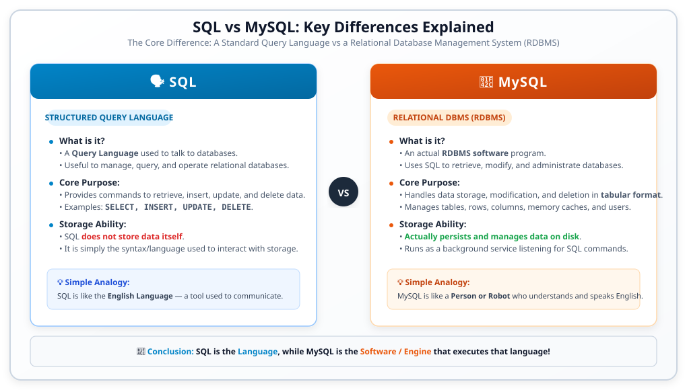

#### Simple Explanation of the Diagram:
* **Left Card (SQL):** The declarative language used to communicate instructions (`SELECT`, `INSERT`, `UPDATE`, `DELETE`).
* **Right Card (MySQL):** The database software engine that receives SQL instructions and performs disk storage, caching, and retrieval.
* **Bottom Rule:** SQL is the Language, while MySQL is the Software Engine that executes that language!

* **📌 आकृतीचे मराठीत स्पष्टीकरण:**
  * *डावे कार्ड (SQL):* डेटाबेसशी संवाद साधण्यासाठीची भाषा.
  * *उजवे कार्ड (MySQL):* प्रत्यक्षात कॉम्प्युटरवर इन्स्टॉल होणारे सॉफ्टवेअर/इंजिन.
  * *सोपे सूत्र:* SQL ही भाषा आहे, तर MySQL हे ती भाषा बोलणारे सॉफ्टवेअर आहे!

---

### 7.5 Topic 7 Summary (मराठी सारांश)

* **SQL (Structured Query Language):**
  * ही एक क्वेरी लँग्वेज आहे. Relational databases शी संवाद साधण्यासाठी ही भाषा वापरली जाते.
  * SQL स्वतः डेटा साठवत नाही; ती फक्त सूचना देण्याचे साधन आहे.
* **MySQL:**
  * हे एक **RDBMS** सॉफ्टवेअर आहे. हे SQL भाषेचा वापर करून डेटा प्रत्यक्षात टॅब्युलर फॉरमॅटमध्ये साठवण्याचे, सुरक्षित ठेवण्याचे आणि व्यवस्थापित करण्याचे काम करते.
* **थोडक्यात फरक:**
  * *SQL* ही भाषा आहे.
  * *MySQL* हे ती भाषा समजून डेटा चालवणारे सॉफ्टवेअर आहे.

---

## Topic 8: SQL Commands & DDL (Data Definition Language) In-Depth

### 8.1 Check Current SQL / MySQL Version

To verify the current installed version of your database engine:

```sql
mysql> SELECT VERSION();
+-----------+
| VERSION() |
+-----------+
| 9.1.0     |
+-----------+
1 row in set (0.00 sec)
```

---

### 8.2 Broad Classification of SQL Commands
SQL commands are used to communicate with the database, manage structures, and manipulate data. They are classified into:

1. **DDL (Data Definition Language):** Defines and modifies the structure/blueprint of database objects (`CREATE`, `ALTER`, `DROP`, `TRUNCATE`, `RENAME`).
2. **DML (Data Manipulation Language):** Manipulates actual row data (`INSERT`, `UPDATE`, `DELETE`).
3. **DQL (Data Query Language):** Searches, filters, and retrieves data (`SELECT`).

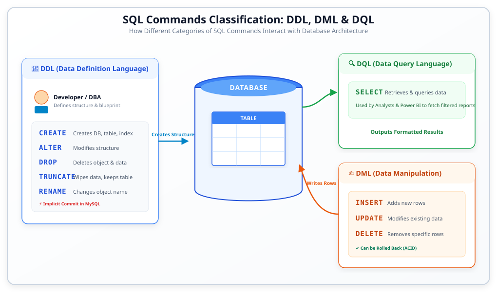

---

### 8.3 What is DDL (Data Definition Language)?
* *Definition: DDL (Data Definition Language) commands are used to define, modify, and manage the structure (schema blueprint) of databases and database objects.*
  * **Defines the structure of the database object:** It is how you create, modify, or delete the blueprint of your database.
  * **Consists of SQL commands used to define the database schema:** DDL is used to define and modify the structure of a database, such as creating databases/schemas, tables, indexes, and modifying or deleting database objects.
* **Objects It Works On:** Databases, Schemas, Tables, Views, Indexes, Stored Procedures, Triggers, and Functions.
* **Core Functions:**
  * **`CREATE`**: Creates a database or database objects inside the DB (Database / Schema, Table, Index, View, Stored Procedure, Triggers, Function).
  * **`ALTER`**: Modifies the structure of existing objects without deleting them.
  * **`DROP`**: Permanently deletes database objects and all their data.
  * **`TRUNCATE`**: Removes all records from a table while preserving the table structure.
  * **`RENAME`**: Changes the name of existing database objects.

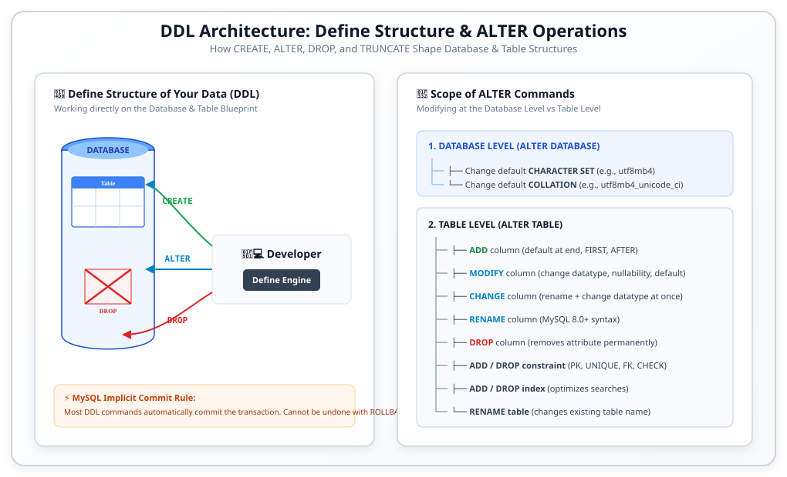

---

### 8.4 The Implicit Commit Rule in MySQL
> ⚠️ **Critical Architectural Note:**
> In MySQL, most DDL statements perform an implicit commit.
> This means that when you execute a DDL command (`CREATE`, `ALTER`, `DROP`, `TRUNCATE`), MySQL commits the current transaction automatically.
> **You CANNOT use ROLLBACK to undo a DDL operation!**

---

### 8.5 CREATE Commands (Database, Tables, Indexes & Info)
The **`CREATE`** command is used to create a database or database objects inside the DB (such as Tables, Indexes, Views, Stored Procedures, Triggers, and Functions).

#### 1. How to Create a Database
* **Syntax:**
  ```sql
  CREATE DATABASE [IF NOT EXISTS] db_name;
  ```

* **Examples:**
  ```sql
  -- Basic creation:
  CREATE DATABASE company_db;

  -- Safe creation (avoids error if it already exists):
  CREATE DATABASE IF NOT EXISTS school_db;
  ```

#### 2. How to Show All Databases in the RDBMS
* **Command / Syntax:**
  ```sql
  SHOW DATABASES;
  ```

#### 3. How to Select or Use a Particular Database
* Once a database is created, you must select it before creating tables or querying:
* **Syntax:**
  ```sql
  USE db_name;
  ```
* **Example:**
  ```sql
  USE company_db;
  ```

#### 4. How to Show All Tables in the Current Database
* **Command / Syntax:**
  ```sql
  SHOW TABLES;
  ```

#### 5. How to Create a Table
* **General Syntax:**
  ```sql
  CREATE TABLE table_name (
      column1 datatype constraints,
      column2 datatype constraints,
      ...
  );
  ```

* **Basic Example (Without explicit constraints):**
  ```sql
  CREATE TABLE employees (
      id INT,
      name VARCHAR(100),
      age INT,
      email VARCHAR(150),
      salary DECIMAL(10, 2)
  );
  ```

* **Production Example (With Constraints: Primary Key, Not Null, Unique, Default):**
  ```sql
  CREATE TABLE employees (
      id INT PRIMARY KEY,
      name VARCHAR(100) NOT NULL,
      age INT,
      email VARCHAR(150) UNIQUE,
      salary DECIMAL(10, 2) DEFAULT 0
  );
  ```

#### 6. How to Show Detailed Information / Schema of a Table
* **Syntax:**
  ```sql
  DESCRIBE table_name;
  -- or shorthand:
  DESC table_name;
  ```

* **Example:**
  ```sql
  DESCRIBE employees;
  -- or
  DESC employees;
  ```

#### 7. How to Create an Index on a Table
Indexes accelerate lookup speeds on frequently queried columns:
* **Syntax:**
  ```sql
  CREATE INDEX index_name
  ON table_name (column_name);
  ```
* **Real Example:**
  ```sql
  CREATE INDEX AGE_INDEX ON STUDENT(AGE);
  ```

---

### 8.6 ALTER Commands (Database Level & Table Level)

* *Definition & Core Purpose: ALTER is a DDL command used to modify the structure or properties of an existing database object without recreating the object.*
  * **Using ALTER, you change the definition of the table or database object:**
    * It alters the structure of the database (changes the blueprint/structure of tables).
    * It modifies existing objects (such as adding or removing columns from a table).
  * **Preserves Actual Row Data:** `ALTER` modifies the structure of an existing database object. It does not normally modify the actual row data in unaffected columns.

* **Two Main Scopes of ALTER:**
  1. **On a Database (ALTER DATABASE / ALTER SCHEMA):**
     * You can use `ALTER DATABASE` (or `ALTER SCHEMA`) to change certain database properties.
     * Examples: Change the default **CHARACTER SET** (e.g., `utf8mb4`) or default **COLLATION** (e.g., `utf8mb4_unicode_ci`).
  2. **On Table Level (ALTER TABLE):**
     * `ALTER TABLE` changes the structure of a table.
     * If you want modification on table structure, you use `ALTER` to perform tasks such as:
       * **Add column:** Insert new columns into an existing table (at the end, `FIRST`, or `AFTER column_name`).
       * **Modify column datatype:** Change datatype, size, nullability, or default value.
       * **Rename column:** Change column names (`RENAME COLUMN` or `CHANGE`).
       * **Drop a column:** Permanently delete a column from the table.
       * **Add a constraint:** Add rules like `PRIMARY KEY`, `UNIQUE`, `FOREIGN KEY`, or `CHECK`.
       * **Drop constraint:** Remove existing constraints.
       * **Add / modify / drop indexes:** Add or remove lookup indexes for faster query performance.
       * **Rename table:** Rename an existing table entity (`RENAME TO`).
       * *(i.e., Edit, modify, and change the existing table structure and definition).*

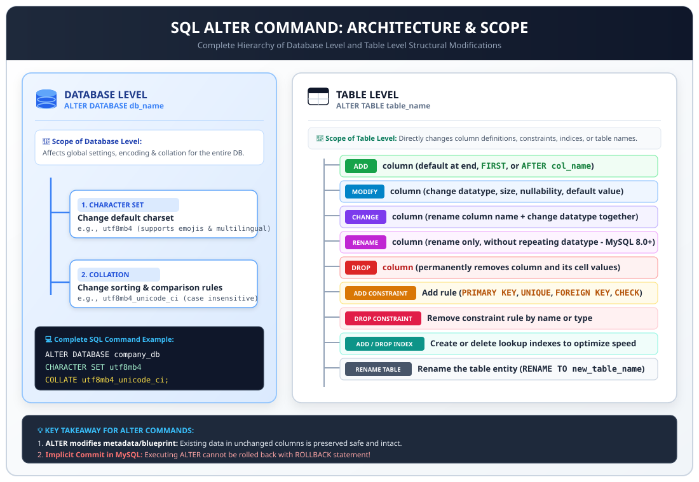

#### 1. Database-Level Alter Operations
* **Modifying Default Character Set and Collation:**
  ```sql
  ALTER DATABASE database_name
  CHARACTER SET utf8mb4
  COLLATE utf8mb4_unicode_ci;
  ```

* **Q. Can we rename a database in MySQL?**
  * **Answer:** **No.** MySQL does not support a direct `RENAME DATABASE` statement (to prevent data corruption). To rename a database, you create a new database, dump/move the tables to it, and drop the old database after verification.

---

#### 2. Table-Level Alter Operations

##### A. Add a New Column
* **Syntax:**
  ```sql
  -- 1. Default (adds column at the end of the table):
  ALTER TABLE table_name ADD COLUMN column_name datatype [constraints];

  -- 2. Add column as the FIRST column:
  ALTER TABLE table_name ADD COLUMN column_name datatype [constraints] FIRST;

  -- 3. Add column AFTER a specific column:
  ALTER TABLE table_name ADD COLUMN column_name datatype [constraints] AFTER existing_column;
  ```

* **Examples:**
  * **Default (Adds column at the end of the table):**
    ```sql
    ALTER TABLE employees ADD COLUMN address VARCHAR(255);
    ```
  * **Add column as the FIRST column:**
    ```sql
    ALTER TABLE employees ADD COLUMN address VARCHAR(255) FIRST;
    ```
  * **Add column AFTER a specific column:**
    ```sql
    ALTER TABLE employees ADD COLUMN address VARCHAR(255) AFTER name;
    ```

##### B. Modify an Existing Column (Datatype, Size, Nullability)
* **Syntax:**
  ```sql
  ALTER TABLE table_name MODIFY COLUMN column_name new_datatype [new_constraints];
  ```
  *(Note: The keyword `COLUMN` is optional in MySQL: `ALTER TABLE table_name MODIFY column_name new_datatype;`)*

* **Examples:**
  * `MODIFY` is used to change column data type, size, nullability, or default without renaming:
  ```sql
  -- Increase size and make NOT NULL:
  ALTER TABLE employees MODIFY salary DECIMAL(12, 2) NOT NULL;

  -- Change student_phone size from VARCHAR(100) to VARCHAR(20):
  ALTER TABLE STUDENT MODIFY STUDENT_PHONE VARCHAR(20);
  ```

##### C. Change a Column (Rename + Modify Datatype At Once)
* **Syntax:**
  ```sql
  ALTER TABLE table_name CHANGE COLUMN old_column new_column datatype [constraints];
  ```
  *(Note: The keyword `COLUMN` is optional in MySQL)*

* **Examples:**
  ```sql
  -- Rename PHONENO to MOBILE and change datatype to VARCHAR(100):
  ALTER TABLE PERSON1 CHANGE PHONENO MOBILE VARCHAR(100);

  -- Rename PHONE to STUDENT_PHONE with VARCHAR(200):
  ALTER TABLE STUDENT CHANGE PHONE STUDENT_PHONE VARCHAR(200);

  -- Rename MOBILE to STUDENT_MOBILE with VARCHAR(50):
  ALTER TABLE STUDENT CHANGE MOBILE STUDENT_MOBILE VARCHAR(50);
  ```

##### D. Rename ONLY a Column (MySQL 8.0+)
* **Syntax:**
  ```sql
  ALTER TABLE table_name RENAME COLUMN old_column_name TO new_column_name;
  ```

* **Example:**
  ```sql
  ALTER TABLE employees RENAME COLUMN salary TO monthly_salary;
  ```

##### E. Drop a Column
* **Syntax:**
  ```sql
  ALTER TABLE table_name DROP COLUMN column_name;
  ```

* **Examples (Permanently removes column and its data):**
  ```sql
  ALTER TABLE employees DROP COLUMN phone;

  ALTER TABLE STUDENT DROP COLUMN STUDENT_PHONE;
  ```

##### F. Rename a Table
* **Syntax:**
  ```sql
  -- Method 1 (Using ALTER TABLE):
  ALTER TABLE table_name RENAME TO new_table_name;

  -- Method 2 (Using RENAME TABLE statement):
  RENAME TABLE old_table_name TO new_table_name;
  ```

* **Examples:**
  ```sql
  -- Method 1 Examples:
  ALTER TABLE employees RENAME TO staff;
  ALTER TABLE STUDENT RENAME STUDENT_INFO;

  -- Method 2 Examples:
  RENAME TABLE employee TO staff;
  RENAME TABLE STUDENT_INFO TO STUD;
  ```

##### G. Set or Drop Default Values
* **Syntax:**
  ```sql
  -- Set Default Value:
  ALTER TABLE table_name ALTER COLUMN column_name SET DEFAULT default_value;

  -- Drop Default Value:
  ALTER TABLE table_name ALTER COLUMN column_name DROP DEFAULT;
  ```
  *(Note: The keyword `COLUMN` is optional in MySQL)*

* **Examples:**
  ```sql
  -- Set Default Value:
  ALTER TABLE employees ALTER salary SET DEFAULT 5000;

  -- Drop Default Value:
  ALTER TABLE employees ALTER salary DROP DEFAULT;
  ```

##### H. Change AUTO_INCREMENT Starting Value
* **Syntax:**
  ```sql
  ALTER TABLE table_name AUTO_INCREMENT = starting_number;
  ```

* **Example:**
  ```sql
  ALTER TABLE employees AUTO_INCREMENT = 1000;
  ```

---

### 8.7 Constraints Management via ALTER (Add & Drop Rules)

Constraints enforce data integrity and business rules on table columns. Using `ALTER TABLE`, you can add or remove these constraints on existing tables without rebuilding them.

#### Quick Reference Matrix:

| Constraint | How to ADD | How to DROP |
| :--- | :--- | :--- |
| **PRIMARY KEY** | `ALTER TABLE employees ADD PRIMARY KEY (id);` | `ALTER TABLE employees DROP PRIMARY KEY;` |
| **UNIQUE** | `ALTER TABLE employees ADD CONSTRAINT unique_email UNIQUE (email);` | `ALTER TABLE employees DROP INDEX unique_email;` |
| **FOREIGN KEY** | `ALTER TABLE orders ADD CONSTRAINT fk_cust FOREIGN KEY (customer_id) REFERENCES customers(id);` | `ALTER TABLE orders DROP FOREIGN KEY fk_cust;` |
| **CHECK** | `ALTER TABLE employees ADD CONSTRAINT chk_age CHECK (age >= 18);` | `ALTER TABLE employees DROP CHECK chk_age;` |
| **NOT NULL** | `ALTER TABLE STUDENT MODIFY EDUCATION VARCHAR(255) NOT NULL;` | `ALTER TABLE STUDENT MODIFY EDUCATION VARCHAR(255) NULL;` |
| **DEFAULT** | `ALTER TABLE employees ALTER salary SET DEFAULT 5000;` | `ALTER TABLE employees ALTER salary DROP DEFAULT;` |

---

#### Detailed Breakdown & Examples for Each Constraint:

##### 1. PRIMARY KEY Constraint
* **What it does:** Uniquely identifies each record in a table. It cannot contain `NULL` values, and each table can have only one primary key.
* **Syntax:**
  ```sql
  -- To ADD a Primary Key:
  ALTER TABLE table_name ADD PRIMARY KEY (column_name);

  -- With explicit constraint name:
  ALTER TABLE table_name ADD CONSTRAINT constraint_name PRIMARY KEY (column_name);

  -- To DROP a Primary Key:
  ALTER TABLE table_name DROP PRIMARY KEY;
  ```
* **Step-by-Step Example:**
  ```sql
  -- Add PRIMARY KEY to 'id' column:
  ALTER TABLE employees ADD PRIMARY KEY (id);

  -- Drop PRIMARY KEY from employees table:
  ALTER TABLE employees DROP PRIMARY KEY;
  ```

##### 2. UNIQUE Constraint
* **What it does:** Ensures that all values in a column are distinct (different). Unlike Primary Key, it allows `NULL` values.
* **Important Note:** In MySQL, adding a `UNIQUE` constraint creates an internal unique index. Therefore, to drop it, you use `DROP INDEX`.
* **Syntax:**
  ```sql
  -- To ADD a Unique constraint:
  ALTER TABLE table_name ADD CONSTRAINT constraint_name UNIQUE (column_name);

  -- To DROP a Unique constraint (drops the underlying index):
  ALTER TABLE table_name DROP INDEX constraint_name;
  ```
* **Step-by-Step Example:**
  ```sql
  -- Add UNIQUE constraint on email:
  ALTER TABLE employees ADD CONSTRAINT unique_email UNIQUE (email);

  -- Drop UNIQUE constraint using its index name:
  ALTER TABLE employees DROP INDEX unique_email;

  -- Another Example (Dropping unique mobile number index):
  ALTER TABLE PERSONINFORMATION DROP INDEX MOBILENO;
  ```

##### 3. FOREIGN KEY Constraint
* **What it does:** Enforces referential integrity between two tables by ensuring that values in a child table correspond to valid primary key values in the parent table.
* **Syntax:**
  ```sql
  -- To ADD a Foreign Key:
  ALTER TABLE child_table
  ADD CONSTRAINT fk_name
  FOREIGN KEY (child_column) REFERENCES parent_table (parent_primary_key);

  -- To DROP a Foreign Key:
  ALTER TABLE child_table DROP FOREIGN KEY fk_name;
  ```
* **Step-by-Step Example:**
  ```sql
  -- Add FOREIGN KEY linking orders.customer_id to customers.id:
  ALTER TABLE orders
  ADD CONSTRAINT fk_cust
  FOREIGN KEY (customer_id) REFERENCES customers(id);

  -- Drop FOREIGN KEY constraint:
  ALTER TABLE orders DROP FOREIGN KEY fk_cust;
  ```

##### 4. CHECK Constraint
* **What it does:** Enforces a condition that all values inserted or updated in a column must satisfy (e.g., minimum age, positive salary).
* **Syntax:**
  ```sql
  -- To ADD a Check constraint:
  ALTER TABLE table_name ADD CONSTRAINT chk_name CHECK (condition);

  -- To DROP a Check constraint:
  ALTER TABLE table_name DROP CHECK chk_name;
  ```
* **Step-by-Step Example:**
  ```sql
  -- Add CHECK constraint ensuring employee age is 18 or older:
  ALTER TABLE employees ADD CONSTRAINT chk_age CHECK (age >= 18);

  -- Add CHECK constraint ensuring salary is greater than 0:
  ALTER TABLE employees ADD CONSTRAINT chk_salary CHECK (salary > 0);

  -- Drop CHECK constraint:
  ALTER TABLE employees DROP CHECK chk_age;
  ```

##### 5. NOT NULL Constraint
* **What it does:** Ensures that a column never accepts empty or missing (`NULL`) values.
* **Syntax:**
  ```sql
  -- To ADD NOT NULL (make column mandatory):
  ALTER TABLE table_name MODIFY column_name datatype NOT NULL;

  -- To DROP NOT NULL (allow NULL values):
  ALTER TABLE table_name MODIFY column_name datatype NULL;
  ```
* **Step-by-Step Example:**
  ```sql
  -- Make EDUCATION column mandatory:
  ALTER TABLE STUDENT MODIFY EDUCATION VARCHAR(255) NOT NULL;

  -- Allow NULL values in EDUCATION column:
  ALTER TABLE STUDENT MODIFY EDUCATION VARCHAR(255) NULL;
  ```

##### 6. DEFAULT Constraint
* **What it does:** Automatically assigns a preset value when no value is provided for the column during an `INSERT`.
* **Syntax:**
  ```sql
  -- To SET / ADD a Default value:
  ALTER TABLE table_name ALTER COLUMN column_name SET DEFAULT default_value;

  -- To DROP a Default value:
  ALTER TABLE table_name ALTER COLUMN column_name DROP DEFAULT;
  ```
  *(Note: The keyword `COLUMN` is optional in MySQL)*
* **Step-by-Step Example:**
  ```sql
  -- Set default salary of 5000:
  ALTER TABLE employees ALTER salary SET DEFAULT 5000;

  -- Set default status to 'Active':
  ALTER TABLE employees ALTER status SET DEFAULT 'Active';

  -- Drop the default salary value:
  ALTER TABLE employees ALTER salary DROP DEFAULT;
  ```

---

### 8.8 Quick Revision Cheat Sheet: ALTER Operations

| Keyword | What it Does |
| :--- | :--- |
| **`ADD`** | Adds column, constraint, or index |
| **`DROP`** | Drops column, constraint, index, or primary key |
| **`MODIFY`** | Changes column definition (datatype, null, default) without renaming |
| **`CHANGE`** | Renames + modifies column definition in one step |
| **`RENAME`** | Renames table or index (or column in MySQL 8.0+) |
| **`ALTER`** | Sets/drops default values, character sets, or `AUTO_INCREMENT` |

---

### 8.9 DROP Commands (Permanent Object Deletion)
* **What it does:** Completely and permanently removes a database object and all its stored data.
* **Automatic Commit:** In MySQL, `DROP` cannot be rolled back with `ROLLBACK`.
* **Difference from `DELETE`:** `DELETE` only removes row records; `DROP` destroys the entire table structure, indexes, and constraints.

#### 1. Drop Database
* **Syntax:**
  ```sql
  DROP DATABASE [IF EXISTS] database_name;
  ```
* **Example:**
  ```sql
  DROP DATABASE company_db;
  ```

#### 2. Drop Table
* **Syntax:**
  ```sql
  DROP TABLE [IF EXISTS] table_name;
  ```
* **Examples:**
  ```sql
  DROP TABLE employees;
  DROP TABLE person;
  ```

---

### 8.10 TRUNCATE Commands (Wipe Data, Keep Structure)
* *Definition: TRUNCATE removes all records from a table and deallocates all disk space, while preserving the table structure.*
* **Syntax:**
  ```sql
  TRUNCATE TABLE table_name;
  ```

* **Example:**
  ```sql
  TRUNCATE TABLE Students;
  ```
* **Key Characteristics of TRUNCATE:**
  1. **Keeps the Structure:** Table name, column names, data types, primary key, unique constraints, and foreign key definitions remain 100% intact.
  2. **Resets AUTO_INCREMENT:** Resets auto-increment counters back to 1.
  3. **DDL Operation:** Faster than `DELETE` because it deallocates data pages instead of logging row-by-row deletions.
  4. **Cannot be Rolled Back:** Cannot undo with `ROLLBACK` in MySQL.
  5. **Foreign Key Rule:** You cannot truncate a table that is actively referenced by an existing foreign key constraint.

---

### 8.11 RENAME Commands (Objects & Tables)

* *Definition: The RENAME statement is a DDL (Data Definition Language) command used to change the identifier name of existing database objects (tables, views, columns, and indexes) without altering or recreating the underlying data records.*

* **Core Characteristics & Architectural Rules:**
  * **Metadata Modification Only:** Renaming an object does not rebuild or duplicate data; it simply updates the dictionary name pointer in the database engine.
  * **Zero Data Loss:** All column definitions, constraints (Primary Key, Foreign Key, Unique), indexes, and existing rows remain 100% intact.
  * **Implicit Commit:** In MySQL, executing `RENAME` immediately causes an implicit transaction commit. **It cannot be rolled back with ROLLBACK.**
  * **Application & View Impact:** Any application queries, views, or stored procedures that hardcode the old object name must be updated to reference the new name.

---

#### 1. Renaming Tables (Two Distinct Methods)

##### Method A: The Standalone `RENAME TABLE` Statement (Recommended)
* **Description:** MySQL provides a dedicated `RENAME TABLE` statement. Its unique superpower is that it can rename **multiple tables atomically in a single statement**.
* **Syntax:**
  ```sql
  -- Single table:
  RENAME TABLE old_table_name TO new_table_name;

  -- Multiple tables atomically (Zero-Downtime Swapping):
  RENAME TABLE old_tbl1 TO new_tbl1,
               old_tbl2 TO new_tbl2;
  ```
* **Examples:**
  ```sql
  -- 1. Standard single table rename:
  RENAME TABLE STUDENT_INFO TO STUD;

  -- 2. Renaming employee table to staff:
  RENAME TABLE employees TO staff_members;

  -- 3. Production Zero-Downtime Atomic Swap (Swapping staging table to live table):
  RENAME TABLE live_products TO backup_products,
               staging_products TO live_products;
  ```

##### Method B: Using `ALTER TABLE ... RENAME TO`
* **Description:** Part of the standard `ALTER TABLE` suite. Best used when you are already performing table-level modifications.
* **Syntax:**
  ```sql
  ALTER TABLE table_name RENAME TO new_table_name;
  -- or shorthand:
  ALTER TABLE table_name RENAME new_table_name;
  ```
* **Examples:**
  ```sql
  ALTER TABLE STUDENT RENAME TO STUDENT_INFO;
  ALTER TABLE employees RENAME TO staff;
  ```

---

#### 2. Moving Tables Across Databases (Cross-Database Move)
* **Description:** Because MySQL intentionally does not support a `RENAME DATABASE` command, the `RENAME TABLE` statement is the official, instant way to move a table from one database schema to another without copying data.
* **Syntax:**
  ```sql
  RENAME TABLE source_db.table_name TO target_db.table_name;
  ```
* **Example:**
  ```sql
  -- Instantly moves the 'orders' table from 'staging_db' to 'production_db':
  RENAME TABLE staging_db.orders TO production_db.orders;
  ```

---

#### 3. Renaming Other Database Objects

##### A. Renaming a Column Inside a Table
* **Modern Syntax (MySQL 8.0+):**
  ```sql
  ALTER TABLE table_name RENAME COLUMN old_col_name TO new_col_name;
  ```
  * *Example:*
    ```sql
    ALTER TABLE employees RENAME COLUMN phone TO mobile_number;
    ```
* **Legacy Syntax (MySQL 5.7 and earlier using `CHANGE`):**
  ```sql
  ALTER TABLE table_name CHANGE old_col_name new_col_name datatype [constraints];
  ```
  * *Example:*
    ```sql
    ALTER TABLE employees CHANGE phone mobile_number VARCHAR(20);
    ```

##### B. Renaming an Index
* **Description:** Changes the name of an existing performance index without rebuilding the B-Tree index structure.
* **Syntax:**
  ```sql
  ALTER TABLE table_name RENAME INDEX old_index_name TO new_index_name;
  ```
* **Example:**
  ```sql
  ALTER TABLE employees RENAME INDEX idx_emp_email TO idx_staff_email;
  ```

##### C. Renaming a View
* **Description:** A database view can be renamed exactly like a table using the `RENAME TABLE` command.
* **Syntax:**
  ```sql
  RENAME TABLE old_view_name TO new_view_name;
  ```
* **Example:**
  ```sql
  RENAME TABLE active_users_view TO current_users_view;
  ```

---

#### 4. **Q. Can We Directly Rename a Database in MySQL?**
* **Direct Answer:** **NO.** MySQL had an experimental `RENAME DATABASE` in MySQL 5.1.7, but it was quickly removed in 5.1.23 because it carried extreme risks of file-system data corruption.
* **Recommended Production Method to "Rename" a Database:**
  1. Create the new target database:
     ```sql
     CREATE DATABASE new_database_name;
     ```
  2. Move all tables from old database to new database using `RENAME TABLE`:
     ```sql
     RENAME TABLE old_db.table1 TO new_db.table1,
                  old_db.table2 TO new_db.table2;
     ```
  3. Verify data and drop the now-empty old database:
     ```sql
     DROP DATABASE old_database_name;
     ```

---

### 8.12 Differences Between DELETE, TRUNCATE, and DROP

In SQL, data and table structures can be removed using three distinct commands: **`DELETE`**, **`TRUNCATE`**, and **`DROP`**. While all three remove data, their underlying architecture, speed, transaction support, and space management are fundamentally different.

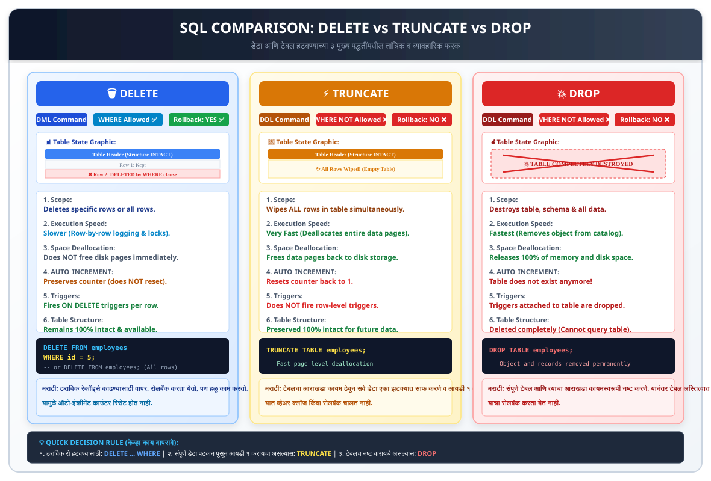

---

#### 1. Comprehensive 10-Point Comparison Matrix

| Feature / Dimension | `DELETE` | `TRUNCATE` | `DROP` |
| :--- | :--- | :--- | :--- |
| **1. Command Category** | **DML** (Data Manipulation Language) | **DDL** (Data Definition Language) | **DDL** (Data Definition Language) |
| **2. Core Purpose & Action** | Deletes specific rows or all rows | Wipes all rows in a table simultaneously | Completely deletes table, schema & data |
| **3. WHERE Clause Filtering** | **Supported** (`WHERE condition`) | **NOT Supported** (Cannot filter rows) | **NOT Supported** (Cannot filter rows) |
| **4. Rollback / Transactions** | **YES** (Can be undone with `ROLLBACK`) | **NO in MySQL** (Implicit Commit) | **NO in MySQL** (Implicit Commit) |
| **5. Execution Speed** | **Slower** (Logs row-by-row deletions) | **Very Fast** (Deallocates entire data pages) | **Fastest** (Removes object from catalog) |
| **6. Space Deallocation** | **NO** (Keeps disk pages allocated to table) | **YES** (Releases data pages back to engine) | **YES** (100% disk and memory space freed) |
| **7. AUTO_INCREMENT Counter** | **Preserved** (Next ID = Max ID + 1) | **RESET back to 1** (Starts numbering fresh) | **Deleted** (Table no longer exists) |
| **8. Trigger Execution** | **Fires** `ON DELETE` row triggers | **Does NOT** fire row-level triggers | **Does NOT** fire triggers (Triggers dropped) |
| **9. Foreign Key Rules** | Allowed if cascade/child rules permit | **BLOCKED** if referenced by active FK | **BLOCKED** unless `CASCADE` or FK removed |
| **10. Table Structure After Query** | **100% Intact** (Columns, keys preserved) | **100% Intact** (Columns, keys preserved) | **DESTROYED** (Table completely vanishes) |

---

#### 2. Syntax and Concrete Practical Examples

##### A. `DELETE` Command
* **Syntax:**
  ```sql
  DELETE FROM table_name [WHERE condition];
  ```
* **Examples:**
  ```sql
  -- 1. Conditional deletion (removes single row):
  DELETE FROM employees WHERE id = 101;

  -- 2. Range deletion:
  DELETE FROM employees WHERE age < 18;

  -- 3. Delete all rows (row-by-row, rollback possible):
  DELETE FROM employees;
  ```

##### B. `TRUNCATE` Command
* **Syntax:**
  ```sql
  TRUNCATE TABLE table_name;
  ```
* **Example:**
  ```sql
  -- Wipes all records, resets AUTO_INCREMENT to 1, table structure stays intact:
  TRUNCATE TABLE employees;
  ```

##### C. `DROP` Command
* **Syntax:**
  ```sql
  DROP TABLE [IF EXISTS] table_name;
  ```
* **Example:**
  ```sql
  -- Permanently deletes the table structure and its data from the database:
  DROP TABLE employees;
  ```

---

#### 3. When to Use Which? (Decision Guide)

1. **Use `DELETE` when:**
   - You need to delete **only specific rows** based on a criteria (`WHERE condition`).
   - You need the safety of **`ROLLBACK`** in case of errors.
   - You have **auditing triggers** that must execute on every deleted row.

2. **Use `TRUNCATE` when:**
   - You want to **wipe out all records from a table quickly** (e.g., staging tables, logs, testing caches).
   - You want the primary key **`AUTO_INCREMENT` counter to reset back to 1**.
   - You want to release allocated disk pages back to the database system.

3. **Use `DROP` when:**
   - You want to **completely decommission and delete an entire table** that is no longer needed.
   - You are rebuilding a table from scratch by dropping and recreating it.

---

#### 4. Focused Deep-Dive: DROP vs. TRUNCATE (Direct 6-Point Comparison)

* **`DROP TABLE` (Total Structural Elimination):**
  * **Core Action:** Removes the entire table structure (schema + data). After drop, the table no longer exists.
    ```sql
    DROP TABLE table_name;  -- Drop table completely
    ```
  * **Storage:** Frees up the storage completely from disk.
  * **Rollback:** Permanent and irreversible in MySQL (`DDL = Implicit Commit`). *(Note: In PostgreSQL, DDL can rollback inside transactions).*
  * **Speed:** Extremely fast (removes metadata entry from system catalog in one step).
  * **Objects Removed:** Removes table definition, constraints, indexes, triggers—everything.
  * **Auto-Increment Counter:** Disappears completely because the table entity is destroyed.

* **`TRUNCATE TABLE` (Fast Data Wipe, Structure Retained):**
  * **Core Action:** Clears the whole table at once without row-by-row logging. Removes all rows, but keeps the table structure intact (table becomes empty and ready for fresh use).
    ```sql
    TRUNCATE TABLE table_name;  -- Truncate table (delete all rows)
    ```
  * **Storage:** Empties the table data, but structure and table allocations stay.
  * **Rollback:** Not rollback-able in MySQL (`DDL = Implicit Commit`).
  * **Speed:** Faster than `DELETE` (deallocates pages rather than writing undo logs), but slightly slower than `DROP` because table schema must be preserved.
  * **Objects Preserved:** Only removes row records; preserves columns, data types, constraints, indexes, and triggers.
  * **Auto-Increment Counter:** Resets the `AUTO_INCREMENT` sequence counter back to `1` (fresh start).

---

### 8.13 Visual Diagrams & Architectural Explanations

#### Diagram 1: SQL Commands Overview (DDL, DML, DQL)

* **Explanation:**
  * **DDL (Left):** Used by developers to define the blueprint (`CREATE`, `ALTER`, `DROP`, `TRUNCATE`, `RENAME`). Operates with implicit commits.
  * **DML (Bottom-Right):** Used to write and modify actual rows (`INSERT`, `UPDATE`, `DELETE`).
  * **DQL (Top-Right):** Used to search and retrieve data reports (`SELECT`).
* **📌 आकृतीचे मराठीत स्पष्टीकरण:**
  * **DDL (डावा भाग):** डेटाबेस व टेबल्सचा मूळ साचा तयार करणे व बदलणे (`CREATE`, `ALTER`, `DROP`, `TRUNCATE`, `RENAME`). हे बदल तात्काळ ऑटो-कमिट होतात.
  * **DML (उजवीकडील खालचा भाग):** टेबलमधील प्रत्यक्ष डेटावर प्रक्रिया करणे (`INSERT`, `UPDATE`, `DELETE`).
  * **DQL (उजवीकडील वरचा भाग):** डेटाबेसमधून हवा तो डेटा शोधून वाचणे (`SELECT`).

---

#### Diagram 2: DDL Structure & Scope of ALTER

* **Explanation:**
  * **Left Panel:** Illustrates `CREATE`, `ALTER`, and `DROP` acting upon the database container and its tables.
  * **Right Panel:** Visualizes the scope tree showing changes at the **Database Level** (Character Set, Collation) vs. **Table Level** (Columns, Datatypes, Constraints, and Indexes).
* **📌 आकृतीचे मराठीत स्पष्टीकरण:**
  * **डावा पॅनेल:** संपूर्ण डेटाबेस व टेबलवर चालणाऱ्या मुख्य DDL कमांड्स (`CREATE`, `ALTER`, `DROP`) दाखवतो.
  * **उजवा पॅनेल (ALTER चा विस्तार):** बदल दोन स्तरांवर होतात—**डेटाबेस स्तर** (कॅरेक्टर सेट व कोलेशन बदलणे) आणि **टेबल स्तर** (नवीन कॉलम जोडणे, डेटा टाईप बदलणे, कॉलम काढणे व नियम लावणे).

---

#### Diagram 3: Descriptive Summary (Database Level vs Table Level ALTER Operations)
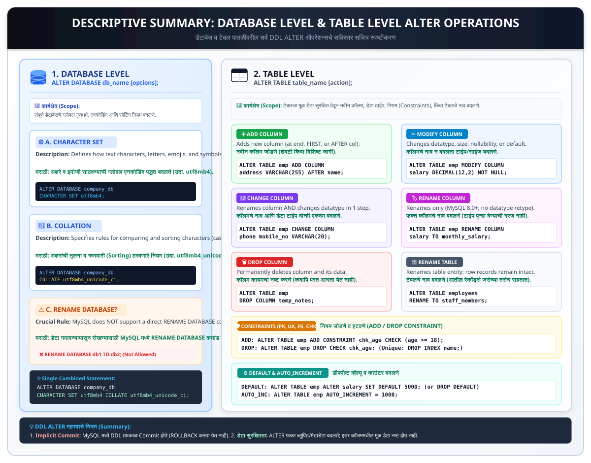
* **Explanation:**
  * **Database Level (Left Panel):** Focuses on schema-wide properties—modifying default `CHARACTER SET` (e.g., `utf8mb4` for complete multilingual & emoji storage) and default `COLLATION` (e.g., `utf8mb4_unicode_ci` for case-insensitive accurate comparisons), along with the safeguard that direct `RENAME DATABASE` is disallowed in MySQL.
  * **Table Level (Right Panel):** Categorizes all table structural modifications (`ADD`, `MODIFY`, `CHANGE`, `RENAME COLUMN`, `DROP COLUMN`, `RENAME TABLE`, `CONSTRAINTS`, `DEFAULT`, and `AUTO_INCREMENT`).
* **📌 आकृतीचे मराठीत स्पष्टीकरण:**
  * **डेटाबेस स्तर (डावा पॅनेल):** भाषेचा सेट (`utf8mb4` इमोटिकॉन्स व सर्व भाषांसाठी) आणि तुलना नियम (`utf8mb4_unicode_ci`) बदलणे; तसेच MySQL मध्ये थेट डेटाबेस नाव बदलता येत नाही हा नियम दाखवतो.
  * **टेबल स्तर (उजवा पॅनेल):** टेबलमधील सर्व रचनात्मक बदल (`ADD`, `MODIFY`, `CHANGE`, `RENAME COLUMN`, `DROP COLUMN`, `CONSTRAINTS`, `AUTO_INCREMENT`) एका दृष्टिक्षेपात दर्शवतो.

---

#### Diagram 4: Detailed Comparison (DELETE vs TRUNCATE vs DROP)

* **Explanation:**
  * **DELETE (Blue):** Shows DML row-by-row filtering via `WHERE`, with rollback capability and preserved table structure and auto-increment counter.
  * **TRUNCATE (Amber):** Shows DDL page-level instant wipe, leaving empty table structure with counter reset to 1.
  * **DROP (Red):** Shows total structural obliteration where the table definition and all data are permanently removed.
* **📌 आकृतीचे मराठीत स्पष्टीकरण:**
  * **DELETE (निळा रंग):** DML द्वारे ओळीनुसार डेटा काढतो, `WHERE` द्वारे निवडक रेकॉर्ड्स डिलीट करता येतात, आणि चूक झाल्यास `ROLLBACK` करता येतो.
  * **TRUNCATE (पिवळा/अंबर रंग):** DDL द्वारे एका झटक्यात टेबलमधील संपूर्ण डेटा साफ करतो, टेबल रिकामे राहते, आणि आयडी काऊंटर पुन्हा १ वर येतो.
  * **DROP (लाल रंग):** संपूर्ण टेबल आणि त्याचा आराखडा कायमस्वरूपी नष्ट करतो; यानंतर टेबल शिल्लक राहत नाही.

---

### 8.14 Topic 8 Summary (मराठी सारांश)

* **SQL Version तपासणे:**
  * `SELECT VERSION();` द्वारे MySQL ची चालू आवृत्ती समजते.

* **SQL Commands चे वर्गीकरण:**
  1. **DDL (Data Definition Language):** डेटाबेस आणि टेबलचा आराखडा तयार करणे आणि बदलणे (`CREATE`, `ALTER`, `DROP`, `TRUNCATE`, `RENAME`).
  2. **DML (Data Manipulation Language):** डेटा भरणे व बदलणे (`INSERT`, `UPDATE`, `DELETE`).
  3. **DQL (Data Query Language):** डेटा शोधणे व वाचणे (`SELECT`).

* **DDL Commands चे महत्त्वाचे नियम:**
  * **Implicit Commit:** MySQL मध्ये DDL कमांड्स तात्काळ ऑटोमॅटिक सेव्ह (Commit) होतात; यांना `ROLLBACK` करता येत नाही.

* **महत्त्वाच्या DDL कमांड्स:**
  * **CREATE:** डेटाबेस किंवा DB मधील ऑब्जेक्ट्स तयार करणे (जसे की Database, Tables, Indexes, Views, Stored Procedures, Triggers, Functions).
  * **ALTER:** टेबलचे डिझाइन बदलणे:
    * `ADD`: नवीन कॉलम जोडणे (शेवटी, `FIRST`, किंवा `AFTER col`).
    * `MODIFY`: कॉलमचा डेटा टाईप किंवा साईज बदलणे.
    * `CHANGE`: कॉलमचे नाव आणि डेटा टाईप एकाच वेळी बदलणे.
    * `RENAME COLUMN`: फक्त कॉलमचे नाव बदलणे (MySQL 8.0+).
    * `DROP COLUMN`: नको असलेला कॉलम हटवणे.
    * `ADD/DROP CONSTRAINT`: Primary Key, Unique, Foreign Key, Check नियम जोडणे किंवा हटवणे.
  * **DROP:** संपूर्ण टेबल किंवा डेटाबेस त्याच्या संरचनेसह कायमस्वरूपी नष्ट करणे.
  * **TRUNCATE:** टेबलचा आराखडा तसाच ठेवून आतील सर्व डेटा एका झटक्यात साफ करणे व `AUTO_INCREMENT` १ वर रिसेट करणे.
  * **RENAME:** टेबल किंवा इतर ऑब्जेक्ट्सचे नाव बदलणे (`RENAME TABLE old TO new;`, एकाच वेळी अनेक टेबल्सची अदलाबदल करणे, डेटाबेस दरम्यान टेबल्स हलवणे, आणि कॉलम/इंडेक्सचे नाव बदलणे).

* **कन्स्ट्रेंट्स (Constraints) व नियम व्यवस्थापन सारांश:**
  1. **PRIMARY KEY:** प्रत्येक रेकॉर्डची युनिक ओळख, `NULL` चालत नाही (`ADD PRIMARY KEY`, `DROP PRIMARY KEY`).
  2. **UNIQUE:** सर्व व्हॅल्यू वेगवेगळ्या असणे बंधनकारक, यात `NULL` चालतात (`ADD CONSTRAINT ... UNIQUE`, `DROP INDEX ...`).
  3. **FOREIGN KEY:** दोन टेबल्सची जोडणी, Child डेटा Parent च्या Primary Key शी जुळणारा असावा (`ADD CONSTRAINT ... FK`, `DROP FOREIGN KEY ...`).
  4. **CHECK:** कॉलम व्हॅल्यूजची अट तपासणे (`ADD CONSTRAINT ... CHECK`, `DROP CHECK ...`).
  5. **NOT NULL:** कॉलम रिकामा ठेवण्यास सक्त मनाई (`MODIFY col datatype NOT NULL`, `MODIFY col datatype NULL`).
  6. **DEFAULT:** मूल्य न दिल्यास पूर्व-निर्धारित मूल्य भरणे (`ALTER col SET DEFAULT`, `ALTER col DROP DEFAULT`).

* **DELETE vs TRUNCATE vs DROP मधील मुख्य फरक सारांश:**
  1. **DELETE (DML):** ठराविक किंवा सर्व रो हटवणे, `WHERE` क्लॉज चालतो, `ROLLBACK` करता येतो, ऑटो-इंक्रीमेंट रिसेट होत **नाही**.
  2. **TRUNCATE (DDL):** संपूर्ण डेटा एका झटक्यात साफ करणे, टेबलचा आराखडा तसाच राहतो, ऑटो-इंक्रीमेंट **१ वर रिसेट** होते, `ROLLBACK` चालत **नाही**.
  3. **DROP (DDL):** संपूर्ण टेबल आणि त्याचा आराखडा कायमस्वरूपी नष्ट करणे, यानंतर टेबल अस्तित्वात राहत **नाही**.

* **DELETE vs TRUNCATE vs DROP तुलना आकृती:**


* **Database Level vs Table Level ALTER सारांश आकृती:**


* **कन्स्ट्रेंट्स सारांश आकृती:**
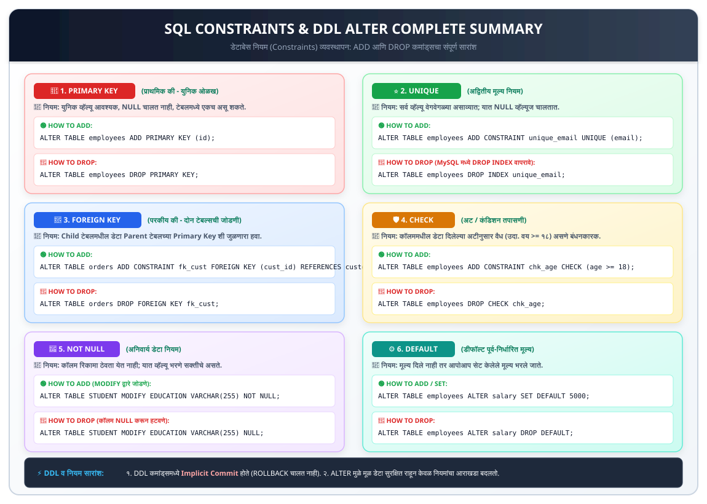

---

## Topic 9: DML (Data Manipulation Language) In-Depth

### 9.1 What is DML (Data Manipulation Language)?

* *Definition: DML (Data Manipulation Language) is used to manage and manipulate data inside database tables.*
  * DML commands make modifications directly to the database records.
  * **Operates on Records (Rows):** DML works strictly on the rows (records) stored in tables, **not on the table structure (schema blueprint)**.
  * **Transaction Safety (Controlled with Transactions):** Unlike DDL (which performs implicit commits in MySQL), DML operations can be controlled using **`COMMIT`** (to permanently save changes) and **`ROLLBACK`** (to undo/revert changes if an error occurs).

* **Classification of Primary DML Commands:**
  1. **`INSERT`:** Adds new data (rows/records) into a table.
  2. **`UPDATE`:** Updates or modifies existing data inside a table.
  3. **`DELETE`:** Removes data records from a table.
  4. **`REPLACE` (MySQL-specific):** Replaces a row by deleting the existing row if a duplicate key exists and inserting a new row.

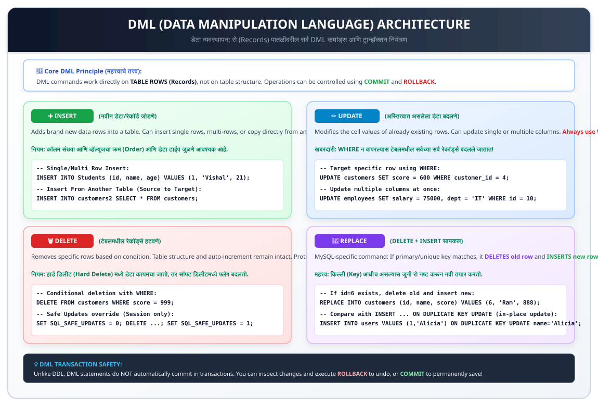

---

### 9.2 The INSERT Command & Bulk Operations

* *Definition: The INSERT statement is used to insert new data or rows into an existing table.*

#### 1. Syntax for INSERT
```sql
-- Single and Multi-Row Insertion:
INSERT INTO table_name (column1, column2, column3, ...)
VALUES
    (value1, value2, value3, ...),
    (value11, value12, value13, ...),
    (value21, value22, value23, ...);
```

#### 2. Critical Rules & Best Practices for INSERT
* **Match Number of Columns and Values:** The number of values in the `VALUES` clause must match the number of specified columns.
* **Column and Value Order:** At the time of insert, ensure that values appear in the exact same order as the listed columns.
* **Matching Data Types & Constraints:** Inserted values must be compatible with the column's defined data type and satisfy all constraints (Primary Key uniqueness, Foreign Key existence, Not Null rules).
* **Optional Column Names:**
  * Specifying column names is optional. If no columns are specified, SQL expects values for all columns in the exact sequence defined in the table schema.
  * *Tip: Always list column names explicitly for clarity, maintainability, and to avoid bugs when table structure evolves.*
* **Handling Unspecified Columns:** Any column omitted from the column list automatically becomes `NULL`, unless a `DEFAULT` value or an `AUTO_INCREMENT` constraint is defined on that column.

#### 3. Standard INSERT Examples
```sql
-- Explicit Column Insertion (Best Practice):
INSERT INTO Students (id, name, age)
VALUES (1, 'Vishal', 21);

-- Multi-Row Insertion in a Single Query:
INSERT INTO Students (id, name, age)
VALUES
    (2, 'Amit', 22),
    (3, 'Neha', 20),
    (4, 'Pooja', 23);

-- Omitting Column List (Must provide values for all table columns in order):
INSERT INTO Students
VALUES (5, 'Rahul', 24);
```

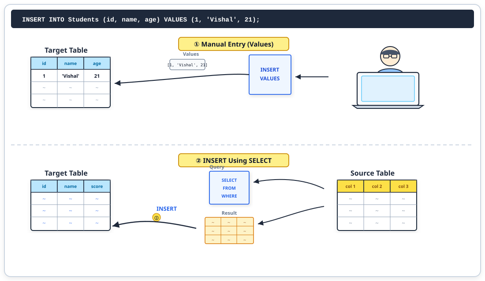

* **Architecture & Flow Explanation (आकृतीचे सविस्तर स्पष्टीकरण):**
  * **Method ①: Manual Entry (`VALUES` Clause):**
    * **User / Developer Input:** The developer specifies literal values manually from their workstation or application code using:
      ```sql
      INSERT INTO Students (id, name, age) VALUES (1, 'Vishal', 21);
      ```
    * **Execution Flow:** The database engine receives the `INSERT ... VALUES` statement, verifies schema constraints, and writes the newly created single or multi-row record directly into the **Target Table**.
  * **Method ②: INSERT Using `SELECT` (Automated Query-Driven Ingestion):**
    * **Source Table Query:** An internal query (`SELECT col1, col2 FROM source_table WHERE ...`) retrieves a filtered result set from an existing **Source Table**.
    * **Execution Flow:** The intermediate result set is piped directly into the **Target Table** in bulk via `INSERT INTO target_table SELECT ...` without requiring manual value entry or client-side round trips.

#### 4. How to Insert Data from One Table to Another (Source to Target Table)

* **Interview Questions:**
  * **Q. How to insert data from one table to another table (from source table to target table)?**
  * **Q. Write the SQL query to get data from the source table and insert into the target table (e.g., how to copy data from `customers` to `customers2` / `orders`)?**

You can copy data from an existing source table directly into a target table using `INSERT INTO ... SELECT`.

* **Syntax:**
  ```sql
  -- Copying specific matched columns:
  INSERT INTO target_table (col1, col2, col3, ...)
  SELECT col1, col2, col3, ...
  FROM source_table
  [WHERE condition];

  -- Copying all columns directly:
  INSERT INTO target_table
  SELECT * FROM source_table;
  ```

* **Practical Concrete Examples (Copying Customers Table):**
  ```sql
  -- Example 1: Explicit column selection from source to target
  INSERT INTO customers2 (customerid, firstname, lastname, country, score)
  SELECT customerid, firstname, lastname, country, score
  FROM customers;

  -- Example 2: Copying all columns using wildcard
  INSERT INTO customers2 (customerid, firstname, lastname, country, score)
  SELECT *
  FROM customers;

  -- Example 3: Filtered copy (only customers from India with high score)
  INSERT INTO premium_customers (customerid, firstname, country, score)
  SELECT customerid, firstname, country, score
  FROM customers
  WHERE country = 'India' AND score >= 800;
  ```

---

### 9.3 The UPDATE Command & Best Practices

* *Definition: The UPDATE command modifies and updates existing data values inside table rows without altering the table's schema or structure.*
* **Use of UPDATE & SET:** `UPDATE` specifies the target table to be modified, while `SET` specifies the column name(s) and assigns their new values.

* **Detailed Overview & Core Characteristics (सविस्तर माहिती व वैशिष्ट्ये):**
  * **1. Row-Level / Cell-Level Data Modification:**
    * Unlike DDL commands (`ALTER TABLE`) which alter the blueprint and table schema, `UPDATE` operates strictly on data rows already residing in the table without changing column names, datatypes, or constraints.
  * **2. Granular Filtering via `WHERE` Clause:**
    * It enables precise, targeted updates down to a single row, specific cells, or a subset of records that satisfy given logical criteria. If the `WHERE` clause is omitted, every single row across the entire table is modified.
  * **3. Dynamic Computations, Expressions & Subqueries:**
    * In addition to setting static constant values (e.g., `SET status = 'Active'`), `UPDATE` supports dynamic expressions based on current values (e.g., `SET salary = salary * 1.10`, `SET score = score + 50`), string concatenations, and values computed from subqueries.
  * **4. Transactional Safety (`COMMIT` & `ROLLBACK`):**
    * In ACID-compliant engines (such as MySQL InnoDB), `UPDATE` operations can be managed inside a transaction. This allows you to preview or verify changes and execute `ROLLBACK` if an unintended update occurs.
  * **5. Constraint & Index Integrity:**
    * Every update is automatically checked against table constraints (`PRIMARY KEY`, `FOREIGN KEY`, `UNIQUE`, `CHECK`, `NOT NULL`). If any constraint is violated, the entire statement aborts. Modifying indexed columns automatically updates the internal B-Tree index structures.

#### 1. Syntax for UPDATE
```sql
UPDATE table_name
SET
    column1 = value1,
    column2 = value2,
    ...
WHERE condition;
```

#### 2. Features & Clauses Supported by UPDATE
* **Single or Multiple Columns:** You can update one column or multiple columns simultaneously in a single statement.
* **Combine with Advanced Clauses:** `UPDATE` can be combined with `WHERE`, `LIKE`, `IN`, `JOIN`, `ORDER BY`, and `LIMIT`.

#### 3. Practical Examples

**Q. How to update the customer's score where customer id is 4?**
```sql
UPDATE CUSTOMERS
SET SCORE = 600
WHERE CUSTOMERID = 4;
```

```sql
-- Updating multiple columns at once:
UPDATE employees
SET salary = 75000, department = 'Engineering', status = 'Promoted'
WHERE employee_id = 101;

-- Conditional update using LIKE:
UPDATE customers
SET score = score + 50
WHERE country LIKE 'Ind%';

-- Conditional update using IN:
UPDATE products
SET discount = 15
WHERE category_id IN (1, 3, 5);

-- Conditional update using JOIN (Cross-Table Update):
UPDATE employees e
JOIN departments d ON e.dept_id = d.dept_id
SET e.salary = e.salary * 1.15
WHERE d.dept_name = 'Research & Development';

-- Update with ORDER BY and LIMIT (Safe Batch / Top-N Updates in MySQL):
-- Increase scores for only the bottom 5 lowest-scoring customers in India:
UPDATE customers
SET score = score + 20
WHERE country = 'India'
ORDER BY score ASC
LIMIT 5;
```

#### 4. Critical Warnings & Best Practices
> ⚠️ **CRITICAL WARNING:**
> **Always use a WHERE clause in an UPDATE statement!**
> Without a `WHERE` clause, **ALL rows in the table will be updated unconditionally**.
>
> 💡 **Industry Best Practice:**
> Always verify your criteria first by running a `SELECT` query with the exact same `WHERE` clause before executing the `UPDATE`.
> ```sql
> -- Step 1: Verify the rows to be modified:
> SELECT * FROM customers WHERE customerid = 4;
>
> -- Step 2: Once verified, execute the UPDATE:
> UPDATE customers SET score = 600 WHERE customerid = 4;
> ```

---

### 9.4 The DELETE Command & Safe Execution

* *Definition: The DELETE command removes specific existing rows or all rows from a table while keeping the table structure, columns, constraints, and indexes completely intact.*
* **Role of DELETE FROM & WHERE:** `DELETE FROM table_name` specifies the target table, while the `WHERE condition` identifies the exact records to be deleted. By default, standard SQL `DELETE` performs a **hard delete** (physical removal from the table).

* **Detailed Overview & Core Characteristics (सविस्तर माहिती व वैशिष्ट्ये):**
  * **1. Row-by-Row Removal (Record-Level Action):**
    * Unlike DDL commands like `DROP` (which deletes the entire table schema) or `TRUNCATE` (which deallocates table pages), `DELETE` is a DML command that processes rows individually, writing undo/redo logs for each deleted row.
  * **2. Granular Filtering with `WHERE` Clause:**
    * Supports fine-grained row selection using conditions (`=`, `!=`, `<`, `>`, `LIKE`, `IN`, `BETWEEN`). If the `WHERE` clause is omitted, **all records in the table will be deleted**.
  * **3. Transaction Safety & Rollback:**
    * In ACID-compliant engines (such as MySQL InnoDB), deletions can be wrapped in a transaction (`START TRANSACTION`). If records are deleted by mistake, you can restore them immediately using `ROLLBACK` before committing.
  * **4. Foreign Key & Referential Integrity Enforcement:**
    * Checks related child tables before deletion (`ON DELETE RESTRICT`, `CASCADE`, or `SET NULL`). If a child table holds dependent records and is protected by `RESTRICT`, the deletion will be rejected to prevent orphan records.
  * **5. Trigger Activation:**
    * Fires `BEFORE DELETE` and `AFTER DELETE` database triggers on each affected row, which is essential for audit logging and archival workflows.
  * **6. Auto-Increment Preservation:**
    * Unlike `TRUNCATE`, running `DELETE` (even without a `WHERE` clause) does **not** reset the `AUTO_INCREMENT` sequence counter in MySQL.

#### 1. Syntax for DELETE
```sql
DELETE FROM table_name
WHERE condition;
```

#### 2. Practical Examples
```sql
-- Delete customer records where country is India:
DELETE FROM customers
WHERE country = 'India';

-- Delete customer records where score is 999:
DELETE FROM CUSTOMERS
WHERE SCORE = 999;
```

#### 3. Critical Safety Rules
* **Avoid `DELETE` without a `WHERE` clause:** Executing `DELETE FROM table_name;` without a `WHERE` clause will wipe out all records in the table.
* **Verify with `SELECT` first:** Run `SELECT * FROM table_name WHERE condition;` prior to running the delete to inspect the exact rows that will be eliminated.

---

### 9.5 MySQL Safe Update Mode (`SQL_SAFE_UPDATES`)

* *Definition: Safe mode (SQL_SAFE_UPDATES) in MySQL is a built-in safety feature that helps prevent accidental mass UPDATE and DELETE operations across an entire table or unintended records.*
* **Enforcement Rules (कधी आणि कसे लागू होते?):**
  * When safe mode is enabled, MySQL **does not allow** an `UPDATE` or `DELETE` statement unless:
    1. The `WHERE` clause uses a **key column** (such as a **Primary Key** or an **Indexed column**).
    2. **OR** the statement includes a **`LIMIT`** clause.

#### 1. Error Analysis: Why Non-Key Deletes Fail
If you run:
```sql
DELETE FROM customers WHERE SCORE = 999;
```
MySQL triggers an error:
```
Error Code: 1175. You are using safe update mode and you tried to update a table without a WHERE that uses a KEY column.
To disable safe mode, toggle the option in Preferences -> SQL Editor and reconnect.
```
* **Why this happens:** `SCORE` is not a Primary Key or indexed column. MySQL cannot guarantee row isolation efficiently, so it blocks the command to safeguard against accidental mass deletion.

#### 2. How to Handle Safe Mode (Two Approaches)

##### Approach A: Use a Key Column in WHERE or Add LIMIT (Best Practice)
* **Example (Not Allowed in Safe Mode):**
  ```sql
  DELETE FROM employees;
  -- Reason: This statement attempts to delete all rows because it lacks both a WHERE clause and a LIMIT clause.
  ```
* **Example (Allowed in Safe Mode):**
  ```sql
  -- Allowed: Using the Primary Key / Indexed column:
  DELETE FROM employees WHERE employee_id = 101;
  DELETE FROM customers WHERE customer_id = 101;

  -- Allowed: Using a LIMIT clause:
  DELETE FROM employees LIMIT 1;
  DELETE FROM customers WHERE score = 999 LIMIT 1;
  ```

##### Approach B: Temporarily Toggle Safe Mode for Current Session
If you genuinely need to perform a bulk delete/update on a non-key column:
```sql
-- Step 1: Temporarily disable safe mode in current session (0 = Disabled / OFF)
SET SQL_SAFE_UPDATES = 0;

-- Step 2: Execute your bulk query safely
DELETE FROM customers WHERE score = 999;
DELETE FROM customers WHERE score = 350;

-- Step 3: Immediately re-enable safe mode (1 = Enabled / ON)
SET SQL_SAFE_UPDATES = 1;
```

* **Interview Answer Summary:**
  > "MySQL Safe Mode (`SQL_SAFE_UPDATES`) is a safety feature that prevents accidental mass `UPDATE` and `DELETE` operations. It requires a `WHERE` clause using a key column (such as a Primary Key or indexed column) or a `LIMIT` clause. This helps protect data from unintended modifications or deletions."

---

### 9.6 Soft Delete vs Hard Delete (In-Depth Comparison)

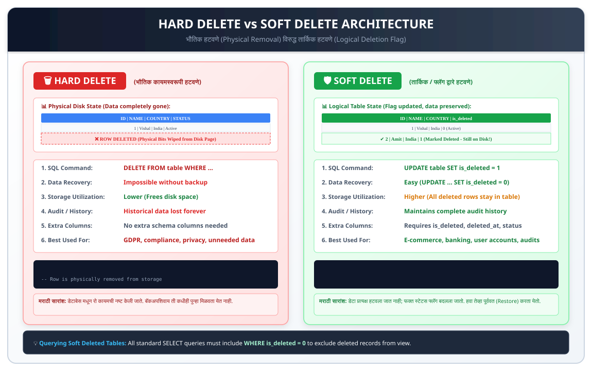

#### 1. Detailed 9-Point Comparison Matrix

| Feature / Dimension | Hard Delete (कठोर/भौतिक हटवणे) | Soft Delete (तार्किक हटवणे) |
| :--- | :--- | :--- |
| **1. Meaning** | Data is permanently and physically removed from disk | Data is not physically removed; it is only marked as deleted using a status flag |
| **2. Data Recovery** | Cannot be recovered unless a database backup is available | Easily restored by changing the status flag back to active |
| **3. How It Works** | Removes the actual row records from the storage pages | Updates a flag or timestamp column to indicate deletion |
| **4. SQL Command** | Executed using **`DELETE`** or **`TRUNCATE`** | Executed using **`UPDATE`** (`SET is_deleted = 1`) |
| **5. Storage Usage** | Uses less storage because deleted records are cleared | Uses more storage because deleted records remain in the table indefinitely |
| **6. Query Performance** | Generally faster; fewer records remain to scan and index | Queries may require filtering index checks (`WHERE is_deleted = 0`) |
| **7. Data History & Audit** | Historical data is permanently lost | Maintains complete audit history and allows tracking of who deleted what and when |
| **8. Implementation** | No extra table columns required | Requires additional columns like `is_deleted`, `deleted_at`, or `status` |
| **9. Common Use Cases** | Temporary data, cache tables, compliance data removal (GDPR) | Banking, e-commerce orders, user accounts, audit-heavy enterprise apps |

#### 2. Practical Implementation of Soft Delete
```sql
-- Step 1: Add soft delete tracking columns to the table
ALTER TABLE customers
ADD COLUMN is_deleted TINYINT(1) DEFAULT 0,
ADD COLUMN deleted_at DATETIME NULL;

-- Step 2: Perform a "Soft Delete" (UPDATE instead of DELETE)
UPDATE customers
SET is_deleted = 1, deleted_at = NOW()
WHERE customer_id = 101;

-- Step 3: Query active records (Exclude soft-deleted rows)
SELECT * FROM customers
WHERE is_deleted = 0;

-- Step 4: Restore / Undelete a record
UPDATE customers
SET is_deleted = 0, deleted_at = NULL
WHERE customer_id = 101;
```

---

### 9.7 Foreign Key Referential Actions (Complete Guide)

#### 1. What is Referential Integrity?
* *Definition: Referential Integrity is a relational database rule ensuring that relationships between tables remain consistent and valid.*
* It prevents **child records from pointing to non-existing parent records**.
* It prevents **invalid or orphan data** (अनाथ रेकॉर्ड्स प्रतिबंध).

#### 2. What is a Referential Action?
* *Definition: A Referential Action instructs MySQL: "If a parent row is UPDATED or DELETED, what should automatically happen to the related child rows?"*
This action is defined directly inside the Foreign Key constraint clause:
```sql
FOREIGN KEY (department_id)
REFERENCES department(department_id)
ON DELETE CASCADE
ON UPDATE CASCADE;
```

#### 3. The 5 Types of Referential Actions
1. **`CASCADE`:** Automatically deletes or updates child rows when parent is deleted or updated.
2. **`RESTRICT` (MySQL Default):** Prevents deletion or modification of a parent row if matching child rows exist.
3. **`NO ACTION`:** Exactly the same as `RESTRICT` in MySQL.
4. **`SET NULL`:** Sets child foreign key columns to `NULL` when parent row is deleted or updated (requires column to be nullable).
5. **`SET DEFAULT`:** Sets child foreign key to its defined default value (*Note: MySQL's InnoDB engine does not support `SET DEFAULT` for foreign keys*).

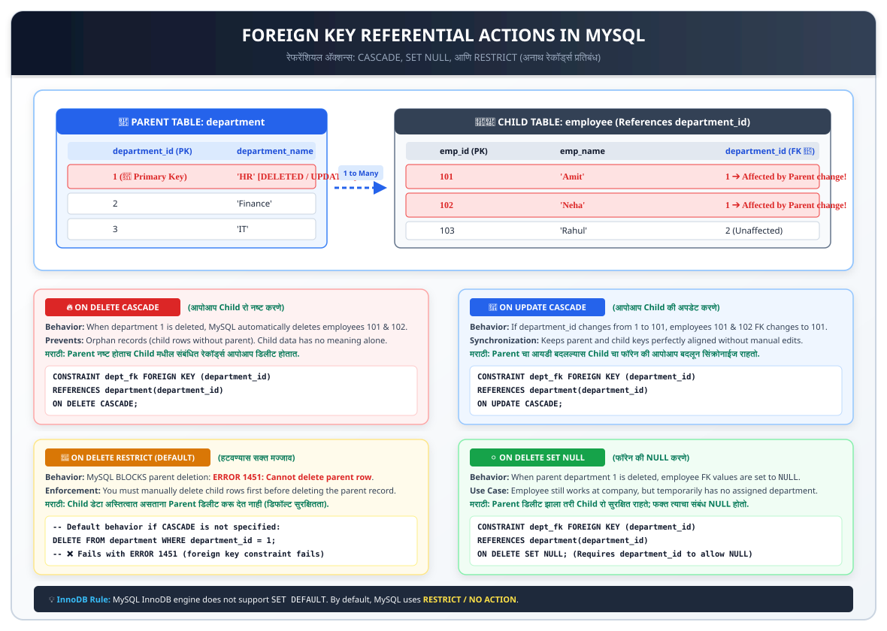

---

#### 4. Deep-Dive: `ON DELETE CASCADE`
* *Definition: ON DELETE CASCADE is a referential action used with foreign key constraints. When a row in the parent table is deleted, MySQL automatically deletes all related rows from the child table.*
* **Purpose:** Maintains referential integrity and prevents orphan records ("अनाथ (संबंध तुटलेले) रेकॉर्ड तयार होण्यापासून प्रतिबंध करते").
* **What happens WITHOUT `ON DELETE CASCADE`?**
  * If not specified, MySQL defaults to `RESTRICT`.
  * Deleting the parent row will fail with `ERROR 1451 (23000): Cannot delete or update a parent row: a foreign key constraint fails`.
  * You must first manually delete all child records before deleting the parent record.

* **Complete Executable SQL Demonstration:**
  ```sql
  -- Step 1: Create Parent Table (department)
  DROP TABLE IF EXISTS employee;
  DROP TABLE IF EXISTS department;

  CREATE TABLE department (
      department_id INT PRIMARY KEY,
      department_name VARCHAR(50) NOT NULL
  );

  -- Step 2: Create Child Table (employee) with ON DELETE CASCADE
  CREATE TABLE employee (
      emp_id INT PRIMARY KEY,
      emp_name VARCHAR(50) NOT NULL,
      department_id INT,
      CONSTRAINT fk_dept
          FOREIGN KEY (department_id) REFERENCES department(department_id)
          ON DELETE CASCADE
          ON UPDATE CASCADE
  );

  -- Step 3: Insert Sample Data
  INSERT INTO department VALUES (1, 'HR'), (2, 'Engineering');
  INSERT INTO employee VALUES (101, 'Amit', 1), (102, 'Neha', 1), (103, 'Rahul', 2);

  -- Inspect before deletion
  SELECT * FROM department;
  SELECT * FROM employee;

  -- Step 4: Delete Parent Record (department_id = 1)
  DELETE FROM department WHERE department_id = 1;

  -- Step 5: Verify Cascade Deletion
  -- Notice Amit and Neha are AUTOMATICALLY deleted from employee table!
  SELECT * FROM employee;
  ```

* **Step-by-Step Point-Wise Breakdown of the ON DELETE CASCADE Example:**
  * **Point 1 (Parent Table Definition):** Table `department` is created with `department_id` as the primary key.
  * **Point 2 (Child Foreign Key with CASCADE):** Table `employee` is created with `CONSTRAINT fk_dept FOREIGN KEY (department_id) REFERENCES department(department_id) ON DELETE CASCADE`.
  * **Point 3 (Data Seeding):** Department `1` ('HR') is created, and two employees (`101` Amit, `102` Neha) are assigned to Department `1`.
  * **Point 4 (Parent Deletion):** Running `DELETE FROM department WHERE department_id = 1;` removes the parent record.
  * **Point 5 (Automatic Cascade Purge):** Because `ON DELETE CASCADE` is active, MySQL automatically and immediately deletes Amit and Neha from `employee`. Querying `employee` confirms that no orphan records remain.
  * **Point 6 (Without Cascade Behavior):** Without `ON DELETE CASCADE` (under default `RESTRICT`), deleting department 1 fails with `ERROR 1451 (23000)`. You are required to run a manual 2-step deletion (delete child rows first, then delete parent).

* **What happens without Cascade? (Demonstration of Error 1451):**
  ```sql
  -- Suppose employee was created without ON DELETE CASCADE (Default RESTRICT):
  DELETE FROM department WHERE department_id = 1;
  -- Output: ERROR 1451 (23000): Cannot delete or update a parent row: a foreign key constraint fails

  -- To delete under RESTRICT, you MUST manually delete child records first:
  DELETE FROM employee WHERE department_id = 1;
  DELETE FROM department WHERE department_id = 1;
  ```

* **Interview Answer (ON DELETE CASCADE):**
  > "ON DELETE CASCADE is a referential action used with foreign keys. When a parent row is deleted, MySQL automatically deletes all related child rows. This maintains referential integrity and prevents orphan records (\"अनाथ (संबंध तुटलेले) रेकॉर्ड तयार होण्यापासून प्रतिबंध करते\" — Child table मधील असा डेटा ज्याचा Parent table मध्ये संबंधित रेकॉर्ड उरलेला नाही, असा डेटा तयार होऊ देत नाही). Without ON DELETE CASCADE, you must manually delete the child records before deleting the parent record."

---

#### 5. Deep-Dive: `ON UPDATE CASCADE`
* *Definition: ON UPDATE CASCADE automatically updates the foreign key values in the child table whenever the referenced primary key in the parent table is updated.*
* **Purpose:** Keeps parent and child records continuously synchronized.
* **What happens WITHOUT `ON UPDATE CASCADE`?**
  * Changing a parent's primary key would fail under default `RESTRICT` because existing child rows would point to an invalid key. You would have to manually update child tables first.

* **Complete Executable Demonstration:**
  ```sql
  -- Ensure tables are ready with ON UPDATE CASCADE:
  -- (department and employee created above)

  -- Temporarily disable safe mode if updating by name:
  SET SQL_SAFE_UPDATES = 0;

  -- Update Parent Primary Key (change HR department_id from 1 to 101):
  UPDATE department
  SET department_id = 101
  WHERE department_name = 'HR';

  SET SQL_SAFE_UPDATES = 1;

  -- Verify Child Table:
  -- Notice Amit and Neha's department_id is automatically updated to 101!
  SELECT * FROM employee;
  ```

* **Step-by-Step Point-Wise Breakdown of the ON UPDATE CASCADE Example:**
  * **Point 1 (Parent Key Modification):** Department `1` ('HR') needs to have its primary key changed from `1` to `101`.
  * **Point 2 (Automatic Key Synchronization):** MySQL detects the parent primary key modification and automatically updates `employee.department_id` from `1` to `101` for both Amit and Neha.
  * **Point 3 (Verification & Data Integrity):** Running `SELECT * FROM employee;` shows Amit and Neha now reference `department_id = 101`. No manual update on `employee` was required, and referential integrity remained unbroken.
  * **Point 4 (Without Update Cascade Behavior):** Without `ON UPDATE CASCADE`, MySQL defaults to `RESTRICT` and aborts the primary key update with `ERROR 1451 (23000)`. You would be forced to manually update the child table foreign keys before modifying the parent primary key.

* **Interview Questions & Answers (ON UPDATE CASCADE):**
  * **Q. What is ON UPDATE CASCADE?**
    * **Answer:** ON UPDATE CASCADE is a referential action used in a foreign key constraint. When the primary key value in the parent table changes, MySQL automatically updates the corresponding foreign key values in the child table, maintaining referential integrity and keeping related data synchronized.
  * **Q. Why do we use ON UPDATE CASCADE?**
    * **Answer:** We use ON UPDATE CASCADE to avoid manually updating child table records whenever a parent table's primary key changes. It ensures data consistency and prevents broken relationships between parent and child tables.

---

#### 6. Summary Matrix of Referential Actions

| Action Type | Behavior on Parent Deletion (`ON DELETE`) | Behavior on Parent Update (`ON UPDATE`) | Best Use Case |
| :--- | :--- | :--- | :--- |
| **`CASCADE`** | Automatically deletes all related child rows | Automatically updates related child foreign keys | Child data has no standalone meaning without parent (e.g., Order Items $\rightarrow$ Order) |
| **`RESTRICT` (DEFAULT)**| Blocks parent deletion if child records exist | Blocks parent primary key update if child records exist | Strong data protection required; prevents accidental loss |
| **`NO ACTION`** | Same as `RESTRICT` in MySQL (blocks deletion) | Same as `RESTRICT` in MySQL (blocks update) | Standard ANSI compliance |
| **`SET NULL`** | Sets child foreign key column to `NULL` (Child remains) | Sets child foreign key column to `NULL` | Child can exist independently (e.g., Employee retains job if Department is deleted) |
| **`SET DEFAULT`** | Sets child foreign key to default value | Sets child foreign key to default value | *Rare in MySQL; NOT supported by InnoDB engine* |

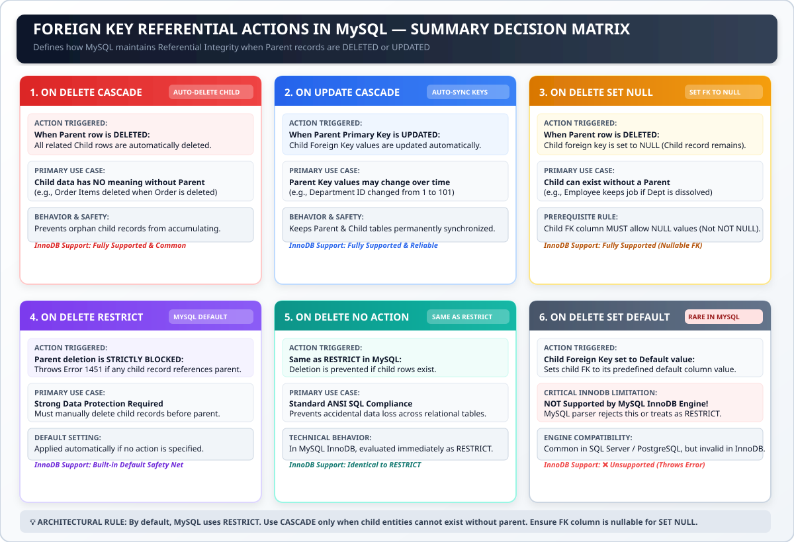

* **Detailed Point-Wise Breakdown & Architectural Use Cases (सविस्तर स्पष्टीकरण व नियम):**
  * **1. `ON DELETE CASCADE`:**
    * **Behavior:** When a parent row is deleted, all related child rows are deleted automatically.
    * **Use Case:** Used when child data has no meaning without the parent (e.g., deleting an `orders` record automatically purges all corresponding `order_items`).
  * **2. `ON UPDATE CASCADE`:**
    * **Behavior:** When the parent primary key is updated, the child foreign key values are updated automatically.
    * **Use Case:** Used when parent key values may change over time and child records must remain continuously synchronized.
  * **3. `ON DELETE SET NULL`:**
    * **Behavior:** When the parent row is deleted, the child foreign key is set to `NULL` so the child record remains intact.
    * **Use Case:** Used when a child entity can exist without a parent (e.g., an `employee` retains their record when a `department` is dissolved).
    * **Prerequisite:** The child foreign key column **must allow `NULL` values** (must not be defined as `NOT NULL`).
  * **4. `ON DELETE RESTRICT` (MySQL Default):**
    * **Behavior:** Parent deletion is strictly blocked with `Error 1451` if any related child records exist.
    * **Use Case:** Used when strong data protection is required to safeguard against unintended deletions. You must manually delete child rows first before deleting the parent record.
  * **5. `ON DELETE NO ACTION`:**
    * **Behavior:** Exactly the same as `RESTRICT` in MySQL InnoDB. Deletion is prevented if child rows exist.
    * **Use Case:** Standard ANSI SQL compliance.
  * **6. `ON DELETE SET DEFAULT` (Rare in MySQL):**
    * **Behavior:** If the parent row is deleted, the child foreign key is set to its predefined default value.
    * **Critical Engine Note:** MySQL's **InnoDB storage engine does NOT support `SET DEFAULT`** for foreign keys. If specified, it is rejected with a syntax error or treated as `RESTRICT`/`NO ACTION`.

---

### 9.8 The REPLACE Command in SQL (MySQL Specific)

#### 1. What is the REPLACE Command?
* *Definition: The REPLACE statement in MySQL is a specialized DML extension of INSERT that operates on a Delete + Insert cycle.*
* **If a row already exists** (with the exact same `PRIMARY KEY` or `UNIQUE KEY` value), MySQL **first deletes the old row** and then **inserts the new row**.
* **If no duplicate key exists**, it behaves exactly like a standard `INSERT` statement.
* **Formula:**
  $$\text{REPLACE} = \text{DELETE (Old Row)} + \text{INSERT (New Row)}$$

#### 2. Crucial Requirements for REPLACE
* **Requires Key:** `REPLACE` works only if the table has a defined `PRIMARY KEY` or `UNIQUE INDEX`. Without keys, MySQL cannot detect conflicts and will always execute a normal insert.

#### 3. Practical Code Examples
```sql
-- Step 1: Normal Insert
INSERT INTO customers (id, first_name, country, score)
VALUES (6, 'Vishal', 'India', 999);

-- Step 2: REPLACE when duplicate key exists (id = 6 already exists):
-- Result: MySQL deletes old row (Vishal, India, 999) and inserts new row (Ram, India, 888)
REPLACE INTO customers (id, first_name, country, score)
VALUES (6, 'Ram', 'India', 888);

-- Step 3: REPLACE when key does not exist:
-- Result: Inserts as a new record
REPLACE INTO customers (id, first_name, country, score)
VALUES (7, 'Vishal', 'India', 999);
```

#### 4. Differences: UPDATE vs REPLACE INTO

| Dimension | `UPDATE` | `REPLACE INTO` |
| :--- | :--- | :--- |
| **Operation Type** | Modifies existing row in-place | **Deletes** old row, then **Inserts** new row |
| **Key Conflict** | Requires key to locate; does not delete | If key exists, deletes old record first |
| **Non-Existing Key** | Returns 0 rows affected (does not insert) | Inserts as a brand new row |
| **Trigger Execution** | Fires `UPDATE` triggers only | Fires **both `DELETE` and `INSERT` triggers** |
| **Performance** | Faster (in-place modification) | Slightly slower (two-step delete + insert cycle) |
| **AUTO_INCREMENT** | Does not affect auto_increment | May cause auto-increment counter to advance |

#### 5. **Q. What is the difference between REPLACE and INSERT ... ON DUPLICATE KEY UPDATE?**

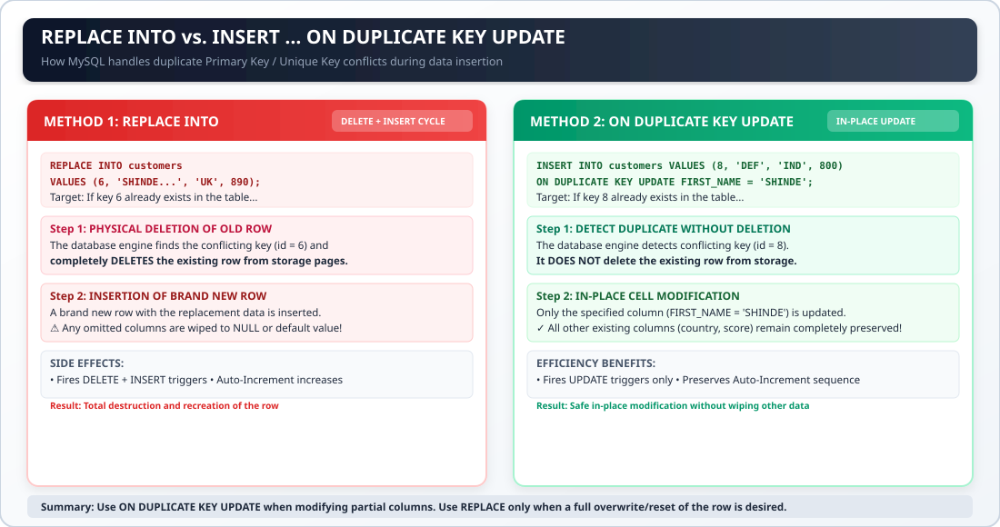

* **Key Concepts & Rules (नियम व फरक):**
  * **`ON DUPLICATE KEY UPDATE`:**
    * **When Key Exists:** If data is already present with a `PRIMARY KEY` or `UNIQUE KEY`, it **modifies the existing record in-place**.
    * **When Key Does Not Exist:** If the record is not present, it **inserts a brand new record**.
    * **No Deletion:** It does **NOT delete** any record like `REPLACE INTO`.
    * **Column Preservation:** Preserves all other existing column values that are not specified in the `UPDATE` clause.
  * **`REPLACE INTO`:**
    * **When Key Exists:** If the record is already present with a `PRIMARY KEY` or `UNIQUE KEY`, **first the old record is physically DELETED**, and then a **new record is INSERTED** into the table.
    * **Column Reset Warning:** Any column omitted from the `REPLACE INTO` statement will lose its existing value and revert to `NULL` or its column default!

* **Practical SQL Code Demonstration (From Workbench Examples):**
  ```sql
  -- =========================================================================
  -- 1. INSERT ... ON DUPLICATE KEY UPDATE
  -- If data is already present with PRIMARY KEY or UNIQUE KEY, modify existing data.
  -- If record is not present, insert new record.
  -- It does NOT delete any record like REPLACE INTO.
  -- It modifies the record if already present; otherwise creates a new record.
  -- =========================================================================
  INSERT INTO CUSTOMERS
  VALUES (8, 'DEF', 'IND', 800)
  ON DUPLICATE KEY UPDATE FIRST_NAME = 'SHINDE';

  -- =========================================================================
  -- 2. REPLACE INTO
  -- If the record is present with PRIMARY KEY,
  -- first the existing record is DELETED, and then a new record is INSERTED.
  -- =========================================================================
  REPLACE INTO CUSTOMERS
  VALUES (6, 'SHINDE...', 'UK', 890);
  ```

* **Standard Example for User Profiles:**
  ```sql
  -- Updating an existing user without wiping their profile data:
  INSERT INTO users (id, name, email)
  VALUES (1, 'Alicia', 'alicia@example.com')
  ON DUPLICATE KEY UPDATE name = 'Alicia';
  ```

---

### 9.9 Comparison: ALTER Command vs UPDATE Command

| Feature / Dimension | `ALTER` Command | `UPDATE` Command |
| :--- | :--- | :--- |
| **1. Command Category** | **DDL** (Data Definition Language) | **DML** (Data Manipulation Language) |
| **2. Target of Operation** | Works on **Table Structure / Blueprint** | Works on **Data Values / Rows** |
| **3. Core Action** | Adds, deletes, or changes columns, constraints, data types | Modifies contents of existing rows |
| **4. Default Initialization** | Initializes new columns for all existing rows as `NULL` (or default) | Sets specific fixed cell values according to `SET` clause |
| **5. Transaction Control** | **Implicit Commit** (Cannot rollback in MySQL) | **Transaction Controlled** (Can rollback before commit) |
| **6. Summary Purpose** | Alters the **definition** of the database object | Modifies the **actual data** inside the table |

---

### 9.10 Visual Diagrams & Architectural Explanations

#### Diagram 1: DML Operations Overview (INSERT, UPDATE, DELETE, REPLACE)

* **Explanation:**
  * Illustrates how DML commands interact directly with table rows inside the storage engine.
  * Demonstrates the transaction safety net (`COMMIT` vs `ROLLBACK`) available exclusively to DML operations.
* **📌 आकृतीचे मराठीत स्पष्टीकरण:**
  * DML ऑपरेशन्स (`INSERT`, `UPDATE`, `DELETE`, `REPLACE`) थेट टेबलमधील डेटा ओळींवर (Rows) काम करतात.
  * या बदलांना ट्रान्झॅक्शनची सुरक्षा असते; म्हणजे बदल कायम ठेवण्यासाठी `COMMIT` आणि चूक झाल्यास पूर्ववत करण्यासाठी `ROLLBACK` ची सुविधा मिळते.

---

#### Diagram 2: Soft Delete vs Hard Delete Architecture

* **Explanation:**
  * Compares physical record wiping from disk pages (Hard Delete) against state updates using logical flag columns like `is_deleted` or timestamps (Soft Delete).
  * Outlines recovery, storage, performance, and compliance implications.
* **📌 आकृतीचे मराठीत स्पष्टीकरण:**
  * **Hard Delete (डावी बाजू):** डेटा हार्ड डिस्कवरून कायमचा नष्ट होतो; नंतर डेटा रिकव्हर करणे अशक्य असते.
  * **Soft Delete (उजवी बाजू):** प्रत्यक्ष डेटा नष्ट न करता फक्त `is_deleted = 1` हा फ्लॅग बदलला जातो. डेटा ॲप्लिकेशनला दिसत नाही, पण डेटाबेसमध्ये सुरक्षित राहतो आणि भविष्यात रिस्टोअर करता येतो.

---

#### Diagram 3: Foreign Key Referential Actions (CASCADE, RESTRICT, SET NULL)

* **Explanation:**
  * Visualizes Parent table (`department`) and Child table (`employee`) relationships.
  * Shows how `CASCADE` propagates changes automatically, `RESTRICT` blocks destructive operations to protect integrity, and `SET NULL` disassociates relationships while preserving child entities.
* **📌 आकृतीचे मराठीत स्पष्टीकरण:**
  * **CASCADE:** पालक (Parent) रेकॉर्ड डिलीट किंवा अपडेट झाल्यास बाल (Child) रेकॉर्ड्स आपोआप डिलीट/अपडेट होतात.
  * **RESTRICT (डिफॉल्ट):** जोपर्यंत संबंधित चाइल्ड रेकॉर्ड्स अस्तित्वात आहेत, तोपर्यंत पालकाला डिलीट करण्यास बंदी असते.
  * **SET NULL:** पालक डिलीट झाल्यावर चाइल्ड रेकॉर्ड्स राहतात, फक्त त्यांची फॉरेन की व्हॅल्यू `NULL` होते.

---

#### Diagram 4: Two Methods of INSERT Operations (Manual Values vs. INSERT Using SELECT)

* **Explanation:**
  * Contrasts manual interactive row insertion using explicit literal values via `INSERT INTO ... VALUES` with automated, bulk query ingestion via `INSERT INTO ... SELECT`.
  * Details how the intermediate result set from a source table query is directly transformed and populated into the destination target table.
* **📌 आकृतीचे मराठीत स्पष्टीकरण:**
  * **पद्धत १ (मॅन्युअल इनसर्ट):** `VALUES (...)` द्वारे एका वेळी एक किंवा काही नोंदी हाताने भरणे.
  * **पद्धत २ (SELECT द्वारे बल्क इनसर्ट):** दुसऱ्या टेबलमधील हजारो नोंदी क्वेरी करून थेट टार्गेट टेबलमध्ये एका सेकंदात कॉपी करणे (`INSERT INTO target SELECT * FROM source`).

---

#### Diagram 5: Foreign Key Referential Actions Summary Decision Matrix

* **Explanation:**
  * Comprehensive 6-card visual decision matrix outlining behavioral differences and use cases for `CASCADE`, `RESTRICT`, `SET NULL`, `NO ACTION`, and `SET DEFAULT`.
  * Highlights why InnoDB rejects `SET DEFAULT` and how default `RESTRICT` guards against unintended cascading data purges.
* **📌 आकृतीचे मराठीत स्पष्टीकरण:**
  * सर्व ५ फॉरेन की नियमांचे तुलनात्मक कार्ड्स—CASCADE (स्वयंचलित पाठपुरावा), RESTRICT (डेटाचे संरक्षण), SET NULL (अनाथ न करता संबंध तोडणे), NO ACTION (RESTRICT प्रमाणेच), आणि SET DEFAULT (InnoDB द्वारे अस्वीकृत).

---

#### Diagram 6: REPLACE INTO vs. INSERT ... ON DUPLICATE KEY UPDATE

* **Explanation:**
  * Visualizes the two distinct conflict-resolution pathways in MySQL.
  * Shows how `REPLACE` physically drops and reinserts entire rows versus how `ON DUPLICATE KEY UPDATE` mutates target cells in-place while keeping existing row data intact.
* **📌 आकृतीचे मराठीत स्पष्टीकरण:**
  * **REPLACE INTO (डावी बाजू):** की चा वाद झाल्यास जुनी संपूर्ण रो थेट नष्ट करून (`DELETE`) नवीन रो नव्याने टाकतो (`INSERT`), ज्यामुळे न नमूद केलेले कॉलम्स डीफॉल्ट/नुल होतात.
  * **ON DUPLICATE KEY UPDATE (उजवी बाजू):** मूळ रो तशीच ठेवून फक्त सांगितलेल्या ठराविक कॉलम्सचे मूल्य बदलतो, इतर डेटा सुरक्षित राहतो.

---

### 9.11 Topic 9 Summary (मराठी सारांश)

* **DML (Data Manipulation Language) ची व्याख्या:**
  * DML चा उपयोग टेबलच्या संरचनेवर (Structure) नाही, तर टेबलमधील **डेटा / रो (Records)** वर प्रक्रिया करण्यासाठी होतो.
  * DML ऑपरेशन्स ट्रान्झॅक्शनद्वारे नियंत्रित असतात; यामध्ये `COMMIT` करून डेटा कायम सेव्ह करता येतो किंवा चूक झाल्यास `ROLLBACK` करून पूर्ववत करता येतो.

* **महत्त्वाच्या DML कमांड्स व त्यांचे कार्य:**
  1. **INSERT:** टेबलमध्ये नवीन रो जोडणे.
      * `INSERT INTO table (cols) VALUES (...);`
      * `INSERT INTO target SELECT * FROM source;` द्वारे एका टेबलमधील डेटा दुसऱ्या टेबलमध्ये कॉपी करता येतो.
  2. **UPDATE:** अस्तित्वात असलेल्या रेकॉर्ड्समधील मूल्ये बदलणे.
      * `UPDATE table SET col = val WHERE condition;`
      * **महत्त्वाची खबरदारी:** `WHERE` क्लॉज न वापरल्यास टेबलमधील सर्वच्या सर्व रेकॉर्ड्स बदलले जातात!
  3. **DELETE:** टेबलमधील नको असलेला डेटा हटवणे.
      * `DELETE FROM table WHERE condition;`
      * हा हार्ड डिलीट (Hard Delete) करतो.

* **MySQL Safe Update Mode (`SQL_SAFE_UPDATES`):**
  * चुकून सर्व डेटा डिलीट किंवा अपडेट होण्यापासून वाचवण्यासाठी MySQL मध्ये सेफ मोड असतो.
  * यासाठी `WHERE` मध्ये Primary Key किंवा इंडेक्स कॉलम असणे आवश्यक असते.
  * सेशनपुरता बंद करण्यासाठी: `SET SQL_SAFE_UPDATES = 0;` व पुन्हा चालू करण्यासाठी: `SET SQL_SAFE_UPDATES = 1;`.

* **Soft Delete विरुद्ध Hard Delete:**
  * **Hard Delete:** डेटा कायमस्वरूपी डिस्कवरून नष्ट होतो; रिकव्हरी शक्य नसते (`DELETE`).
  * **Soft Delete:** डेटा प्रत्यक्ष नष्ट होत नाही, फक्त `is_deleted = 1` हा फ्लॅग बदलला जातो (`UPDATE`). डेटा सुरक्षित राहतो व ऑडिटसाठी वापरता येतो.

* **फॉरेन की आणि रेफरेंशियल अ‍ॅक्शन्स (Referential Actions):**
  * **Referential Integrity:** Parent आणि Child टेबल्समधील संबंध वैध ठेवणे व अनाथ रेकॉर्ड्स (Orphan Records) तयार होण्यास प्रतिबंध करणे.
  * **ON DELETE CASCADE:** Parent रो डिलीट झाल्यास Child मधील संबंधित सर्व रो आपोआप डिलीट होतात.
  * **ON UPDATE CASCADE:** Parent ची Primary Key बदलल्यास Child ची Foreign Key आपोआप बदलून सिंक्रोनाईज होते.
  * **ON DELETE RESTRICT (Default):** जोपर्यंत Child रेकॉर्ड्स अस्तित्वात आहेत, तोपर्यंत Parent डिलीट करण्यास सक्त मज्जाव (Error 1451).
  * **ON DELETE SET NULL:** Parent डिलीट झाल्यावर Child मधील Foreign Key `NULL` होते.

* **REPLACE INTO कमांड (MySQL):**
  * `REPLACE = DELETE (जुनी रो) + INSERT (नवी रो)`.
  * Primary Key किंवा Unique Key चा संघर्ष झाल्यास जुनी रो काढून नवीन रो टाकतो; संघर्ष नसल्यास सामान्य `INSERT` सारखा चालतो.
  * `INSERT ... ON DUPLICATE KEY UPDATE` मात्र जुनी रो न हटवता फक्त ठराविक कॉलम अपडेट करतो.

* **ALTER विरुद्ध UPDATE फरक:**
  * **ALTER (DDL):** टेबलची रचना, कॉलम, डेटा टाईप आणि नियम बदलतो (Implicit Commit).
  * **UPDATE (DML):** टेबलच्या संरचनेत बदल न करता फक्त आतील सेल व्हॅल्यूज/डेटा बदलतो (Rollback शक्य).

---

## Topic 10: DQL (Data Query Language) & Data Retrieval

### 10.1 What is DQL (Data Query Language)?

* *Definition: DQL (Data Query Language) consists of commands used to fetch, query, or retrieve data from database tables without modifying the underlying stored records or database structure.*
  * DQL commands feasibly retrieve and fetch data from the database using a single query.
  * The primary command of DQL is **`SELECT`**.

* **Key Characteristics of DQL:**
  * **1. Read-Only Nature:** DQL queries only read and project data; they do not alter, insert, or delete data on disk (zero side effects on database state).
  * **2. Tabular Result Set (Virtual Table):** Every `SELECT` query returns results structured into rows and columns, known as a **Result Set**.
  * **3. Extreme Flexibility:** Can retrieve everything, target specific columns, filter rows (`WHERE`), sort results (`ORDER BY`), aggregate metrics (`GROUP BY`, `COUNT`, `SUM`), and join across multiple related tables (`JOIN`).

---

### 10.2 Two Fundamental Ways to Retrieve Data via SELECT

You can select or retrieve data in two primary ways:

#### 1. Method ①: Get Whole Data from the Table (All Columns via Wildcard `*`)
* **Q. How to get whole data from the customers table?**
* **SQL Query:**
  ```sql
  SELECT * FROM CUSTOMERS;
  ```
* **Detailed Explanation:**
  * The asterisk (`*`) is a **wildcard character** that instructs the SQL engine to fetch **all columns** defined in the table schema in their exact declared order.
  * **When to use:** Ideal during development, exploratory analysis, ad-hoc debugging, or schema verification.
  * **Production Caveat:** In high-traffic production APIs, avoid `SELECT *` because it retrieves unnecessary columns (including large text or BLOB columns), increases network bandwidth consumption, and prevents the database from utilizing covering indexes.

#### 2. Method ②: Get Only Required Data from the Table (Column Projection)
* **Q. How to get only the required data from the table (whatever columns are required)?**
* **SQL Query:**
  ```sql
  SELECT ID, FIRST_NAME, COUNTRY, SCORE 
  FROM CUSTOMERS;
  ```
* **Detailed Explanation:**
  * By explicitly naming columns separated by commas (`ID, FIRST_NAME, COUNTRY, SCORE`), you project **only the exact columns needed** by your application or report.
  * **When to use:** **Industry standard best practice** for all application queries, dashboards, and APIs.
  * **Key Benefits:**
    1. **Lower Network Payload:** Only relevant byte streams travel over the network between database and client.
    2. **Index Optimization (Covering Index):** Allows MySQL to fulfill queries directly from memory indexes without visiting physical data pages on disk.
    3. **Schema Change Resilience:** If new columns are later added to the table, queries with explicit column lists will not break or consume unexpected memory.

---

### 10.3 Visual Concept: Whole Table vs. Specific Column Projection

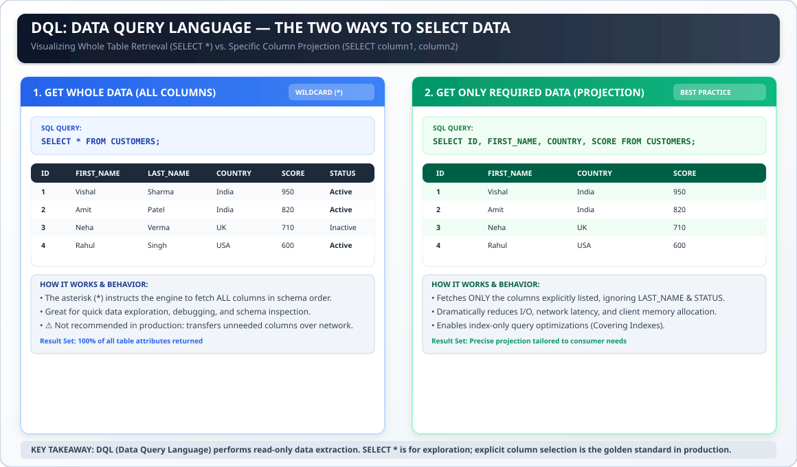

* **Architecture & Flow Explanation (आकृतीचे सविस्तर स्पष्टीकरण):**
  * **Left Panel (`SELECT * FROM CUSTOMERS;`):**
    * The database engine retrieves every single column (`ID`, `FIRST_NAME`, `LAST_NAME`, `COUNTRY`, `SCORE`, `STATUS`).
    * Returns 100% of the table attributes across all records.
  * **Right Panel (`SELECT ID, FIRST_NAME, COUNTRY, SCORE FROM CUSTOMERS;`):**
    * The engine projects only the 4 requested attributes, safely filtering out unneeded columns (`LAST_NAME` and `STATUS`).
    * Produces a streamlined, lightweight result set optimized for memory and network performance.

* **📌 आकृतीचे मराठीत स्पष्टीकरण:**
  * **डावा भाग (`SELECT *`):** डेटाबेस इंजिन टेबलमधील प्रत्येक कॉलम (`ID`, `FIRST_NAME`, `LAST_NAME`, `COUNTRY`, `SCORE`, `STATUS`) शोधून आणतो. यात १००% डेटा मिळतो, पण नेटवर्क बँडविड्थ जास्त खर्च होते.
  * **उजवा भाग (कॉलम प्रोजेक्शन):** ॲप्लिकेशनला लागणारे फक्त ४ निवडक कॉलम्स आणले जातात आणि अनावश्यक कॉलम्स गाळले जातात. यामुळे मेमरी व डेटा ट्रान्सफरची मोठी बचत होते.

---

### 10.4 Topic 10 Summary (मराठी सारांश)

* **DQL (Data Query Language) ची व्याख्या:**
  * DQL चा वापर डेटाबेसमधून डेटा मिळवण्यासाठी (Retrieve / Fetch) केला जातो.
  * DQL ही पूर्णपणे **Read-Only** भाषा आहे; यामुळे डेटाबेसच्या टेबलमध्ये किंवा डेटामध्ये कोणताही बदल (Modify/Delete) होत नाही.
  * DQL मधील मुख्य आणि सर्वात महत्त्वाची कमांड म्हणजे **`SELECT`**.

* **डेटा मिळवण्याच्या दोन मुख्य पद्धती:**
  1. **संपूर्ण डेटा मिळवणे (`SELECT * FROM CUSTOMERS;`):**
     * `*` (Wildcard) चा अर्थ 'सर्व कॉलम्स' असा होतो.
     * टेबलमधील सर्वच्या सर्व कॉलम्स त्यांच्या मूळ क्रमात मिळतात. टेस्टिंग आणि अभ्यासासाठी ही उत्तम आहे.
  2. **फक्त आवश्यक डेटा मिळवणे (`SELECT ID, FIRST_NAME, COUNTRY, SCORE FROM CUSTOMERS;`):**
     * आवश्यक असलेले कॉलम्स स्वल्पविरामाने (Comma) जोडून लिहिले जातात.
     * **इंडस्ट्री बेस्ट प्रॅक्टिस:** ॲप्लिकेशनमध्ये नेहमी फक्त हवे असलेले कॉलम्सच प्रोजेक्ट करावेत; यामुळे नेटवर्क डेटा ट्रान्सफर कमी होतो आणि क्वेरी अतिशय वेगाने धावते.

---

## Topic 11: DCL (Data Control Language) & Security / Access Control

### 11.1 What is DCL (Data Control Language)?

* *Definition: DCL (Data Control Language) consists of commands used for database security and access control, deciding who can access what in a database.*
  * Used to control access and permissions on database objects such as **tables, views, stored procedures, functions, and schemas**.
  * DCL commands are used to **grant** authority/privileges to users and to **take back (revoke)** that authority when no longer required.

* **Why is DCL Used? (Point-Wise Reasons):**
  * **1. To Give Permissions to Users:** Authorize developers, applications, or reporting analysts to perform specific queries (e.g., read-only access).
  * **2. To Remove Permissions from Users:** Withdraw capabilities when roles change or to restrict dangerous capabilities (e.g., revoke `DELETE` or `DROP`).
  * **3. To Maintain Database Security:** Prevent unauthorized access, accidental data wiping, and enforce the **Principle of Least Privilege (PoLP)**.

---

### 11.2 Core DCL Commands: GRANT and REVOKE

The two primary DCL commands in SQL:

| Command | Keyword | Purpose | Action Performed |
| :--- | :--- | :--- | :--- |
| **`GRANT`** | **`TO`** | Give permission | Bestows specific privileges/access on database objects to a user |
| **`REVOKE`** | **`FROM`** | Remove permission | Withdraws/removes previously granted access privileges from a user |

* **1. The `GRANT` Command:**
  * *Definition: GRANT is a DCL command used to provide access privileges to users.*
  * **Syntax:**
    ```sql
    GRANT privilege_list ON object_name TO 'username'@'host';
    ```
  * **Example:**
    ```sql
    GRANT SELECT, INSERT ON Students TO 'user'@'localhost';
    ```

* **2. The `REVOKE` Command:**
  * *Definition: REVOKE is a DCL command used to withdraw or remove privileges from users.*
  * **Syntax:**
    ```sql
    REVOKE privilege_list ON object_name FROM 'username'@'host';
    ```
  * **Example:**
    ```sql
    REVOKE INSERT ON Students FROM 'user'@'localhost';
    ```

---

### 11.3 Inspecting Users & Privileges in MySQL

* **Q. How to Show all users & their related information?**
  * Inspect the internal MySQL authorization catalog to view all created users, hosts, and global privilege flags:
  ```sql
  SELECT * FROM mysql.user;
  
  -- View specific user accounts and hosts:
  SELECT user, host, plugin FROM mysql.user;
  ```

* **Q. How to Show all privilege types available in MySQL?**
  * Displays the complete list of supported server-level and object-level privilege types:
  ```sql
  SHOW PRIVILEGES;
  ```

* **Q. How to Show a specific user's granted privileges?**
  * Displays the exact grants currently active for a specific user account:
  ```sql
  SHOW GRANTS FOR 'VISHAL'@'localhost';
  ```

---

### 11.4 User Management & Creation (Read-Only User Concept)

* **Q. How to Create a User (Read-Only User)?**
  ```sql
  CREATE USER 'VISHAL'@'localhost' IDENTIFIED BY 'VISHAL@1234';
  ```

* **Component-by-Component Explanation:**
  * **`CREATE USER`:** Command used to register a new user account in MySQL.
  * **`'VISHAL'`:** The unique username for the account.
  * **`'@localhost'`:** Host specification — dictates that this user can **only connect from the local machine** where MySQL runs.
  * **`IDENTIFIED BY`:** Sets the authentication plugin and password.
  * **`'VISHAL@1234'`:** The login password assigned to the user.

* **Host Option Explanations (कधी कोणता Host वापरायचा?):**
  * **`'localhost'`:** Allows connections **only from the local machine**.
  * **`'%'`:** Wildcard host — allows connection from **any remote machine** across the network/internet.
  * **`'192.168.1.%'`:** Subnet restriction — allows connections only from IP addresses within a specific subnet (e.g., office LAN).
  * **`'example.com'`:** Domain restriction — allows connections only originating from a specific verified domain.

---

### 11.5 Step-by-Step Granting & Revoking Permissions

#### 1. Table-Level Permissions (Read-Only Access)
* **Q. How to give SELECT permission on the employees / customers table (Read-Only Permission)?**
  ```sql
  -- Grants read-only access on one specific table:
  GRANT SELECT ON customers TO 'VISHAL'@'localhost';
  ```

#### 2. Database-Wide Read-Only Permissions
* **Q. How to grant read permission on all tables in a database?**
  ```sql
  GRANT SELECT ON database_name.* TO 'VISHAL'@'localhost';
  ```
  * **Explanation:**
    * `SELECT` $\rightarrow$ Read-only permission.
    * `database_name.*` $\rightarrow$ All tables inside the specified database.
    * The user **cannot** perform `INSERT`, `UPDATE`, or `DELETE`.

#### 3. Specific Table in Specific Database
* **Q. How to grant read permission on a specific table in a specific database?**
  ```sql
  GRANT SELECT ON customers.user TO 'VISHAL'@'localhost';
  ```

#### 4. Grant Multiple Table-Level Privileges
* **Q. How to grant multiple DML privileges (INSERT, UPDATE, DELETE) on a table?**
  ```sql
  GRANT INSERT, UPDATE, DELETE ON customers TO 'VISHAL'@'localhost';
  ```

#### 5. Revoke a Single Privilege
* **Q. How to revoke INSERT privilege from user?**
  ```sql
  REVOKE INSERT ON customers FROM 'VISHAL'@'localhost';
  ```

---

### 11.6 Database-Wide Privileges & Administrative Access

#### 1. Grant Full DML Privileges Across Entire Database
* Vishal now has full DML access (`SELECT`, `INSERT`, `UPDATE`, `DELETE`) on all tables in the database:
  ```sql
  GRANT SELECT, INSERT, UPDATE, DELETE ON salesdb.* TO 'VISHAL'@'localhost';
  ```

#### 2. Revoke DELETE Privilege from User
* Vishal loses `DELETE` capability, but safely retains `SELECT`, `INSERT`, and `UPDATE`:
  ```sql
  REVOKE DELETE ON salesdb.* FROM 'VISHAL'@'localhost';
  ```

#### 3. Grant ALL Privileges (Database Admin / Superuser on DB)
* Can perform everything inside the database (`CREATE`, `ALTER`, `DROP`, manage indexes, etc.):
  ```sql
  GRANT ALL PRIVILEGES ON salesdb.* TO 'VISHAL'@'localhost';
  ```

#### 4. Revoke Dangerous Privileges (`DROP` & `ALTER`)
* Strips structural destruction and table modification permissions to protect database architecture:
  ```sql
  REVOKE DROP, DELETE, ALTER ON salesdb.* FROM 'VISHAL'@'localhost';
  ```

#### 5. Apply Changes Immediately
* Reloads the in-memory privilege grant tables from the `mysql` system database:
  ```sql
  FLUSH PRIVILEGES;
  ```

#### 6. Verify Updated Privileges
* Confirms active permissions:
  ```sql
  SHOW GRANTS FOR 'VISHAL'@'localhost';
  SHOW GRANTS FOR 'readonly_user'@'localhost';
  ```

#### 7. Remove a User Account Completely
* Completely deletes the user account from the MySQL server:
  ```sql
  DROP USER 'VISHAL'@'localhost';
  ```

---

### 11.7 The 6 Core Privilege Categories in MySQL

As of MySQL 8.x, there are **36+ distinct privilege types** classified into 6 primary operational categories:

| Category | Typical Privileges | Operational Scope & Role |
| :--- | :--- | :--- |
| **1. Data Privileges (DML)** | `SELECT`, `INSERT`, `UPDATE`, `DELETE` | Controls managing, querying, and updating row records inside tables. |
| **2. Structure Privileges (DDL)** | `CREATE`, `DROP`, `ALTER`, `INDEX` | Controls creating, modifying, re-indexing, or destroying databases, tables, and views. |
| **3. Administrative Privileges** | `GRANT OPTION`, `SUPER`, `RELOAD`, `SHUTDOWN` | Controls global MySQL server operation, user delegation, process management, and shutdowns. |
| **4. Replication Privileges** | `REPLICATION SLAVE`, `REPLICATION CLIENT` | Used in Master-Replica high availability topologies to stream binary logs. |
| **5. Security & Process Privileges** | `CREATE USER`, `PROCESS`, `SHOW DATABASES` | Controls user account provisioning, inspecting the server process list, and discovering databases. |
| **6. Proxy Privilege** | `PROXY` | Allows one user account to authenticate and assume the privileges of another account. |

### 11.8 Advanced Interview Concepts & Gotchas in DCL / Security

#### 1. The Classic Interview Trap: When is `FLUSH PRIVILEGES` Actually Required?
* **Q. Do you need to run `FLUSH PRIVILEGES` after every `GRANT` or `REVOKE` statement?**
* **Correct Technical Answer:** **NO!**
  * When using standard SQL DCL commands (`GRANT`, `REVOKE`, `CREATE USER`, `ALTER USER`, `DROP USER`), MySQL updates its in-memory privilege hash tables **automatically and immediately**.
  * `FLUSH PRIVILEGES` is **only required** if you bypass DCL statements and directly manipulate the internal MySQL system grant tables using DML (e.g., `UPDATE mysql.user SET ...;` or `INSERT INTO mysql.db ...;`).

#### 2. `WITH GRANT OPTION` (Delegation of Authority)
* **Q. How can you allow a team lead or user to grant their own permissions to other developers?**
* **Syntax & Example:**
  ```sql
  GRANT SELECT, INSERT ON salesdb.* TO 'team_lead'@'localhost' WITH GRANT OPTION;
  ```
* **Explanation:**
  * `WITH GRANT OPTION` allows `'team_lead'` to grant the exact privileges they hold to any other user account.
  * **Security Warning:** Never grant `WITH GRANT OPTION` to public application service accounts; reserve strictly for DBAs.

#### 3. Role-Based Access Control (RBAC) in MySQL 8.0
* **Q. In an enterprise with hundreds of developers, granting permissions user-by-user is unmanageable. How do you handle this efficiently in MySQL 8.0?**
* **Solution:** Use **Roles** (grouped permissions):
  ```sql
  -- Step 1: Create distinct roles
  CREATE ROLE 'app_developer', 'data_analyst';

  -- Step 2: Assign privileges to each role
  GRANT SELECT, INSERT, UPDATE ON salesdb.* TO 'app_developer';
  GRANT SELECT ON salesdb.* TO 'data_analyst';

  -- Step 3: Grant the role to multiple individual users
  GRANT 'app_developer' TO 'vishal'@'localhost', 'amit'@'localhost';

  -- Step 4: Make role active by default upon user login
  SET DEFAULT ROLE ALL TO 'vishal'@'localhost', 'amit'@'localhost';
  ```

#### 4. Column-Level Privileges (Masking Sensitive Columns)
* **Q. Can you permit an intern to see employee names and departments while hiding sensitive columns like salary and SSN?**
* **Solution:** **Yes!** MySQL supports column-level privilege projection:
  ```sql
  -- Intern can only access emp_id, emp_name, and department:
  GRANT SELECT (emp_id, emp_name, department) ON company.employees TO 'intern'@'localhost';

  -- If the intern attempts: SELECT salary FROM company.employees;
  -- MySQL rejects with: ERROR 1143 (42000): SELECT command denied to user for column 'salary'
  ```

#### 5. Difference: `DROP USER` vs. `REVOKE ALL PRIVILEGES`
| Dimension | `REVOKE ALL PRIVILEGES` | `DROP USER` |
| :--- | :--- | :--- |
| **Account Existence** | Account credentials remain in `mysql.user` | Account is completely purged from server |
| **Authentication** | User **can still connect and log in** successfully | Connection is rejected with `Access Denied` |
| **Access Rights** | User has 0 permissions (cannot access tables) | User does not exist at all |

#### 6. Account Locking & Password Expiry Management
* **Q. How do you temporarily suspend an employee's access (e.g., during sabbatical) without deleting their grants, or force a password reset?**
* **SQL Commands:**
  ```sql
  -- Temporarily lock account (blocks authentication):
  ALTER USER 'vishal'@'localhost' ACCOUNT LOCK;

  -- Unlock account when employee returns:
  ALTER USER 'vishal'@'localhost' ACCOUNT UNLOCK;

  -- Force user to change their password on next login:
  ALTER USER 'vishal'@'localhost' PASSWORD EXPIRE;
  ```

#### 7. Authentication Plugin Incompatibility (`caching_sha2_password` vs. `mysql_native_password`)
* **Q. Why do older Python, PHP, or Node.js drivers fail with "Authentication plugin 'caching_sha2_password' cannot be loaded" when connecting to MySQL 8.0?**
* **Cause & Fix:**
  * MySQL 8.0 changed default password hashing from `mysql_native_password` to `caching_sha2_password`.
  * **Fix for legacy clients:**
    ```sql
    ALTER USER 'vishal'@'localhost' IDENTIFIED WITH mysql_native_password BY 'VISHAL@1234';
    ```

---

### 11.9 Visual Architecture Diagram: DCL & Privileges

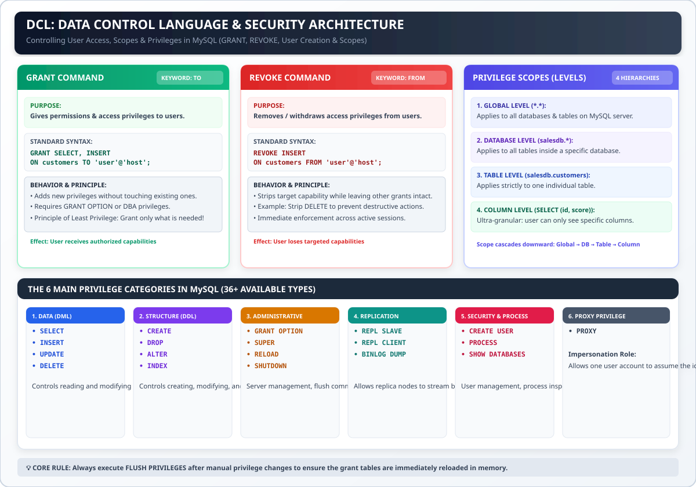

* **Architecture & Flow Explanation (आकृतीचे सविस्तर स्पष्टीकरण):**
  * **GRANT (Top Left):** The Database Administrator uses `GRANT ... TO ...` to push specific privileges down to a target user.
  * **REVOKE (Top Center):** The Administrator uses `REVOKE ... FROM ...` to strip risky permissions without deleting the user.
  * **Scope Hierarchies (Top Right):** Shows how privileges cascade from Global (`*.*`), to Database (`salesdb.*`), to Table (`salesdb.customers`), down to specific Columns.
  * **6 Privilege Categories (Bottom Grid):** Breaks down all 36+ MySQL privileges into their distinct roles (DML, DDL, Admin, Replication, Security, Proxy).

* **📌 आकृतीचे मराठीत स्पष्टीकरण:**
  * **GRANT (वर डावीकडे):** डेटाबेस ॲडमिनिस्ट्रेटर (DBA) द्वारे युझरला आवश्यक परवानग्या (उदा. `SELECT`, `INSERT`) बहाल करणे.
  * **REVOKE (वर मध्यभागी):** सुरक्षा धोके टाळण्यासाठी युझरकडून आधी दिलेले अधिकार परत काढून घेणे.
  * **अधिकारांची व्याप्ती (वर उजवीकडे):** अधिकारांचे ४ स्तर असतात—ग्लोबल (`*.*`), डेटाबेस (`db.*`), टेबल (`db.table`), आणि विशिष्ट कॉलम्स (`table(col1)`).
  * **६ प्रकार (खालचा भाग):** सर्व ३६+ परवानग्यांचे ६ प्रकार—DML, DDL, ॲडमिनिस्ट्रेटिव्ह, रेप्लिकेशन, सुरक्षा, आणि प्रॉक्सी.

---

### 11.10 Topic 11 Summary (मराठी सारांश)

* **DCL (Data Control Language) ची व्याख्या व महत्त्व:**
  * DCL चा वापर डेटाबेसच्या सुरक्षिततेसाठी (Security) आणि अधिकारांचे नियंत्रण (Access Control) करण्यासाठी होतो.
  * **"डेटाबेसमध्ये कोणी काय पाहावे आणि काय बदलावे हे DCL ठरवते."**
  * यासाठी मुख्य दोन कमांड्स वापरल्या जातात:
    1. **`GRANT` (`TO`):** युझरला परवानगी / अधिकार देणे.
    2. **`REVOKE` (`FROM`):** युझरकडून दिलेले अधिकार काढून घेणे.

* **महत्त्वाच्या संकल्पना व नियम:**
  * **युझर तयार करणे:** `CREATE USER 'username'@'host' IDENTIFIED BY 'password';`
    * `'localhost'` चा अर्थ फक्त त्याच कॉम्प्युटरवरून लॉगिन करता येईल.
    * `'%'` चा अर्थ कुठूनही रिमोट लॉगिन करता येईल.
  * **परवानग्या देणे व काढणे:**
    * `GRANT SELECT ON db.* TO 'user'@'localhost';` (फक्त वाचण्याची परवानगी - Read Only).
    * `REVOKE DELETE ON db.* FROM 'user'@'localhost';` (डिलीट करण्याची परवानगी काढून घेणे).
  * **बदल त्वरित लागू करणे:** `FLUSH PRIVILEGES;` द्वारे परवानग्या त्वरित मेमरीमध्ये रिफ्रेश होतात.
  * **तपासणी करणे:** युझरचे अधिकार तपासण्यासाठी `SHOW GRANTS FOR 'user'@'host';` वापरले जाते.

---

## Topic 12: TCL (Transaction Control Language) & Transaction Management

### 12.1 What is TCL (Transaction Control Language)?

* *Definition: TCL (Transaction Control Language) is the part of SQL used to manage and control database transactions, determining when changes made to data are saved permanently or undone (rolled back).*
  * It controls when changes made to data are saved permanently or undone (rolled back) in a database.
  * TCL commands manage all modifications executed inside a transactional scope.
  * **Core Formula:**
    $$\text{TCL} = \text{Transaction Control} = \text{Save or Undo Changes}$$

---

### 12.2 What is a Transaction? (ACID Overview)

* *Definition: A Transaction is a group of one or more SQL statements executed as a single, indivisible logical unit of work.*
* **All-or-Nothing Principle:** Either **all statements succeed**, or **none of them take effect**.
* **Common Statements in Transactions:**
  * Primarily groups **DML statements** (`INSERT`, `UPDATE`, `DELETE`).
* **The 4 ACID Pillars:**
  * **Atomicity (A):** The entire transaction either completes successfully or is completely rolled back (no partial execution).
  * **Consistency (C):** Takes the database from one valid state to another, maintaining all constraints and schema rules.
  * **Isolation (I):** Intermediate transaction states are invisible to other concurrently running transactions.
  * **Durability (D):** Once committed, data changes survive permanently on disk even during system failures or power outages.

---

### 12.3 Core TCL Commands: START, COMMIT, ROLLBACK, SAVEPOINT, SET

| Command | Action / Role | Effect on Data |
| :--- | :--- | :--- |
| **`START TRANSACTION`** | Begins a new transaction block | Opens an atomic staging session |
| **`COMMIT`** | Saves changes permanently | Writes staged changes to disk; ends transaction |
| **`ROLLBACK`** | Undoes uncommitted changes | Restores database back to pre-transaction state |
| **`SAVEPOINT`** | Sets an intermediate checkpoint | Allows partial rollback to a specific marker |
| **`SET TRANSACTION`** | Sets transaction properties | Configures isolation levels and read-only modes |

#### 1. Beginning a Transaction: `START TRANSACTION` / `BEGIN`
* *Definition: START TRANSACTION (or BEGIN) instructs the database engine to open a new atomic transaction context.*
  ```sql
  START TRANSACTION;
  -- OR
  BEGIN;
  ```

#### 2. Saving Changes Permanently: `COMMIT`
* *Definition: COMMIT permanently commits and saves all staged changes to the storage engine (InnoDB) and concludes the transaction.*
  ```sql
  UPDATE customers
  SET balance = balance - 1000
  WHERE id = 1;

  COMMIT;  -- Changes are permanently written to disk!
  ```

#### 3. Undoing Changes: `ROLLBACK`
* *Definition: ROLLBACK discards all uncommitted changes made in the current transaction and restores the data to its pre-transaction state.*
* **Important:** Works **only before `COMMIT`**.
  ```sql
  DELETE FROM customers
  WHERE id = 5;

  ROLLBACK;  -- Data is restored to its previous state; row 5 is NOT deleted!
  ```

#### 4. Partial Rollback via `SAVEPOINT`
* *Definition: SAVEPOINT creates points within a group of statements to rollback to, allowing partial changes to be undone without discarding the entire transaction.*
  ```sql
  START TRANSACTION;

  -- First operation:
  UPDATE accounts SET balance = balance - 500 WHERE acc_id = 101;

  -- Create a checkpoint:
  SAVEPOINT sp1;

  -- Second operation:
  UPDATE customers SET balance = 5000 WHERE id = 2;

  -- Rollback only the second operation:
  ROLLBACK TO sp1;  -- Only changes after sp1 are undone; earlier changes remain active!

  -- Finally commit the remaining first operation:
  COMMIT;
  ```

#### 5. Setting Transaction Properties: `SET TRANSACTION`
* *Definition: SET TRANSACTION configures transaction behavior, such as access mode (READ ONLY / READ WRITE) and isolation levels.*
  ```sql
  SET TRANSACTION ISOLATION LEVEL READ COMMITTED;
  SET SESSION TRANSACTION ISOLATION LEVEL REPEATABLE READ;
  ```

---

### 12.4 Real-World Banking Transaction Example (Atomic Transfer)

A classic banking scenario transferring \$1,000 from Account 101 to Account 102:
```sql
-- Step 1: Begin the transaction
START TRANSACTION;

-- Step 2: Debit money from Sender (Account 101)
UPDATE accounts 
SET balance = balance - 1000 
WHERE acc_id = 101;

-- Step 3: Credit money to Receiver (Account 102)
UPDATE accounts 
SET balance = balance + 1000 
WHERE acc_id = 102;

-- Step 4: Commit both operations together
COMMIT;
```
* **Why Transactions are Critical Here:**
  * If a server crash occurs right after Step 2, the money is not lost. The database automatically executes a `ROLLBACK` upon recovery, restoring the \$1,000 back to Account 101.

---

### 12.5 Critical Rules & Constraints of TCL

* **1. Works Only with DML Commands:**
  * TCL controls **`INSERT`**, **`UPDATE`**, and **`DELETE`**.
* **2. Requires Transaction-Supported Storage Engine:**
  * Requires engines like **InnoDB** in MySQL. Non-transactional engines like **MyISAM** ignore transactions!
* **3. ROLLBACK Does NOT Work After COMMIT:**
  * Once `COMMIT` is executed, the transaction is finalized. `ROLLBACK` has zero effect on committed data.
* **4. DDL Commands Trigger an Implicit Commit:**
  * Running any DDL statement (`CREATE`, `ALTER`, `DROP`, `TRUNCATE`, `RENAME`) inside a transaction **immediately commits all pending changes automatically**. You cannot rollback DDL statements in MySQL.

---

### 12.6 Transaction Isolation Levels & Concurrency Anomalies

When multiple transactions execute concurrently on the same tables, three common data anomalies can occur:

#### 1. The 3 Common Concurrency Problems
| Problem / Phenomenon | Meaning & Manifestation |
| :--- | :--- |
| **Dirty Read** | A transaction reads uncommitted data written by another ongoing transaction (which might later be rolled back). |
| **Non-Repeatable Read** | A transaction re-reads the same row and discovers the data has changed because another transaction committed an `UPDATE` or `DELETE`. |
| **Phantom Read** | A transaction re-executes a range query (`WHERE score > 500`) and finds newly inserted rows committed by another transaction. |

#### 2. The 4 ANSI SQL Isolation Levels Matrix
Isolation levels control how transactions see each other's data:

| Isolation Level | Dirty Read | Non-Repeatable Read | Phantom Read | Standard Use Case & Defaults |
| :--- | :---: | :---: | :---: | :--- |
| **`READ UNCOMMITTED`** | ❌ Allowed | ❌ Allowed | ❌ Allowed | Highest speed, zero consistency; rarely used. |
| **`READ COMMITTED`** | ✓ Prevented | ❌ Allowed | ❌ Allowed | Default in Oracle, PostgreSQL, and SQL Server. |
| **`REPEATABLE READ`** | ✓ Prevented | ✓ Prevented | ✓ Prevented* | **Default in MySQL InnoDB** *(Next-Key Locking blocks Phantoms)*. |
| **`SERIALIZABLE`** | ✓ Prevented | ✓ Prevented | ✓ Prevented | Strict table/row locking; highest consistency, slowest speed. |

---

### 12.7 Advanced Interview Concepts & Gotchas in TCL / Transaction Management

#### 1. Autocommit Mode (`@@autocommit`) & Default Session Behavior
* **Q. If you execute an UPDATE statement without running START TRANSACTION, can you roll it back?**
* **Answer & Mechanics:**
  * In MySQL, **`autocommit` is enabled by default (`1`)**.
  * Every single standalone SQL statement is treated as an independent transaction that is committed to disk immediately upon completion. Therefore, you **cannot** roll it back unless explicit transaction controls are enabled.
* **How to Inspect and Control Autocommit:**
  ```sql
  -- Check current autocommit status (1 = ON, 0 = OFF):
  SELECT @@autocommit;

  -- Disable autocommit for the current session:
  SET autocommit = 0;

  -- With autocommit disabled, every DML requires an explicit COMMIT or ROLLBACK:
  UPDATE accounts SET balance = balance - 200 WHERE acc_id = 101;
  ROLLBACK; -- Successfully rolls back!

  -- Re-enable autocommit:
  SET autocommit = 1;
  ```
  > [!WARNING]
  > **Production Gotcha:** If you set `SET autocommit = 0;` in your session and forget to call `COMMIT` or `ROLLBACK`, open row-level locks remain active indefinitely, causing application connection pools to hang and lock-wait timeouts (`ERROR 1205`) for other users!

---

#### 2. The DDL "Implicit Commit" Interview Trap
* **Q. What happens to the 20% salary hike in this transaction? Is it rolled back or saved?**
  ```sql
  START TRANSACTION;
  UPDATE employees SET salary = salary * 1.20 WHERE dept = 'IT';
  CREATE TABLE audit_log (id INT PRIMARY KEY, action VARCHAR(50));
  ROLLBACK;
  ```
* **Answer:** **It is permanently saved! It CANNOT be rolled back.**
* **Explanation:**
  * In MySQL (and most relational databases), **DDL statements** (`CREATE`, `ALTER`, `DROP`, `TRUNCATE`, `RENAME`) trigger an **Implicit Commit**.
  * The moment MySQL encounters `CREATE TABLE audit_log`, it immediately and irreversibly executes an internal `COMMIT` on all pending transactional modifications (including the preceding `UPDATE`).
  * The subsequent `ROLLBACK;` statement has nothing left to revert because the transaction was already closed and finalized by the DDL operation.

---

#### 3. Deadlocks in MySQL InnoDB (`ERROR 1213`) & Automatic Cycle Resolution
* **Q. What is a Deadlock in SQL transactions, how does MySQL detect it, and what does it do?**
* **What Causes a Deadlock:**
  * A circular dependency where two or more transactions wait for locks held by each other:
    1. **Transaction 1** locks `Row A` and requests a lock on `Row B`.
    2. **Transaction 2** locks `Row B` and requests a lock on `Row A`.
    3. Neither can advance; both are blocked waiting for the other.
* **How InnoDB Resolves Deadlocks:**
  * InnoDB features an active **Deadlock Detection Engine** that tracks a wait-for lock graph.
  * When a cycle is discovered, InnoDB automatically selects one transaction as the **victim** (the transaction that has modified fewer rows or has a smaller undo log).
  * InnoDB automatically aborts and rolls back the victim transaction, throwing:
    ```
    ERROR 1213 (40001): Deadlock found when trying to get lock; try restarting transaction
    ```
* **Production Best Practice:** Always lock tables/rows in a consistent, alphabetical or sorted order across application endpoints, and wrap database calls in retry loops with exponential backoff.

---

#### 4. `ROLLBACK TO SAVEPOINT` vs. `RELEASE SAVEPOINT`
* **Q. What is the exact difference between ROLLBACK TO SAVEPOINT and RELEASE SAVEPOINT? Does RELEASE SAVEPOINT commit changes?**
* **Comparison Table:**

| Feature / Behavior | `ROLLBACK TO SAVEPOINT name;` | `RELEASE SAVEPOINT name;` |
| :--- | :--- | :--- |
| **Data Modifications** | **Undoes (reverts)** changes made after the savepoint | **Preserves** all data modifications |
| **Commit Changes?** | No (transaction remains open) | **No** (does NOT commit changes) |
| **Savepoint Marker** | Keeps the savepoint active for further use | **Deletes the checkpoint marker** from memory |
| **Use Case** | Recovering from a failed sub-task | Freeing server memory resources when checkpoint is no longer needed |

* **Code Demonstration:**
  ```sql
  START TRANSACTION;
  INSERT INTO orders (id, item) VALUES (1, 'Laptop');
  SAVEPOINT sp1;

  INSERT INTO orders (id, item) VALUES (2, 'Mouse');

  -- Option A: Revert only row 2 (row 1 remains staged):
  -- ROLLBACK TO sp1;

  -- Option B: Delete the checkpoint marker (both row 1 and row 2 remain staged):
  RELEASE SAVEPOINT sp1;

  COMMIT; -- Permanently saves both rows!
  ```

---

#### 5. Concurrency Control: Pessimistic Locking vs. Optimistic Locking
* **Q. How do you prevent race conditions during high-volume checkout (e.g., ticket booking / inventory flash sale)?**

##### A. Pessimistic Locking (`SELECT ... FOR UPDATE`)
* **Concept:** Assumes concurrent collisions are frequent. Locks target rows immediately upon reading until the transaction finishes.
* **SQL Implementation:**
  ```sql
  START TRANSACTION;

  -- Exclusively locks row id = 101; other transactions cannot read or write with locks:
  SELECT stock FROM products WHERE id = 101 FOR UPDATE;

  -- Safely decrement stock:
  UPDATE products SET stock = stock - 1 WHERE id = 101;

  COMMIT; -- Lock is released!
  ```
* **Shared Lock Variant (`LOCK IN SHARE MODE` / `FOR SHARE`):** Allows other transactions to read, but blocks any other transaction from updating or deleting until completed.

##### B. Optimistic Locking (Version Tracking)
* **Concept:** Assumes collisions are rare. Does not acquire database-level locks. Instead, uses an integer `version` or timestamp column.
* **SQL Implementation:**
  ```sql
  -- Step 1: Read current state and version without locking:
  SELECT stock, version FROM products WHERE id = 101;
  -- Suppose version = 4, stock = 10

  -- Step 2: Update only if version has not changed:
  UPDATE products 
  SET stock = stock - 1, version = version + 1 
  WHERE id = 101 AND version = 4;

  -- Step 3: Check Rows Affected:
  -- If Rows Affected == 1 -> Success!
  -- If Rows Affected == 0 -> Another transaction modified the row concurrently; retry or abort.
  ```

---

#### 6. Under the Hood: How InnoDB Guarantees Atomicity & Durability (Undo Log vs. Redo Log)
* **Q. How does MySQL InnoDB physically implement Rollback (Atomicity) and Crash Recovery (Durability)?**
* **Direct Comparison:**

| Component | Storage Role | Guarantees | How it Works |
| :--- | :--- | :--- | :--- |
| **Undo Log** | **Before-Images** (Reverse operations) | **Atomicity & MVCC** | When you run an `UPDATE`, the old values are recorded in the undo log. If you run `ROLLBACK` or the server crashes mid-transaction, InnoDB replays the undo log in reverse to restore initial data. |
| **Redo Log (WAL)** | **After-Images** (Write-Ahead Log) | **Durability** | When you run `COMMIT`, InnoDB writes changes sequentially to the redo log buffer and flushes to disk before updating the actual tablespace `.ibd` files. If power cuts out, crash recovery replays the redo log. |

---

#### 7. Can `TRUNCATE` or `DROP` be Rolled Back? (`DELETE` vs. `TRUNCATE` in TCL)
* **Q. Can you rollback a DELETE? Can you rollback a TRUNCATE?**
* **Detailed Breakdown:**
  * **`DELETE`:**
    * Operates as a DML statement row-by-row.
    * Every individual row deletion is logged in the **Undo Log**.
    * **Can be rolled back completely** if executed inside an uncommitted transaction (`ROLLBACK;`).
  * **`TRUNCATE`:**
    * Operates as a DDL statement. It de-allocates and drops the table data pages and creates empty ones.
    * It does **not** write row-by-row before-images to the undo log.
    * It triggers an **Implicit Commit** in MySQL.
    * **CANNOT be rolled back** under any circumstances in MySQL.

---

### 12.8 Visual Architecture Diagram: TCL Lifecycle & Isolation Levels

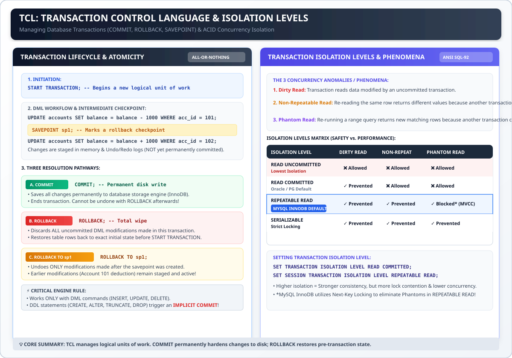

* **Architecture & Flow Explanation (आकृतीचे सविस्तर स्पष्टीकरण):**
  * **Left Panel (Transaction Lifecycle):**
    * Displays `START TRANSACTION` opening the atomic block.
    * Demonstrates `SAVEPOINT sp1` checkpointing.
    * Highlights the 3 resolution branches: `COMMIT` (permanent disk write), `ROLLBACK` (complete reversal), and `ROLLBACK TO sp1` (selective undo).
  * **Right Panel (Isolation Levels Matrix):**
    * Details the 3 concurrency phenomena (Dirty Read, Non-Repeatable Read, Phantom Read).
    * Summarizes the 4 ANSI isolation levels with clear visual badges, highlighting MySQL's default `REPEATABLE READ`.

* **📌 आकृतीचे मराठीत स्पष्टीकरण:**
  * **डावा पॅनेल (ट्रान्झॅक्शन जीवनचक्र):** `START TRANSACTION` ने सुरू होणाऱ्या ब्लॉकचे ३ मार्ग दाखवतो—(१) `COMMIT` (डेटा कायम सेव्ह करणे), (२) `ROLLBACK` (सर्व बदल पूर्ण रद्द करणे), आणि (३) `ROLLBACK TO sp1` (चेकपॉईंटपर्यंतचे निवडक बदल रद्द करणे).
  * **उजवा पॅनेल (आयसोलेशन लेव्हल्स):** ३ महत्त्वाचे डेटा प्रॉब्लेम्स (डर्टी रीड, नॉन-रिपीटएबल रीड, फँटम रीड) आणि ते रोखणाऱ्या ४ लेव्हल्स दाखवतो, ज्यामध्ये MySQL चे बाय-डिफॉल्ट लेव्हल **`REPEATABLE READ`** ठळकपणे दर्शवले आहे.

---

### 12.9 Topic 12 Summary (मराठी सारांश)

* **TCL (Transaction Control Language) ची व्याख्या:**
  * ट्रान्झॅक्शनचे व्यवस्थापन करण्यासाठी आणि डेटा कायम सेव्ह करायचा की पूर्ववत करायचा हे ठरवण्यासाठी TCL चा वापर होतो.
  * **ट्रान्झॅक्शन (Transaction):** अनेक SQL क्वेरीजचा मिळून बनलेला एकसंध लॉजिकल युनिट (All-or-Nothing).
* **महत्त्वाच्या कमांड्स:**
  1. **`START TRANSACTION`:** ट्रान्झॅक्शन सुरू करणे.
  2. **`COMMIT`:** केलेले बदल डेटाबेसमध्ये कायमस्वरूपी सेव्ह करणे (या नंतर `ROLLBACK` करता येत नाही).
  3. **`ROLLBACK`:** नको असलेले बदल रद्द करून आधीची मूळ स्थिती पूर्ववत करणे.
  4. **`SAVEPOINT`:** ट्रान्झॅक्शनमध्ये चेकपॉईंट तयार करणे, जेणेकरून `ROLLBACK TO savepoint_name` द्वारे फक्त काही बदल रद्द करता येतात.
  5. **`RELEASE SAVEPOINT`:** सेव्हपॉईंट मेमरीमधून काढून टाकणे (बदल रद्द न करता).
* **महत्त्वाचे नियम व मुलाखतीचे प्रश्न (Interview Gotchas):**
  * **Autocommit:** MySQL मध्ये `autocommit = 1` बाय-डिफॉल्ट असतो; `SET autocommit = 0;` केल्यास मॅन्युअल कमिट आवश्यक असतो.
  * **Implicit Commit Trap:** ट्रान्झॅक्शन दरम्यान DDL कमांड (`CREATE`, `ALTER`, `TRUNCATE`) आल्यास मागील सर्व बदल आपोआप कमिट होतात आणि नंतर `ROLLBACK` चालत नाही.
  * **Deadlock (Error 1213):** दोन ट्रान्झॅक्शन एकमेकांच्या लॉक्सची वाट पाहत अडकल्यास InnoDB स्वयंचलितपणे एका ट्रान्झॅक्शनला रोलबॅक करतो.
  * **Pessimistic Locking:** `SELECT ... FOR UPDATE` द्वारे रो लॉक करणे.
  * **Undo Log vs. Redo Log:** अंडू लॉग (Undo Log) मुळे Atomicity व Rollback शक्य होते, तर रिडू लॉग (Redo Log / WAL) मुळे Durability व क्रॅश रिकव्हरी शक्य होते.
  * **DELETE vs TRUNCATE:** `DELETE` ट्रान्झॅक्शनमध्ये रोलबॅक करता येतो, पण `TRUNCATE` (DDL असल्यामुळे) रोलबॅक करता येत नाही.
* **आयसोलेशन लेव्हल्स (Isolation Levels):**
  * MySQL चे बाय-डिफॉल्ट आयसोलेशन लेव्हल **`REPEATABLE READ`** असते, जे डर्टी रीड आणि नॉन-रिपीटएबल रीड रोखते.

---

## Topic 13: Commands to Query Data (DQL In-Depth, Clauses & Filtering)

### 13.1 Commands to Query Data & What is DQL?

* *Definition: DQL (Data Query Language) consists of commands used to query, search, and retrieve data from database tables without altering or modifying the underlying stored records or database structure.*
  * In relational databases, DQL commands feasibly retrieve and fetch data from one or more tables using declarative statements.
  * The primary and fundamental command of DQL is **`SELECT`**.

* **Key Characteristics of DQL:**
  * **1. Read-Only Nature:** DQL queries only read, filter, project, and transform data in memory; they do **not** alter, insert, or delete data on disk (zero side effects on database state).
  * **2. Tabular Result Set (Virtual Table):** Every `SELECT` query returns results structured into rows and columns, known as a **Result Set** (an ephemeral virtual table in memory).
  * **3. Extreme Flexibility:** Can retrieve everything, target specific columns, filter rows (`WHERE`), eliminate duplicates (`DISTINCT`), limit row count (`LIMIT` / `TOP`), sort results (`ORDER BY`), aggregate metrics (`GROUP BY`, `COUNT`, `SUM`), filter aggregates (`HAVING`), and combine multiple related tables (`JOIN`).

---

### 13.2 The Core Mental Model: "Ask Your Data"

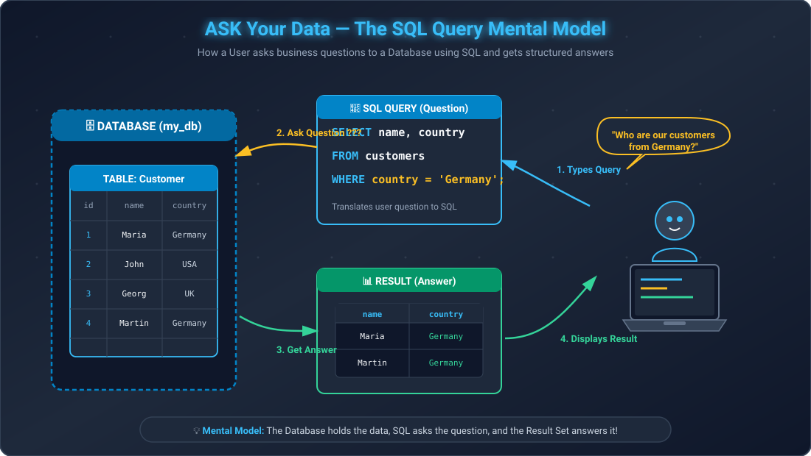

* **Mental Model Breakdown (डेटाशी संवाद साधण्याची संकल्पना):**
  * **1. The Business Question:** A user or application needs specific information (e.g., *"Who are our customers from Germany?"* or *"What is the total sales for this month?"*).
  * **2. The SQL Query:** The question is translated into a structured SQL statement (`SELECT name, country FROM customers WHERE country = 'Germany';`).
  * **3. Database Processing:** The Database Management System (DBMS) locates the target table on disk, reads data blocks into memory, applies the filtering criteria, and keeps only the requested columns.
  * **4. The Result (Answer):** The engine returns a clean, structured tabular result set back to the user's screen or application API.
* **📌 आकृतीचे मराठीत स्पष्टीकरण (Mental Model Summary):**
  * डेटाबेसमध्ये टेबलच्या स्वरूपात कोट्यवधी रेकॉर्ड्स साठवलेले असतात.
  * युझर आपल्या मनात असलेला प्रश्न (Question) SQL क्वेरीच्या (`SELECT ... FROM ... WHERE ...`) माध्यमातून डेटाबेसला विचारतो.
  * डेटाबेस इंजिन त्या क्वेरीवर प्रक्रिया करून फक्त अपेक्षित उत्तर (Answer) एका सुटसुटीत व्हर्च्युअल टेबलच्या (Result Set) रूपात युझरला परत देतो.

---

### 13.3 Commands (to query the data) & Essential Database/Table Setup

Before executing data queries, you need an active database context and a populated table:

#### 1. Show All Databases
* **Concept:** `show all databases`
* **SQL Command:**
  ```sql
  Show databases;
  ```
* **Meaning:** Lists all existing databases currently hosted on the MySQL server instance.

#### 2. Create Database (`my_db`)
* **Prompt Note:** *Make sure in following example we have to add my_db as database*
* **Concept:** `create database db_name`
* **SQL Command:**
  ```sql
  Create database my_db;
  ```
* **Meaning:** Allocates a new logical database container named `my_db`.

#### 3. Use Selected Database
* **Concept:** `used selected database`
* **SQL Command:**
  ```sql
  Use my_db ;
  ```
* **Meaning:** Switches the active session context to `my_db`. All subsequent table operations and queries run inside this selected database.

#### 4. Drop Database (`my_db`)
* **Concept:** `delete database db_name`
* **SQL Command:**
  ```sql
  Drop database my_db;
  ```
* **Meaning:** Permanently deletes the database `my_db` along with all its tables, views, and data.

#### 5. Generic Table Creation Syntax
* **Prompt Syntax:**
  ```sql
  Create table user(column1 int notNull, column1 datatype constraint. column1 datatype constrain,....);
  ```
* **Formatted General Blueprint:**
  ```sql
  CREATE TABLE user (
      column1 INT NOT NULL,
      column2 datatype constraint,
      column3 datatype constraint,
      ...
  );
  ```

#### 6. Common MySQL Data Types & Attributes: The Golden Rule
* **Common mySql data types & entity modeling:**
* **Inside table we have attribute:**
  * *So defined that attribute we need to data type to define that attribute.*
  * In relational databases, each column represents a property or attribute (e.g., `first_name`, `dob`, `phone`, `email`).
* **⭐ Data types applied on the column not row:**
  * *Golden Rule: Data types applied on the column not row.*
  * Every cell within a given column must strictly conform to that column's declared data type and constraints across all rows.

#### 7. Create Table in DB Using Following Command:
* **Create table in db using following command:**
  ```sql
  CREATE TABLE Customer (
      customer_id INT PRIMARY KEY AUTO_INCREMENT,
      first_name VARCHAR(100) NOT NULL,
      last_name VARCHAR(100),
      dob DATE,
      gender CHAR(1),
      phone VARCHAR(15),
      email VARCHAR(100),
      address VARCHAR(255),
      branch_id INT,
      FOREIGN KEY (branch_id) REFERENCES Branch(branch_id)
  );
  ```
* **Schema Highlights:**
  * `customer_id INT PRIMARY KEY AUTO_INCREMENT`: Unique identifier for each customer that increments automatically.
  * `first_name VARCHAR(100) NOT NULL`: Mandatory customer first name.
  * `dob DATE`: Date of birth formatted as `YYYY-MM-DD`.
  * `gender CHAR(1)`: Single-character code (`'M'`, `'F'`).
  * `branch_id INT`: Foreign key linking customer to the `Branch` table.

#### 8. Insert Data into Table Like:
* **Insert data into table like:**
  ```sql
  INSERT INTO Customer (first_name, last_name, dob, gender, phone, email, address, branch_id) VALUES
  ('Amit', 'Sharma', '1985-06-15', 'M', '9876543210', 'amit.sharma@example.com', 'Andheri, Mumbai', 1),
  ('Priya', 'Singh', '1990-08-22', 'F', '9123456780', 'priya.singh@example.com', 'Salt Lake, Kolkata', 2);
  ```

#### 9. Querying Data from the Database:
* **Prompt Syntax:** `Select * form the databaseName;`
  ```sql
  -- Querying within active database:
  SELECT * FROM Customer;

  -- Querying using fully-qualified databaseName.tableName syntax:
  SELECT * FROM my_db.Customer;
  ```

#### 10. Select Top Number of Data (Top-Most Data)
* **Prompt Syntax:** `Select top no of data (Top most data) → SELECT `OrderID`FROM `ORDERS` LIMIT 2;`
  ```sql
  SELECT `OrderID` FROM `ORDERS` LIMIT 2;
  ```
* **Explanation:**
  * Fetches only the first 2 rows matching the query.
  * In SQL Server / MS Access, the equivalent keyword is `SELECT TOP 2 OrderID FROM ORDERS;`.
  * In MySQL, PostgreSQL, and SQLite, **`LIMIT`** is the standard syntax.

---

### 13.4 Sql query clauses ?

* **Sql query clauses ?**
  What are the fundamental clauses of an SQL Query?

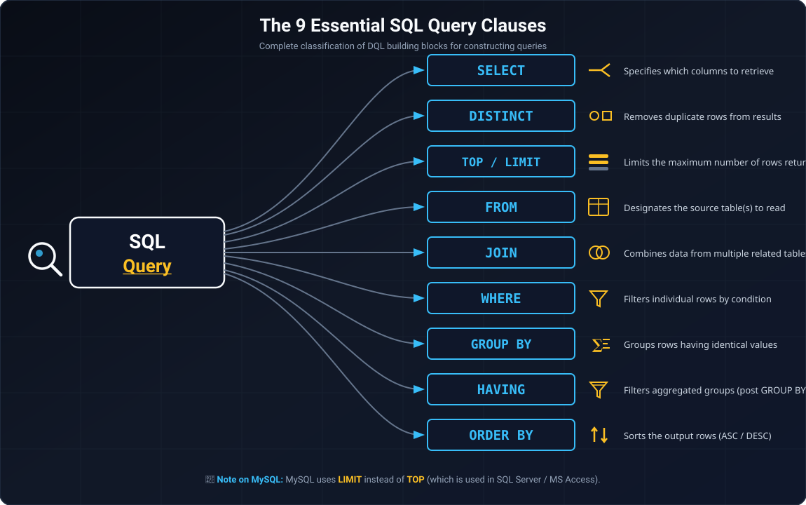

* **The 9 Building Blocks of SQL Queries:**

| # | Clause | Syntax Keyword | Core Purpose & Action |
| :--- | :--- | :--- | :--- |
| **1** | **Projection** | `SELECT` | Specifies which columns (attributes) to retrieve and display in the result set. |
| **2** | **Deduplication** | `DISTINCT` | Eliminates duplicate identical rows from the query output. |
| **3** | **Row Restriction** | `TOP` / `LIMIT` | Restricts the maximum number of rows returned (`LIMIT n`). |
| **4** | **Data Source** | `FROM` | Identifies the table(s) from which data must be extracted. |
| **5** | **Relationship** | `JOIN` | Merges rows from two or more tables based on related foreign key columns. |
| **6** | **Row Filtering** | `WHERE` | Filters rows based on individual boolean conditions (predicates). |
| **7** | **Aggregation** | `GROUP BY` | Groups rows sharing identical values into summary rows (e.g., per department). |
| **8** | **Group Filtering**| `HAVING` | Filters summarized groups created by `GROUP BY` using aggregate functions. |
| **9** | **Sorting** | `ORDER BY` | Sorts the final result rows in ascending (`ASC`) or descending (`DESC`) order. |

---

### 13.5 How SQL Works: Written Syntax (Left to Right) vs. Engine Execution Order

* **In database query execution done left to right:**
  * When writing an SQL query, the human developer types from left to right:
    $$\text{SELECT} \longrightarrow \text{FROM} \longrightarrow \text{WHERE} \longrightarrow \text{GROUP BY} \longrightarrow \text{HAVING} \longrightarrow \text{ORDER BY} \longrightarrow \text{LIMIT}$$
  * **HOWEVER**, inside the database management engine, SQL queries are **NOT physically executed from left to right**!
  * The SQL execution engine follows a strict, logical pipeline order:

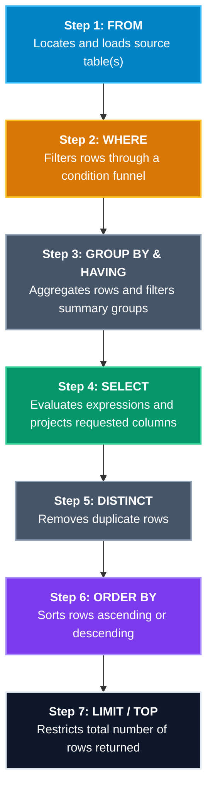
```mermaid
flowchart TD
    A["<b>Step 1: FROM</b><br/>Locates and loads source table(s)"] --> B["<b>Step 2: WHERE</b><br/>Filters rows through a condition funnel"]
    B --> C["<b>Step 3: GROUP BY & HAVING</b><br/>Aggregates rows and filters summary groups"]
    C --> D["<b>Step 4: SELECT</b><br/>Evaluates expressions and projects requested columns"]
    D --> E["<b>Step 5: DISTINCT</b><br/>Removes duplicate rows"]
    E --> F["<b>Step 6: ORDER BY</b><br/>Sorts rows ascending or descending"]
    F --> G["<b>Step 7: LIMIT / TOP</b><br/>Restricts total number of rows returned"]

    style A fill:#0284c7,stroke:#38bdf8,stroke-width:2px,color:#fff
    style B fill:#d97706,stroke:#fbbf24,stroke-width:2px,color:#fff
    style C fill:#475569,stroke:#94a3b8,stroke-width:2px,color:#fff
    style D fill:#059669,stroke:#34d399,stroke-width:2px,color:#fff
    style E fill:#475569,stroke:#94a3b8,stroke-width:2px,color:#fff
    style F fill:#7c3aed,stroke:#a78bfa,stroke-width:2px,color:#fff
    style G fill:#0f172a,stroke:#e2e8f0,stroke-width:2px,color:#fff
```

* **Why does `FROM` run first?**
  * The database engine cannot know what columns or conditions exist until it first opens and identifies the source table! Therefore, `FROM` is always step #1.

---

### 13.6 Select Query / Data Retrieve Query: `SELECT *` vs. `SELECT column_name`

* **Select query:**
  * `Select * form` (Select * from ...)
* **data retrieve query :**
  * **1. Select * from tableName:**
    * *(retrieve all column data) → (everything form the given table)*
  * **2. Select column name:**
    * *retrieve the column specific data*

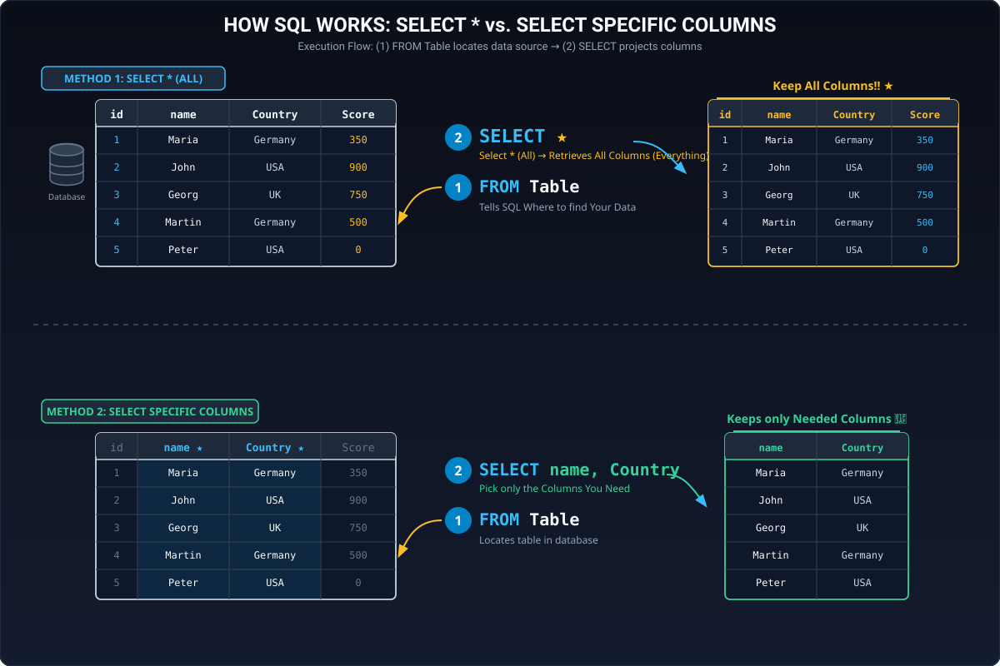

#### 1. Method ①: Select * from tableName
* *Concept: (retrieve all column data) → (everything form the given table) — "Keep All Columns!!".*
* **Syntax:**
  ```sql
  SELECT * FROM tableName;
  ```
* **Step-by-Step Execution:**
  * **Step ① (`FROM Table`):** Tells SQL where to find your data.
  * **Step ② (`SELECT *`):** The asterisk (`*`) is a wildcard that instructs the engine to keep all columns defined in the table.

* **Q1. retrieve all data from the customers  and orders data form the orders table**
  ```sql
  SELECT * FROM customers;
  SELECT * FROM orders;
  ```

#### 2. Method ②: Select column name
* *Concept: retrieve the column specific data — "Pick only the Columns You Need / Keeps only Needed Columns".*
* **Syntax:**
  ```sql
  SELECT column1, column2, column3 FROM tableName;
  ```
* **Step-by-Step Execution:**
  * **Step ① (`FROM Table`):** Locates table in the database.
  * **Step ② (`SELECT col1, col2`):** Extracts and projects only the designated attributes, ignoring unnecessary columns.

* **Q2. Retrieve each customer name, country, and score**
  ```sql
  SELECT first_name, country, score FROM customers;
  ```

#### 3. Comparison: `SELECT *` vs. Specific Column Projection

| Dimension | `SELECT *` (All Columns) | `SELECT col1, col2` (Specific Projection) |
| :--- | :--- | :--- |
| **Data Returned** | Returns 100% of columns in table | Returns only explicitly requested columns |
| **Network Payload** | High byte size; transfers unneeded data | Minimal byte size; transfers only required data |
| **Performance** | Slower over network; disk page scanning | Faster; can leverage memory **Covering Indexes** |
| **Best Used For** | Ad-hoc queries, debugging, schema exploration | **Production code**, web APIs, microservices, reporting |

---

### 13.7 Filtering Data & The WHERE Clause In-Depth

* **Filtering Data (The WHERE Clause):**
  * *In databases, filtering means retrieving only the rows (records) that match specific conditions instead of fetching everything.*
  * *The WHERE clause is used to filter data using different types of operators.*
  * *Core Definition:* **Filtering = Applying boolean conditions (predicates) to select only the rows you need from a database table.**
  * The `WHERE` clause acts as a sieve / gatekeeper: it evaluates a boolean test for every single row in the source table.
    * If the condition evaluates to **`TRUE`**, the row is **kept** and moves to the next execution stage.
    * If the condition evaluates to **`FALSE`** or **`UNKNOWN`** (involving `NULL`), the row is **discarded**.

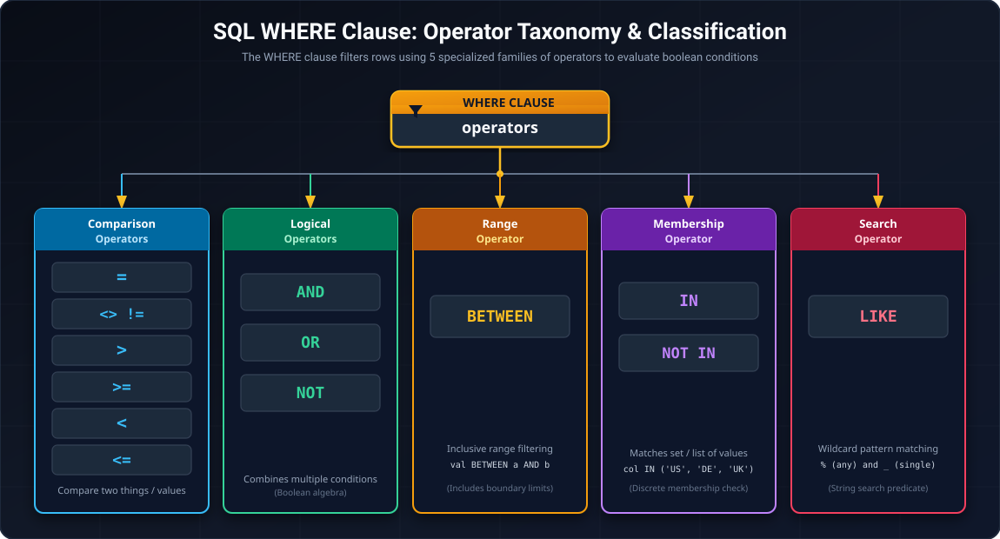

---

#### 13.7.1 The 5 Families of WHERE Clause Operators

* The `WHERE` clause filters data using 5 specialized families of operators:

| # | Operator Family | Operators / Keywords | Core Purpose & Action | SQL Syntax Example |
| :--- | :--- | :--- | :--- | :--- |
| **1** | **Comparison Operators** | `=`, `!=`, `<>`, `>`, `>=`, `<`, `<=` | Compares two expressions, columns, or literal values to test equality or magnitude. | `WHERE score > 500` |
| **2** | **Logical Operators** | `AND`, `OR`, `NOT` | Combines multiple conditions or negates a condition using boolean algebra. | `WHERE country = 'USA' AND score >= 500` |
| **3** | **Range Operator** | `BETWEEN ... AND ...` | Filters values falling within an inclusive lower and upper boundary range. | `WHERE score BETWEEN 500 AND 900` |
| **4** | **Membership Operator** | `IN (...)`, `NOT IN (...)` | Checks if a value matches any item within a specified discrete list or subquery set. | `WHERE country IN ('USA', 'Germany', 'UK')` |
| **5** | **Search Operator** | `LIKE` (with `%`, `_`) | Performs string pattern matching using SQL wildcards (`%` for any characters, `_` for one). | `WHERE first_name LIKE 'J%'` |

---

#### 13.7.2 Comparison Operators: Compare Two Things!

* **What is a Comparison Operator?**
  * *Definition: Comparison operators are used to compare two things (values, columns, expressions, functions, or subqueries).*
  * A comparison operator evaluates the relationship between two expressions and returns a boolean state: **`TRUE`**, **`FALSE`**, or **`UNKNOWN`**.

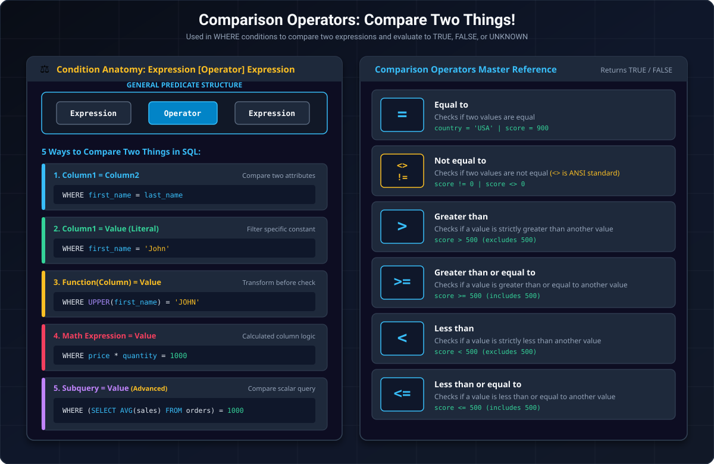

##### 1. Anatomy of a Condition
* Every comparison condition follows a strict 3-part syntax structure:
  $$\text{Condition} \longrightarrow \mathbf{\text{Expression 1}}\;\;[\mathbf{\text{Comparison Operator}}]\;\;\mathbf{\text{Expression 2}}$$

##### 2. The 5 Ways to Compare Two Things in SQL
SQL allows flexible comparisons across different types of operands:

1. **Column1 = Column2 (Compare Two Attributes):**
   * Compares the value in one column with the value in another column within the same row.
   ```sql
   SELECT * FROM customers WHERE first_name = last_name;
   ```
2. **Column1 = Value (Compare Attribute to Constant Literal):**
   * Compares a column against a literal string, number, or date.
   ```sql
   SELECT * FROM customers WHERE first_name = 'John';
   SELECT * FROM customers WHERE country = 'USA';
   ```
3. **Function = Value (Compare Transformed Column to Constant):**
   * Applies a built-in SQL function (e.g., `UPPER()`, `LOWER()`, `LENGTH()`) before testing the condition.
   ```sql
   SELECT * FROM customers WHERE UPPER(first_name) = 'JOHN';
   ```
4. **Expression = Value (Compare Mathematical Calculation to Constant):**
   * Computes an arithmetic expression across columns and compares the calculated result.
   ```sql
   SELECT * FROM orders WHERE price * quantity = 1000;
   ```
5. **Subquery = Value (Compare Scalar Subquery to Constant — Advanced):**
   * Compares a value against the single scalar output of an inner nested query.
   ```sql
   SELECT * FROM orders WHERE (SELECT AVG(sales) FROM orders) = 1000;
   ```

---

#### 13.7.3 Master Comparison Operators Reference (Definitions & Descriptions)

* Complete technical definitions and plain-English descriptions for all 6 comparison operators:

| Operator Symbol | Name / Operation | Definition & Description | SQL Query Example | Condition Evaluated | Surviving Rows |
| :---: | :--- | :--- | :--- | :--- | :--- |
| **`=`** | **Equal to** | **Checks if two values are equal.**<br/>Returns `TRUE` if the left operand has exactly the same value as the right operand; otherwise returns `FALSE`. | `SELECT * FROM customers WHERE country = 'USA';` | `country = 'USA'` | Rows where `country` is exactly `'USA'` (e.g., John, Peter). |
| **`!=`**<br/>**`<>`** | **Not equal to** | **Checks if two values are not equal.**<br/>Returns `TRUE` if the left operand is not equal to the right operand.<br/>*Note: `<>` is the official **ISO/ANSI SQL standard** operator, while `!=` is the widely supported industry alias.* | `SELECT * FROM customers WHERE score != 0;`<br/>`SELECT * FROM customers WHERE score <> 0;` | `score != 0`<br/>`score <> 0` | All rows where `score` is any number other than 0. |
| **`>`** | **Greater than** | **Checks if a value is greater than another value.**<br/>Returns `TRUE` strictly when the left operand has a numerically or alphabetically larger value than the right operand. | `SELECT * FROM customers WHERE score > 500;` | `score > 500` | Rows where `score` is strictly greater than 500 (e.g., 750, 900). **Excludes 500.** |
| **`>=`** | **Greater than or equal to** | **Checks if a value is greater than or equal to another value.**<br/>Returns `TRUE` if the left operand is either strictly larger than or exactly equal to the right operand. | `SELECT * FROM customers WHERE score >= 500;` | `score >= 500` | Rows where `score` is 500 or higher (e.g., 500, 750, 900). **Includes 500.** |
| **`<`** | **Less than** | **Checks if a value is less than another value.**<br/>Returns `TRUE` strictly when the left operand has a numerically or alphabetically smaller value than the right operand. | `SELECT * FROM customers WHERE score < 500;` | `score < 500` | Rows where `score` is strictly less than 500 (e.g., 0, 350). **Excludes 500.** |
| **`<=`** | **Less than or equal to** | **Checks if a value is less than or equal to another value.**<br/>Returns `TRUE` if the left operand is either strictly smaller than or exactly equal to the right operand. | `SELECT * FROM customers WHERE score <= 500;` | `score <= 500` | Rows where `score` is 500 or lower (e.g., 0, 350, 500). **Includes 500.** |

> [!WARNING]
> **Technical Gotcha: Three-Valued Logic & NULL Values**
> In SQL, `NULL` represents an *unknown* or *missing* value, not zero or an empty string.
> Because of this, comparing any value to `NULL` using `=` or `!=` evaluates to **`UNKNOWN`**, never `TRUE`:
> * `score = NULL` $\longrightarrow$ **UNKNOWN (Evaluates as Falsey, returns 0 rows)**
> * `score != NULL` $\longrightarrow$ **UNKNOWN (Evaluates as Falsey, returns 0 rows)**
> **The Golden Rule:** *Always use `IS NULL` or `IS NOT NULL` when checking for missing values in SQL!*

---

#### 13.7.4 Internal Filtering Process (Row-by-Row Predicate Evaluation)

* Let us see how the database engine evaluates conditions row-by-row in memory.

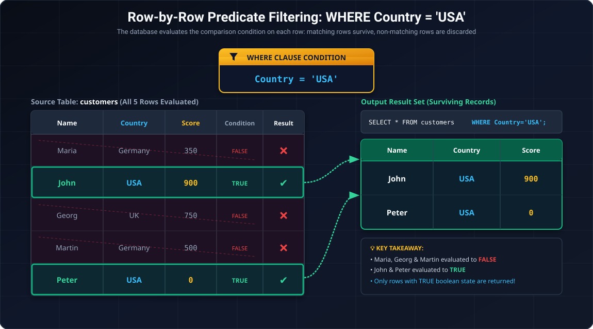

##### Demonstration 1: String Equality Predicate (`WHERE Country = 'USA'`)
* Consider the query:
  ```sql
  SELECT name, country, score 
  FROM customers 
  WHERE country = 'USA';
  ```
* **Step-by-Step Row Evaluation:**
  1. **Row 1 (`Maria`, `Germany`, `350`):** Evaluates `'Germany' = 'USA'` $\rightarrow$ **`FALSE`** $\rightarrow$ **Row Discarded ❌**
  2. **Row 2 (`John`, `USA`, `900`):** Evaluates `'USA' = 'USA'` $\rightarrow$ **`TRUE`** $\rightarrow$ **Row Kept ✔️**
  3. **Row 3 (`Georg`, `UK`, `750`):** Evaluates `'UK' = 'USA'` $\rightarrow$ **`FALSE`** $\rightarrow$ **Row Discarded ❌**
  4. **Row 4 (`Martin`, `Germany`, `500`):** Evaluates `'Germany' = 'USA'` $\rightarrow$ **`FALSE`** $\rightarrow$ **Row Discarded ❌**
  5. **Row 5 (`Peter`, `USA`, `0`):** Evaluates `'USA' = 'USA'` $\rightarrow$ **`TRUE`** $\rightarrow$ **Row Kept ✔️**

* **Output Result Set:**
  | name | country | score |
  | :--- | :--- | :--- |
  | **John** | USA | 900 |
  | **Peter** | USA | 0 |

---

##### Demonstration 2: Numeric Greater Than Predicate (`WHERE score > 500`)
* Consider the query:
  ```sql
  SELECT name, country, score 
  FROM customers 
  WHERE score > 500;
  ```
* **Step-by-Step Row Evaluation:**
  1. **Row 1 (Maria, 350):** $350 > 500 \rightarrow$ **`FALSE`** $\rightarrow$ **Row Discarded ❌**
  2. **Row 2 (John, 900):** $900 > 500 \rightarrow$ **`TRUE`** $\rightarrow$ **Row Kept ✔️**
  3. **Row 3 (Georg, 750):** $750 > 500 \rightarrow$ **`TRUE`** $\rightarrow$ **Row Kept ✔️**
  4. **Row 4 (Martin, 500):** $500 > 500 \rightarrow$ **`FALSE`** $\rightarrow$ **Row Discarded ❌** *(500 is not strictly greater than 500)*
  5. **Row 5 (Peter, 0):** $0 > 500 \rightarrow$ **`FALSE`** $\rightarrow$ **Row Discarded ❌**

* **Output Result Set:**
  | name | country | score |
  | :--- | :--- | :--- |
  | **John** | USA | 900 |
  | **Georg** | UK | 750 |

---

#### 13.7.5 Practical Practice Questions (Hands-on Comparison Queries)

* **Q1. Retrieve customers where scores are not equal to zero ?**
  ```sql
  -- Standard industry syntax:
  SELECT first_name, score FROM customers WHERE score != 0;

  -- Official ISO/ANSI SQL standard syntax:
  SELECT first_name, score FROM customers WHERE score <> 0;
  ```
  * *Key Takeaway:* Both `!=` and `<>` perform identically in MySQL. `<>` is the ISO/ANSI SQL standard, while `!=` is common in modern programming languages.

* **Q2. Retrieve all customers from Germany ?**
  ```sql
  SELECT * FROM customers WHERE country = 'Germany';
  ```
  * *With column projection (Production Best Practice):*
  ```sql
  SELECT first_name, country, score FROM customers WHERE country = 'Germany';
  ```

* **Q3. Retrieve all customers from USA ?**
  ```sql
  SELECT first_name, country, score FROM customers WHERE country = 'USA';
  ```

* **Q4. Retrieve customers who have scored strictly greater than 500 ?**
  ```sql
  SELECT first_name, score FROM customers WHERE score > 500;
  ```

* **Q5. Retrieve customers who have scored 500 or higher (greater than or equal to 500) ?**
  ```sql
  SELECT first_name, score FROM customers WHERE score >= 500;
  ```

* **Q6. Retrieve customers who have scored strictly less than 500 ?**
  ```sql
  SELECT first_name, score FROM customers WHERE score < 500;
  ```

* **Q7. Retrieve customers who have scored 500 or lower (less than or equal to 500) ?**
  ```sql
  SELECT first_name, score FROM customers WHERE score <= 500;
  ```

* **Q8. Retrieve customers whose first name is identical to their last name (Compare Column to Column) ?**
  ```sql
  SELECT * FROM customers WHERE first_name = last_name;
  ```

* **Q9. Retrieve orders where total cost (price * quantity) is equal to 1000 (Compare Expression to Value) ?**
  ```sql
  SELECT order_id, product_name, price, quantity, (price * quantity) AS total_amount 
  FROM orders 
  WHERE price * quantity = 1000;
  ```

---

#### 13.7.6 Logical Operators In-Depth (AND, OR, NOT)

* **What are Logical Operators?**
  * *Definition: Logical operators in SQL are used to combine multiple conditions or negate a condition in the `WHERE` clause.*
  * They evaluate individual condition predicates using formal boolean logic and determine whether a row meets the overall criteria to be included in the result set.

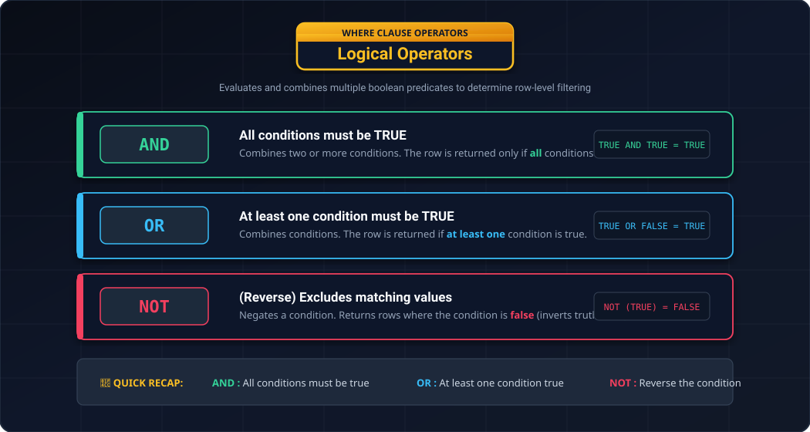

* **Summary Recap of the 3 Core Logical Operators:**
  * **`AND`** : **All conditions must be TRUE** (Returns the row only if every single condition evaluates to `TRUE`).
  * **`OR`**  : **At least one condition must be TRUE** (Returns the row if any condition evaluates to `TRUE`).
  * **`NOT`** : **Reverse the condition** (Excludes matching values; inverts `TRUE` to `FALSE` and `FALSE` to `TRUE`).

---

##### 1. The `AND` Operator

* **Definition & Meaning:**
  * Combines two or more conditions.
  * The row is returned **only if all conditions are true**.
  * If even a single condition evaluates to `FALSE`, the entire combined expression evaluates to `FALSE` and the row is discarded.

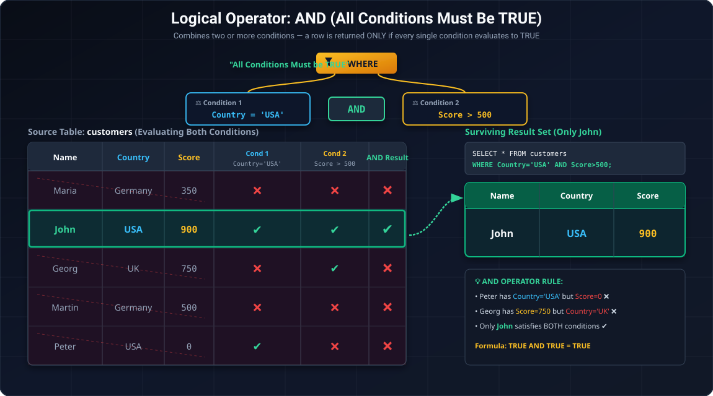

* **Mathematical Truth Table for `AND`:**
  | Condition 1 | Condition 2 | Combined (`Cond1 AND Cond2`) | Row Evaluation Action |
  | :---: | :---: | :---: | :---: |
  | **`TRUE`** | **`TRUE`** | **`TRUE`** | **Row Kept in Result Set ✔️** |
  | **`TRUE`** | `FALSE` | `FALSE` | Row Discarded ❌ |
  | `FALSE` | **`TRUE`** | `FALSE` | Row Discarded ❌ |
  | `FALSE` | `FALSE` | `FALSE` | Row Discarded ❌ |

* **Hands-on Query Example:**
  ```sql
  SELECT * FROM customers 
  WHERE country = 'USA' AND score > 500;
  ```
* **Step-by-Step Row Evaluation:**
  1. **Maria** (`Germany`, `350`): `'Germany' = 'USA'` (❌) AND `350 > 500` (❌) $\rightarrow$ `FALSE` $\rightarrow$ **Discarded ❌**
  2. **John** (`USA`, `900`): `'USA' = 'USA'` (✔️) AND `900 > 500` (✔️) $\rightarrow$ **`TRUE`** $\rightarrow$ **Row Kept ✔️**
  3. **Georg** (`UK`, `750`): `'UK' = 'USA'` (❌) AND `750 > 500` (✔️) $\rightarrow$ `FALSE` $\rightarrow$ **Discarded ❌**
  4. **Martin** (`Germany`, `500`): `'Germany' = 'USA'` (❌) AND `500 > 500` (❌) $\rightarrow$ `FALSE` $\rightarrow$ **Discarded ❌**
  5. **Peter** (`USA`, `0`): `'USA' = 'USA'` (✔️) AND `0 > 500` (❌) $\rightarrow$ `FALSE` $\rightarrow$ **Discarded ❌**
* **Surviving Result Set:**
  | name | country | score |
  | :--- | :--- | :--- |
  | **John** | USA | 900 |

---

##### 2. The `OR` Operator

* **Definition & Meaning:**
  * Combines conditions.
  * The row is returned **if at least one condition is true**.
  * Evaluates to `FALSE` only when **all** combined conditions evaluate to `FALSE`.

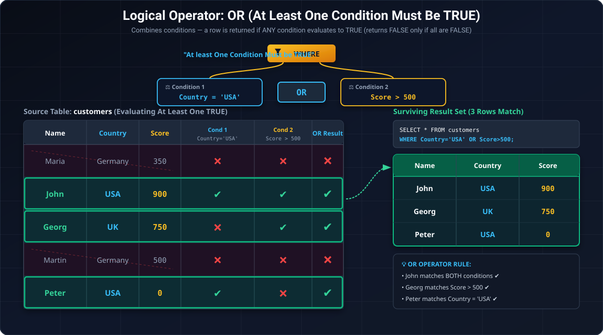

* **Mathematical Truth Table for `OR`:**
  | Condition 1 | Condition 2 | Combined (`Cond1 OR Cond2`) | Row Evaluation Action |
  | :---: | :---: | :---: | :---: |
  | **`TRUE`** | **`TRUE`** | **`TRUE`** | **Row Kept in Result Set ✔️** |
  | **`TRUE`** | `FALSE` | **`TRUE`** | **Row Kept in Result Set ✔️** |
  | `FALSE` | **`TRUE`** | **`TRUE`** | **Row Kept in Result Set ✔️** |
  | `FALSE` | `FALSE` | `FALSE` | Row Discarded ❌ |

* **Hands-on Query Example:**
  ```sql
  SELECT * FROM customers 
  WHERE country = 'USA' OR score > 500;
  ```
* **Step-by-Step Row Evaluation:**
  1. **Maria** (`Germany`, `350`): Neither condition is true $\rightarrow$ `FALSE` $\rightarrow$ **Discarded ❌**
  2. **John** (`USA`, `900`): Both conditions are true $\rightarrow$ **`TRUE`** $\rightarrow$ **Row Kept ✔️**
  3. **Georg** (`UK`, `750`): `score > 500` is true $\rightarrow$ **`TRUE`** $\rightarrow$ **Row Kept ✔️**
  4. **Martin** (`Germany`, `500`): Neither condition is true (500 is not > 500) $\rightarrow$ `FALSE` $\rightarrow$ **Discarded ❌**
  5. **Peter** (`USA`, `0`): `country = 'USA'` is true $\rightarrow$ **`TRUE`** $\rightarrow$ **Row Kept ✔️**
* **Surviving Result Set:**
  | name | country | score |
  | :--- | :--- | :--- |
  | **John** | USA | 900 |
  | **Georg** | UK | 750 |
  | **Peter** | USA | 0 |

---

##### 3. The `NOT` Operator

* **Definition & Meaning:**
  * Negates a condition.
  * Returns rows where the condition is **false** (reverses the boolean state).
  * Excludes matching values from the result set.

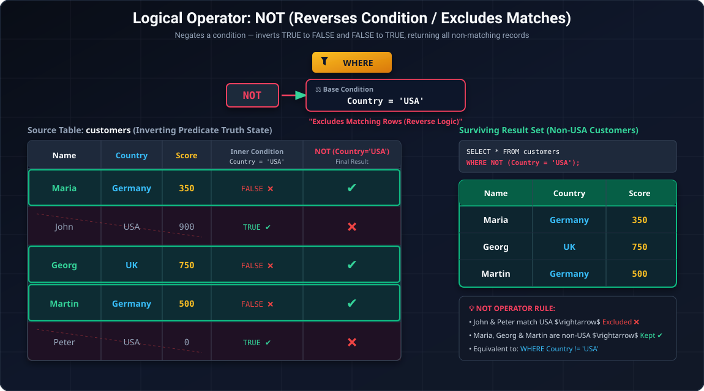

* **Mathematical Truth Table for `NOT`:**
  | Inner Condition Predicate | Combined State (`NOT Condition`) | Row Evaluation Action |
  | :---: | :---: | :---: |
  | **`TRUE`** | `FALSE` | Row Discarded ❌ (Excluded) |
  | `FALSE` | **`TRUE`** | **Row Kept in Result Set ✔️** |

* **Hands-on Query Example:**
  ```sql
  SELECT * FROM customers 
  WHERE NOT (country = 'USA');
  ```
* **Step-by-Step Row Evaluation:**
  1. **Maria** (`Germany`): `'Germany' = 'USA'` is `FALSE` $\rightarrow$ `NOT FALSE` = **`TRUE`** $\rightarrow$ **Row Kept ✔️**
  2. **John** (`USA`): `'USA' = 'USA'` is `TRUE` $\rightarrow$ `NOT TRUE` = `FALSE` $\rightarrow$ **Discarded ❌**
  3. **Georg** (`UK`): `'UK' = 'USA'` is `FALSE` $\rightarrow$ `NOT FALSE` = **`TRUE`** $\rightarrow$ **Row Kept ✔️**
  4. **Martin** (`Germany`): `'Germany' = 'USA'` is `FALSE` $\rightarrow$ `NOT FALSE` = **`TRUE`** $\rightarrow$ **Row Kept ✔️**
  5. **Peter** (`USA`): `'USA' = 'USA'` is `TRUE` $\rightarrow$ `NOT TRUE` = `FALSE` $\rightarrow$ **Discarded ❌**
* **Surviving Result Set:**
  | name | country | score |
  | :--- | :--- | :--- |
  | **Maria** | Germany | 350 |
  | **Georg** | UK | 750 |
  | **Martin** | Germany | 500 |

* **Equivalence Note:**
  * `WHERE NOT (country = 'USA')` is functionally identical to `WHERE country != 'USA'` or `WHERE country <> 'USA'`.

---

#### 13.7.7 Range Operator In-Depth: `BETWEEN … AND …`

* **What is the `BETWEEN` Operator?**
  * *Definition:* The `BETWEEN … AND …` operator checks if a value is **within a range or not**.
  * The `BETWEEN … AND …` operator is used in SQL to filter a range of values.
  * **It includes the lower and upper bounds (both ends are inclusive).**
  * **Works with numbers, dates, or text:**
    * **Numbers:** Filters values within numeric boundaries (e.g., `score BETWEEN 100 AND 500`).
    * **Dates:** Filters records within temporal dates (e.g., `order_date BETWEEN '2025-01-01' AND '2025-12-31'`).
    * **Text:** Filters strings based on dictionary alphabetical sorting (e.g., `last_name BETWEEN 'A' AND 'M'`).

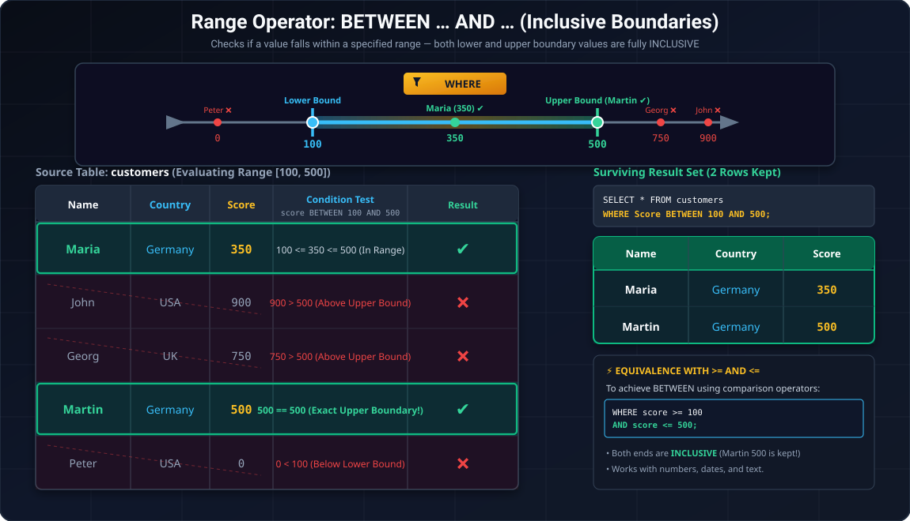

##### 1. Inclusive Nature (Both Ends are Inclusive)
* In SQL, `BETWEEN` is strictly **inclusive** on both boundaries:
  $$\text{value} \ge \text{lower\_boundary}\quad \mathbf{AND}\quad \text{value} \le \text{upper\_boundary}$$
* For example, if a record's score is exactly `100` or exactly `500`, **both boundary values are retained**.

##### 2. To Achieve `BETWEEN` Operator Using `AND` & Comparison Operators
* It is very similar to explicitly declaring the lower boundary and higher boundary using comparison operators:
  ```sql
  -- Syntax using BETWEEN operator:
  SELECT * FROM customers WHERE score BETWEEN 100 AND 500;

  -- Syntax using comparison operators with AND:
  SELECT * FROM customers WHERE score >= 100 AND score <= 500;
  ```
* **Above command is also exactly the same as the `BETWEEN` command!**
* Inside the database engine, the SQL query optimizer evaluates both queries to the exact same execution plan.

##### 3. Step-by-Step Row Evaluation (`WHERE score BETWEEN 100 AND 500`)
* Let us evaluate each record from our `customers` table against the range $[100, 500]$:
  1. **Maria** (`350`): $100 \le 350 \le 500$ is **`TRUE`** $\rightarrow$ **Row Kept ✔️**
  2. **John** (`900`): $900 > 500$ (above upper boundary) is `FALSE` $\rightarrow$ **Discarded ❌**
  3. **Georg** (`750`): $750 > 500$ (above upper boundary) is `FALSE` $\rightarrow$ **Discarded ❌**
  4. **Martin** (`500`): $500 = 500$ (matches exact upper inclusive bound!) is **`TRUE`** $\rightarrow$ **Row Kept ✔️**
  5. **Peter** (`0`): $0 < 100$ (below lower boundary) is `FALSE` $\rightarrow$ **Discarded ❌**

* **Output Result Set:**
  | name | country | score |
  | :--- | :--- | :--- |
  | **Maria** | Germany | 350 |
  | **Martin** | Germany | 500 |

##### 4. Negating a Range: `NOT BETWEEN … AND …`
* The `NOT BETWEEN` operator retrieves all rows that fall **outside** the specified range:
  ```sql
  SELECT * FROM customers WHERE score NOT BETWEEN 100 AND 500;
  ```
  * *Equivalent Comparison Syntax:*
  ```sql
  SELECT * FROM customers WHERE score < 100 OR score > 500;
  ```
  * *Surviving Records:* **Peter** (0), **Georg** (750), and **John** (900).

---

### 13.8 Visual Diagrams & Architectural Reference

#### 1. ASK Your Data: The SQL Query Mental Model
* **Definition:** The cognitive model that frames relational databases as an interactive repository where human business questions are systematically translated into structured SQL queries to retrieve accurate tabular answers.
* **Description:** This diagram illustrates the complete closed query lifecycle across 4 distinct phases:
  1. **The Business Question:** Natural human query (e.g., *"Who are our customers from Germany?"*).
  2. **The SQL Query:** Formal declarative query formulation (`SELECT name, country FROM customers WHERE country = 'Germany';`).
  3. **Database Processing:** The DBMS engine reads physical disk blocks into memory, evaluates filtering predicates, and discards non-matching rows.
  4. **The Tabular Result Set:** Clean virtual table returned to the application screen or API.


---

#### 2. The 9 Essential SQL Query Clauses
* **Definition:** The fundamental structural keywords (clauses) of Data Query Language (DQL) used to define data sources, filtering predicates, grouping, and output formatting.
* **Description:** A visual taxonomy classifying all 9 query clauses branching out from a central SQL query engine:
  * **`SELECT`**: Specifies attributes to project and display.
  * **`DISTINCT`**: Eliminates duplicate identical rows.
  * **`TOP` / `LIMIT`**: Restricts the maximum number of returned rows.
  * **`FROM`**: Identifies source table(s) on disk.
  * **`JOIN`**: Merges records from related tables.
  * **`WHERE`**: Filters rows using boolean conditions (predicates).
  * **`GROUP BY`**: Summarizes rows into aggregated groups.
  * **`HAVING`**: Filters summarized groups using aggregate functions.
  * **`ORDER BY`**: Sorts final result rows in ascending (`ASC`) or descending (`DESC`) order.


---

#### 3. HOW SQL WORKS: SELECT * vs. Specific Column Projection
* **Definition:** The operational and performance distinction between full-table extraction (`SELECT *`) and targeted attribute selection (`SELECT col1, col2`).
* **Description:** A chalkboard-style architectural comparison showing physical query execution:
  * **Step ① (`FROM Table`):** Identifies and locates the table on disk storage.
  * **Method A (`SELECT *`):** Keeps all columns (100% table width), resulting in high disk I/O, heavy memory allocation, and large network payloads.
  * **Method B (`SELECT col1, col2`):** Extracts only the designated attributes, minimizing network byte transfer and allowing MySQL to utilize fast **Covering Indexes**.


---

#### 4. WHERE Clause Filtering Pipeline & Query Execution Order
* **Definition:** The physical execution sequence performed by the DBMS query optimizer when evaluating filtered data queries.
* **Description:** Highlights that while SQL queries are written from left to right (`SELECT ... FROM ... WHERE ...`), the physical database engine executes in a strict logical order:
  * **Step ① `FROM customers`:** Reads the raw table from storage into the buffer cache.
  * **Step ② `WHERE score > 500`:** Funnels every row through the boolean predicate filter, discarding non-matching rows (`FALSE` / `UNKNOWN`) and keeping matching rows (`TRUE`).
  * **Step ③ `SELECT name, country`:** Projects and outputs only the specified columns of the surviving records.


---

#### 5. WHERE Operators Taxonomy Tree (The 5 Operator Families)
* **Definition:** The comprehensive classification system of all operator types supported in the SQL `WHERE` clause for constructing filtering predicates.
* **Description:** A hierarchical tree diagram mapping out the 5 specialized operator families used in row-level filtering:
  1. **Comparison Operators:** `=`, `<>`, `!=`, `>`, `>=`, `<`, `<=` (compares two expressions or values).
  2. **Logical Operators:** `AND`, `OR`, `NOT` (combines or negates conditions using boolean algebra).
  3. **Range Operator:** `BETWEEN ... AND ...` (inclusive boundary filtering).
  4. **Membership Operator:** `IN`, `NOT IN` (matches against a discrete list or subquery set).
  5. **Search Operator:** `LIKE` (wildcard string pattern matching with `%` and `_`).


---

#### 6. Comparison Operators: Condition Anatomy & Master Reference
* **Definition:** Relational operators used to compare two operands (expressions, attributes, literals, functions, or subqueries) and return a boolean truth state (`TRUE`, `FALSE`, or `UNKNOWN`).
* **Description:** Details the tripartite anatomy of a condition (`Expression [Operator] Expression`), illustrates the 5 practical ways to compare two things in SQL (`Column=Column`, `Column=Value`, `Function=Value`, `Expression=Value`, `Subquery=Value`), and presents the master reference matrix of all 6 comparison operators with their definitions, syntax, and boolean outcomes.


---

#### 7. Row-by-Row Predicate Filtering Demonstration (WHERE Country = 'USA')
* **Definition:** Memory-level visual trace of how the database engine tests boolean predicates against each table record to decide row survival.
* **Description:** Step-by-step visual demonstration of applying `WHERE Country = 'USA'` to the `customers` table:
  * Rows for Maria (`Germany`), Georg (`UK`), and Martin (`Germany`) evaluate to **`FALSE`** and are **discarded ❌**.
  * Rows for John (`USA`) and Peter (`USA`) evaluate to **`TRUE`** and are **kept ✔️**.
  * The resulting output virtual table contains only the surviving records (John and Peter).


---

#### 8. Whole Table vs. Specific Column Projection Architecture
* **Definition:** Architectural analysis of network payload, memory consumption, and disk I/O between full-table queries and column projection.
* **Description:** Illustrates the internal pipeline differences between `SELECT *` (reading all column blocks into the buffer pool and sending maximum bytes over the network wire) and targeted column selection (reading only required columns, enabling covering index lookups without touching table data pages, and dramatically shrinking network bandwidth).


---

#### 9. Logical Operators Master Reference Table (AND, OR, NOT)
* **Definition:** A visual summary card classifying the 3 core boolean operators in SQL, their formal evaluation rules, and logical truth results.
* **Description:** Details `AND` (all conditions must be TRUE), `OR` (at least one condition must be TRUE), and `NOT` (reverses the condition / excludes matching rows) with side-by-side boolean formula pills and quick-recap reference.


---

#### 10. Logical Operator: AND (All Conditions Must Be TRUE)
* **Definition:** A logical conjunction operator that links two or more conditions and evaluates to `TRUE` if and only if every condition predicate is satisfied.
* **Description:** Demonstrates the row-by-row filtering evaluation for `WHERE Country = 'USA' AND Score > 500`. Only John satisfies both condition 1 (`Country = 'USA'`) and condition 2 (`Score > 500`), while Peter and Georg fail one condition and are discarded.


---

#### 11. Logical Operator: OR (At Least One Condition Must Be TRUE)
* **Definition:** A logical disjunction operator that evaluates to `TRUE` if any of the specified conditions is met, discarding records only when all conditions fail.
* **Description:** Illustrates evaluation for `WHERE Country = 'USA' OR Score > 500`. Records for John (meets both), Georg (meets score > 500), and Peter (meets Country = 'USA') all survive to form the final result set.


---

#### 12. Logical Operator: NOT (Reverses Condition / Excludes Matches)
* **Definition:** A logical negation operator that inverts the truth value of a condition predicate, converting matching rows into non-matches.
* **Description:** Demonstrates the evaluation of `WHERE NOT (Country = 'USA')`. Rows matching 'USA' (John, Peter) evaluate to `FALSE` and are excluded, while non-USA customers (Maria, Georg, Martin) evaluate to `TRUE` and survive.


---

#### 13. Range Operator: BETWEEN … AND … (Inclusive Boundaries)
* **Definition:** A range evaluation operator that tests whether an attribute's value falls within a specified interval, including both boundary endpoints.
* **Description:** Displays a number line with lower bound (100) and upper bound (500), showing that values within the interval (Maria: 350) and exactly on the boundary (Martin: 500) are kept, while out-of-bound records (Peter: 0, Georg: 750, John: 900) are discarded. Also highlights functional equivalence to `>= 100 AND <= 500`.


---

### 13.9 Topic 13 Summary (मराठी सारांश)

* **DQL (Data Query Language) आणि डेटा क्वेरी करण्याचे स्वरूप:**
  * DQL चा उपयोग डेटाबेसमधून अचूक माहिती शोधण्यासाठी (Fetch / Retrieve) केला जातो.
  * ही पूर्णपणे **Read-Only** भाषा आहे; याने मूळ डेटामध्ये कोणताही फेरबदल होत नाही.
  * DQL मधील मुख्य कमांड **`SELECT`** ही आहे.
* **क्वेरी करण्यापूर्वीच्या मूलभूत कमांड्स (Prerequisites):**
  * `SHOW DATABASES;`: सर्व अस्तित्वात असलेले डेटाबेस पाहणे.
  * `CREATE DATABASE my_db;`: नवीन डेटाबेस तयार करणे.
  * `USE my_db;`: हवा असलेला डेटाबेस निवडणे (Active Database).
  * `DROP DATABASE my_db;`: नको असलेला डेटाबेस कायमचा डिलीट करणे.
* **टेबल, ॲट्रिब्यूट्स आणि डेटा टाईप्सचा सुवर्ण नियम:**
  * टेबलमधील प्रत्येक उभ्या स्तंभाला (Column) **Attribute** म्हटले जाते.
  * प्रत्येक ॲट्रिब्यूटमधील डेटा ठरवण्यासाठी **Data Type** लावला जातो.
  * **महत्त्वाचा नियम:** *डेटा टाईप हा कॉलमवर (Column) लागू होतो, रोवर (Row) नाही!*
* **SQL चे ९ महत्त्वाचे क्लॉजेस (Clauses):**
  1. `SELECT` (कॉलम्स निवडणे)
  2. `DISTINCT` (डुप्लिकेट रो गाळणे)
  3. `LIMIT` / `TOP` (रेकॉर्ड्सची संख्या मर्यादित करणे: `SELECT OrderID FROM ORDERS LIMIT 2;`)
  4. `FROM` (डेटा कुठून आणायचा तो मूळ टेबल दर्शवणे)
  5. `JOIN` (संबंध जोडणे)
  6. `WHERE` (शर्तींनुसार रो फिल्टर करणे)
  7. `GROUP BY` (गट तयार करणे)
  8. `HAVING` (गटांवर शर्ती लावणे)
  9. `ORDER BY` (डेटा चढत्या किंवा उतरत्या क्रमाने लावणे)
* **क्वेरी रन होण्याचा अंतर्गत क्रम (Internal Execution Order):**
  * आपण डावीकडून उजवीकडे क्वेरी लिहितो (`SELECT ... FROM ... WHERE ...`), परंतु डेटाबेस इंजिन मात्र सर्वात आधी **`FROM`** (टेबल शोधतो), नंतर **`WHERE`** (डेटा गाळतो), आणि शेवटी **`SELECT`** (कॉलम्स प्रोजेक्ट करतो) या क्रमाने चालते.
* **डेटा मिळवण्याच्या दोन पद्धती:**
  1. `SELECT * FROM tableName;`: सर्व कॉलम्स मिळवणे (Keep All Columns).
  2. `SELECT col1, col2 FROM tableName;`: फक्त आवश्यक कॉलम्स निवडणे (Keeps only Needed Columns - इंडस्ट्री बेस्ट प्रॅक्टिस).
* **WHERE क्लॉज द्वारे फिल्टरिंग (Filtering Data):**
  * *व्याख्या:* **Filtering = Applying conditions to select only the rows you need.**
  * नको असलेला डेटा गाळून फक्त दिलेल्या अटी पूर्ण करणारा डेटा शोधणे.
  * **WHERE क्लॉजमधील ५ प्रमुख ऑपरेटर्सचे प्रकार (5 Operator Families):**
    1. **Comparison Operators:** `=`, `<>`, `!=`, `>`, `>=`, `<`, `<=` (दोन गोष्टींची तुलना करणे).
    2. **Logical Operators:** `AND`, `OR`, `NOT` (अनेक अटी एकत्र करणे).
    3. **Range Operator:** `BETWEEN ... AND ...` (विशिष्ट मर्यादेतील डेटा निवडणे).
    4. **Membership Operator:** `IN`, `NOT IN` (यादीतील घटकांशी जुळवणी करणे).
    5. **Search Operator:** `LIKE` (अक्षरांचे नमुने / Wildcards शोधणे).
* **Comparison Operators (दोन गोष्टींची तुलना करणे):**
  * **Condition ची रचना:** `Expression [Operator] Expression`
  * **तुलना करण्याचे ५ प्रकार:**
    1. `Column1 = Column2` (`first_name = last_name`)
    2. `Column1 = Value` (`country = 'USA'`)
    3. `Function = Value` (`UPPER(first_name) = 'JOHN'`)
    4. `Expression = Value` (`price * quantity = 1000`)
    5. `Subquery = Value` (Advanced - सबक्वेरीच्या निकालाशी तुलना)
  * **६ मुख्य तुलनात्मक ऑपरेटर्सची व्याख्या (Definitions):**
    * `=` : **Equal to** - दोन्ही मूल्ये समान आहेत का ते तपासतो (`country = 'USA'`).
    * `!=` किंवा `<>` : **Not equal to** - दोन्ही मूल्ये असमान आहेत का ते तपासतो. `<>` हे ISO/ANSI अधिकृत स्टँडर्ड आहे, तर `!=` हे सर्वमान्य अलियास आहे (`score <> 0`).
    * `>` : **Greater than** - डावे मूल्य उजव्या मूल्यापेक्षा मोठे आहे का ते तपासतो (`score > 500`).
    * `>=` : **Greater than or equal to** - डावे मूल्य मोठे किंवा समान आहे का ते तपासतो (`score >= 500`).
    * `<` : **Less than** - डावे मूल्य उजव्या मूल्यापेक्षा लहान आहे का ते तपासतो (`score < 500`).
    * `<=` : **Less than or equal to** - डावे मूल्य लहान किंवा समान आहे का ते तपासतो (`score <= 500`).
* **Logical Operators (तार्किक ऑपरेटर्स):**
  * **`AND`:** दिलेल्या **सर्व अटी बरोबर (`TRUE`)** असणे अनिवार्य असते. एकही अट चुकल्यास रो वगळली जाते (`country = 'USA' AND score > 500`).
  * **`OR`:** दिलेल्या अटींपैकी **किमान एक तरी अट बरोबर (`TRUE`)** असावी लागते. सर्व अटी चुकल्या तरच रो वगळली जाते (`country = 'USA' OR score > 500`).
  * **`NOT`:** दिलेली अट **उलटी करतो (Reverse / Negate)**; म्हणजेच अटीशी जुळणारे रेकॉर्ड्स वगळतो आणि न जुळणारे रेकॉर्ड्स निवडतो (`NOT country = 'USA'`).
* **Range Operator (`BETWEEN … AND …`):**
  * मूल्य दिलेल्या मर्यादेमध्ये आहे की नाही हे तपासतो (`score BETWEEN 100 AND 500`).
  * **दोन्ही मर्यादा समाविष्ट असतात (Inclusive Boundaries):** खालची मर्यादा (Lower: 100) आणि वरची मर्यादा (Upper: 500) दोन्ही रिझल्टमध्ये धरली जातात.
  * **Comparison Operators द्वारे समतुल्यता (Equivalence):**
    * `WHERE score BETWEEN 100 AND 500` हे `WHERE score >= 100 AND score <= 500` च्या अगदी समान कार्य करते.
  * संख्या, तारखा (Dates), किंवा अक्षरांसाठी (Alphabetical Text) वापरता येतो.
* **Row-by-Row Predicate Evaluation:**
  * प्रत्येक रोवर अट तपासली जाते; ज्या रोसाठी उत्तर **`TRUE`** येते तीच रो रिझल्टमध्ये राहते, तर **`FALSE`** किंवा **`UNKNOWN`** येणारी रो वगळली (Discard) जाते.
* **NULL व्हॅल्यूजचा नियम:**
  * `NULL` शी तुलना करण्यासाठी कधीही `=` किंवा `!=` वापरू नये; त्याऐवजी नेहमी **`IS NULL`** किंवा **`IS NOT NULL`** वापरावे.


